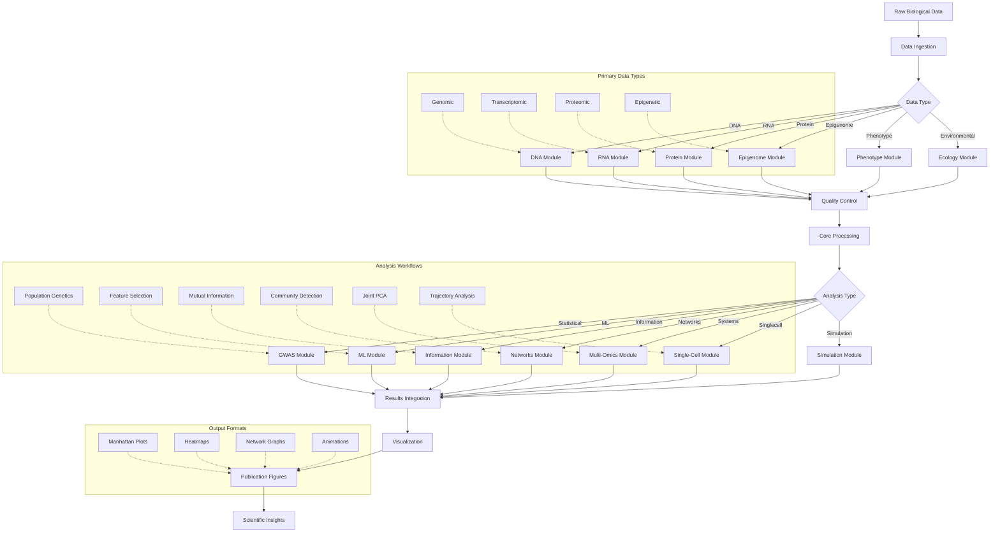
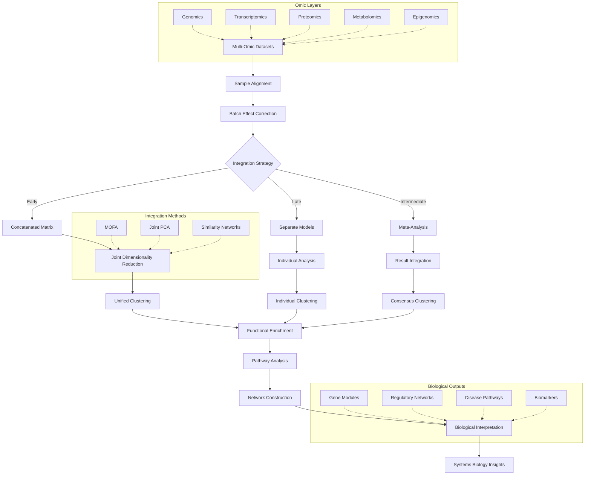
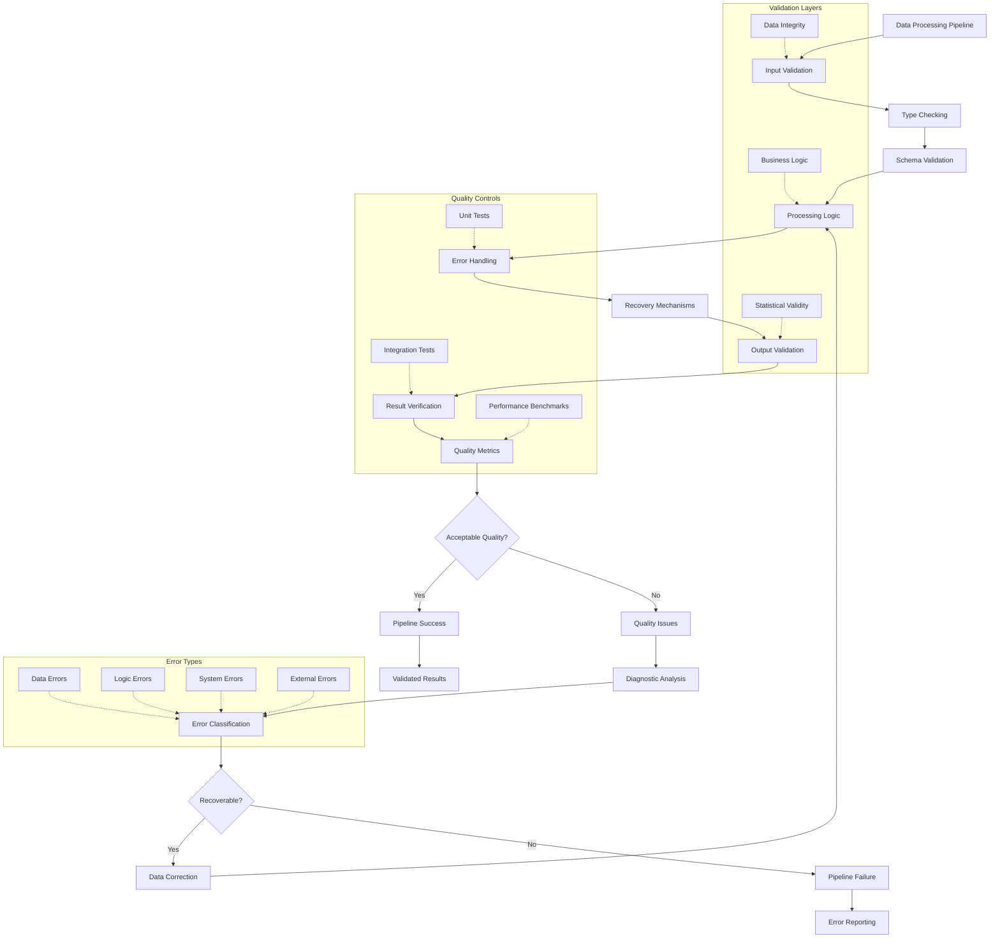

# METAINFORMANT

**Comprehensive bioinformatics toolkit for multi-omic analysis**

[](https://www.python.org/downloads/)
[](LICENSE)
[](https://github.com/psf/black)
[](src/metainformant/)
[](src/metainformant/)

---

## Overview

METAINFORMANT provides broad bioinformatics analysis modules across genomics, transcriptomics, proteomics, epigenomics, and systems biology. Built with Python 3.11+ and [`uv`](https://astral.sh/uv) for fast dependency management.

### At a Glance

| Metric | Value |
|--------|-------|
| **Modules** | 28 specialized analysis modules |
| **Python Files** | 639 implementation files under `src/metainformant/` |
| **Plot Types** | 70+ visualization methods |
| **Documentation** | 439 project-owned `README.md` and `AGENTS.md` files |

### Core Capabilities

| Domain | Features |
|--------|----------|
| **DNA** | Sequences, alignment, phylogenetics, population genetics, variant analysis |
| **RNA** | Amalgkit integration, ENA/SRA downloads, Kallisto quantification, industrial-scale pipelines (8,300+ samples across 28 species) |
| **GWAS** | Association testing, fine-mapping, visualization, complete GWAS pipelines |
| **eQTL** | Integration of GWAS variants and Amalgkit RNA-seq expression data |
| **Multi-omics** | Cross-omic integration, joint PCA, correlation analysis |
| **ML** | Classification, regression, feature selection, LLM integration |
| **Visualization** | Manhattan plots, heatmaps, networks, animations, publication-ready output |

### System Architecture


```mermaid
flowchart TB
    subgraph coreInfra["Core Infrastructure"]
        CORE["Core Utilities"]
    end

    subgraph molecular["Molecular Analysis"]
        DNA["DNA Analysis"]
        RNA["RNA Analysis"]
        PROT["Protein Analysis"]
        EPI["Epigenome Analysis"]
    end

    subgraph statsML["Statistical and ML"]
        GWAS["GWAS Analysis"]
        MATH["Mathematical Biology"]
        ML["Machine Learning"]
        INFO["Information Theory"]
    end

    subgraph systems["Systems Biology"]
        NET["Network Analysis"]
        MULTI["Multi-Omics Integration"]
        SC["Single-Cell Analysis"]
        SIM["Simulation"]
    end

    subgraph annotation["Annotation and Metadata"]
        ONT["Ontology"]
        PHEN["Phenotype Analysis"]
        ECO["Ecology"]
        LE["Life Events"]
    end

    subgraph utilities["Utilities"]
        QUAL["Quality Control"]
        VIZ["Visualization"]
    end

    subgraph specialized["Specialized Domains"]
        LR["Long-Read Sequencing"]
        METAG["Metagenomics"]
        SV["Structural Variants"]
        SPATIAL["Spatial Transcriptomics"]
        PHARMA["Pharmacogenomics"]
        METAB["Metabolomics"]
        MENU["Menu System"]
        CLOUD["Cloud Deployment"]
    end

    CORE --> DNA
    CORE --> RNA
    CORE --> PROT
    CORE --> EPI
    CORE --> GWAS
    CORE --> MATH
    CORE --> ML
    CORE --> INFO
    CORE --> NET
    CORE --> MULTI
    CORE --> SC
    CORE --> SIM
    CORE --> ONT
    CORE --> PHEN
    CORE --> ECO
    CORE --> LE
    CORE --> QUAL
    CORE --> VIZ
    CORE --> LR
    CORE --> METAG
    CORE --> SV
    CORE --> SPATIAL
    CORE --> PHARMA
    CORE --> METAB
    CORE --> MENU
    CORE --> CLOUD
```

### Data Flow and Integration Architecture


```mermaid
graph TD
    A["Raw Biological Data"] --> B["Data Ingestion"]
    B --> C{Data Type}

    C -->|DNA| D["DNA Module"]
    C -->|RNA| E["RNA Module"]
    C -->|Protein| F["Protein Module"]
    C -->|Epigenome| G["Epigenome Module"]
    C -->|Phenotype| H["Phenotype Module"]
    C -->|Environmental| I["Ecology Module"]

    D --> J["Quality Control"]
    E --> J
    F --> J
    G --> J
    H --> J
    I --> J

    J --> K["Core Processing"]
    K --> L{Analysis Type}

    L -->|Statistical| M["GWAS Module"]
    L -->|ML| N["ML Module"]
    L -->|Information| O["Information Module"]
    L -->|Networks| P["Networks Module"]
    L -->|Systems| Q["Multi-Omics Module"]
    L -->|Singlecell| R["Single-Cell Module"]
    L -->|Simulation| S["Simulation Module"]

    M --> T["Results Integration"]
    N --> T
    O --> T
    P --> T
    Q --> T
    R --> T
    S --> T

    T --> U["Visualization"]
    U --> V["Publication Figures"]
    V --> W["Scientific Insights"]

    subgraph "Primary Data Types"
        X["Genomic"] -.-> D
        Y["Transcriptomic"] -.-> E
        Z["Proteomic"] -.-> F
        AA["Epigenetic"] -.-> G
    end

    subgraph "Analysis Workflows"
        BB["Population Genetics"] -.-> M
        CC["Feature Selection"] -.-> N
        DD["Mutual Information"] -.-> O
        EE["Community Detection"] -.-> P
        FF["Joint PCA"] -.-> Q
        GG["Trajectory Analysis"] -.-> R
    end

    subgraph "Output Formats"
        HH["Manhattan Plots"] -.-> V
        II["Heatmaps"] -.-> V
        JJ["Network Graphs"] -.-> V
        KK["Animations"] -.-> V
    end
```

### Multi-Omic Integration Pipeline


```mermaid
graph TD
    A["Multi-Omic Datasets"] --> B["Sample Alignment"]
    B --> C["Batch Effect Correction"]

    C --> D{Integration Strategy}
    D -->|Early| E["Concatenated Matrix"]
    D -->|Late| F["Separate Models"]
    D -->|Intermediate| G["Meta-Analysis"]

    E --> H["Joint Dimensionality Reduction"]
    F --> I["Individual Analysis"]
    G --> J["Result Integration"]

    H --> K["Unified Clustering"]
    I --> L["Individual Clustering"]
    J --> M["Consensus Clustering"]

    K --> N["Functional Enrichment"]
    L --> N
    M --> N

    N --> O["Pathway Analysis"]
    O --> P["Network Construction"]

    P --> Q["Biological Interpretation"]
    Q --> R["Systems Biology Insights"]

    subgraph "Omic Layers"
        S["Genomics"] -.-> A
        T["Transcriptomics"] -.-> A
        U["Proteomics"] -.-> A
        V["Metabolomics"] -.-> A
        W["Epigenomics"] -.-> A
    end

    subgraph "Integration Methods"
        X["MOFA"] -.-> H
        Y["Joint PCA"] -.-> H
        Z["Similarity Networks"] -.-> H
    end

    subgraph "Biological Outputs"
        AA["Gene Modules"] -.-> Q
        BB["Regulatory Networks"] -.-> Q
        CC["Disease Pathways"] -.-> Q
        DD["Biomarkers"] -.-> Q
    end
```

### Quality Assurance Framework


```mermaid
graph TD
    A["Data Processing Pipeline"] --> B["Input Validation"]
    B --> C["Type Checking"]
    C --> D["Schema Validation"]

    D --> E["Processing Logic"]
    E --> F["Error Handling"]
    F --> G["Recovery Mechanisms"]

    G --> H["Output Validation"]
    H --> I["Result Verification"]
    I --> J["Quality Metrics"]

    J --> K{Acceptable Quality?}
    K -->|Yes| L["Pipeline Success"]
    K -->|No| M["Quality Issues"]

    M --> N["Diagnostic Analysis"]
    N --> O["Error Classification"]

    O --> P{Recoverable?}
    P -->|Yes| Q["Data Correction"]
    P -->|No| R["Pipeline Failure"]

    Q --> E
    L --> S["Validated Results"]
    R --> T["Error Reporting"]

    subgraph "Validation Layers"
        U["Data Integrity"] -.-> B
        V["Business Logic"] -.-> E
        W["Statistical Validity"] -.-> H
    end

    subgraph "Quality Controls"
        X["Unit Tests"] -.-> F
        Y["Integration Tests"] -.-> I
        Z["Performance Benchmarks"] -.-> J
    end

    subgraph "Error Types"
        AA["Data Errors"] -.-> O
        BB["Logic Errors"] -.-> O
        CC["System Errors"] -.-> O
        DD["External Errors"] -.-> O
    end
```

### Key Features

- **Multi-Omic Analysis**: DNA, RNA, protein, and epigenome data integration
- **Statistical & ML Methods**: GWAS, population genetics, machine learning pipelines
- **Single-Cell Genomics**: Complete scRNA-seq analysis workflows
- **Network Analysis**: Biological networks, pathways, community detection algorithms
- **Visualization Suite**: 14 specialized plotting modules with 70+ plot types and publication-quality output
- **Modular Architecture**: Individual modules or complete end-to-end workflows
- **Comprehensive Documentation**: 310+ README files with technical specifications
- **Implementation Testing**: Real methods in tests, no mocks or stubs
- **Quality Assurance**: Rigorous validation and error handling throughout
- **Performance Optimization**: Efficient algorithms for large-scale biological data

## Quick Start

### I Want To...

**Analyze DNA sequences:**
```bash
# One-liner: GC content for a short sequence
uv run python - <<'PY'
from metainformant.dna.sequence.composition import gc_content

seq = "ATGCGC"
print(f"GC: {gc_content(seq) * 100:.1f}%")
PY
```

**Run RNA-seq pipeline (amalgkit):**
```bash
# List available species configs before running an amalgkit workflow
uv run python scripts/rna/run_workflow.py --list-configs
```

**Perform GWAS analysis:**
```bash
# End-to-end Apis mellifera GWAS workflow
uv run python scripts/gwas/run_amellifera_gwas.py \
  --config config/gwas/gwas_amellifera.yaml \
  --output output/gwas/amellifera
```

**Visualize results:**
```python
import numpy as np
from metainformant.visualization.plots.basic import heatmap

ax = heatmap(np.array([[1.0, 0.5], [0.5, 1.0]]), output_path="output/figures/heatmap.png")
```

**Deploy to cloud (GCP):**
```bash
# Inspect the GCP deployment subcommands
uv run python scripts/cloud/deploy_gcp.py --help
```

---


### Choosing the Right Module

| Your Data Type | Use This Module | Start Here |
|----------------|-----------------|------------|
| DNA sequences (FASTA) | `dna` | [docs/dna/](docs/dna/) |
| RNA-seq (FASTQ, BAM) | `rna` (amalgkit) | [docs/rna/](docs/rna/workflow.md) |
| VCF + phenotypes | `gwas` | [docs/gwas/workflow.md](docs/gwas/workflow.md) |
| Protein (FASTA, PDB) | `protein` | [docs/protein/](docs/protein/) |
| Single-cell (h5ad, mtx) | `singlecell` | [docs/singlecell/](docs/singlecell/) |
| Methylation arrays/bams | `epigenome` | [docs/epigenome/](docs/epigenome/) |
| Microbiome (16S, metagenome) | `metagenomics` | [docs/metagenomics/](docs/metagenomics/) |
| Multiple omics (joint analysis) | `multiomics` | [docs/multiomics/](docs/multiomics/) |
| Gene lists + GO terms | `ontology` | [docs/ontology/](docs/ontology/) |
| Phenotype traits | `phenotype` | [docs/phenotype/](docs/phenotype/) |
| Ecological communities | `ecology` | [docs/ecology/](docs/ecology/) |
| Long-read (PacBio/ONT) | `longread` | [docs/longread/](docs/longread/) |
| Networks & pathways | `networks` | [docs/networks/](docs/networks/) |
| Information theory analysis | `information` | [docs/information/](docs/information/) |
| Simulation/synthetic data | `simulation` | [docs/simulation/](docs/simulation/) |
| Visualizations only | `visualization` | [docs/visualization/](docs/visualization/) |
| GCP cloud deployment | `cloud` | [src/metainformant/cloud/README.md](src/metainformant/cloud/README.md) |

**Not sure?** Read the [full module matrix](docs/index.md#module-overview-matrix).

---

### First-Time Visitor Path

1. **Install** (10 min): Follow [QUICKSTART.md](QUICKSTART.md)
2. **Run demo** (2 min): `python3 scripts/core/run_demo.py`
3. **Pick your domain**: See table above → click module link
4. **Read workflow guide**: Each module's `docs/<module>/workflow.md`
5. **Try on sample data**: Each module has `tests/data/<module>/` examples
6. **Run on your data**: Replace sample paths with your files

---

### Prerequisites

### Module Status Overview

### **Production-Ready Modules**

| Category | Module | Status | Key Features |
|----------|--------|--------|--------------|
| **Core** | [core/](src/metainformant/core/) | [DONE] **Complete** | I/O, config, logging, parallel, cache, validation, workflow orchestration |
| **DNA** | [dna/](src/metainformant/dna/) | [DONE] **Complete** | Sequences, alignment, phylogeny, population genetics, variant analysis |
| **RNA** | [rna/](src/metainformant/rna/) | [DONE] **Complete & Verified** | AMALGKIT integration, workflow orchestration, expression quantification |
| **Protein** | [protein/](src/metainformant/protein/) | [DONE] **Complete** | Sequences, structures, AlphaFold, UniProt, functional analysis |
| **GWAS** | [gwas/](src/metainformant/gwas/) | [DONE] **Complete** | Association testing, QC, population structure, visualization |
| **Math** | [math/](src/metainformant/math/) | [DONE] **Complete** | Population genetics, coalescent, selection, epidemiology |
| **Visualization** | [visualization/](src/metainformant/visualization/) | [DONE] **Complete** | 70+ plot types, animations, publication-quality output |
| **Ontology** | [ontology/](src/metainformant/ontology/) | [DONE] **Complete** | GO analysis, semantic similarity, functional annotation |
| **Quality** | [quality/](src/metainformant/quality/) | [DONE] **Complete** | FASTQ analysis, validation, contamination detection |

### **Functional Modules** (Partial Implementation)

| Category | Module | Status | Key Features | Coverage |
|----------|--------|--------|--------------|----------|
| **ML** | [ml/](src/metainformant/ml/) | [PARTIAL] **Partial** | Classification, regression, feature selection | 75% |
| **Networks** | [networks/](src/metainformant/networks/) | [PARTIAL] **Partial** | Graph algorithms, community detection | 78% |
| **Multi-Omics** | [multiomics/](src/metainformant/multiomics/) | [PARTIAL] **Partial** | Integration, joint PCA, correlation | 72% |
| **Single-Cell** | [singlecell/](src/metainformant/singlecell/) | [PARTIAL] **Partial** | Preprocessing, clustering, DE analysis | 74% |
| **Epigenome** | [epigenome/](src/metainformant/epigenome/) | [PARTIAL] **Partial** | Methylation, ChIP-seq, ATAC-seq | 76% |
| **Phenotype** | [phenotype/](src/metainformant/phenotype/) | [PARTIAL] **Partial** | AntWiki integration, trait analysis | 79% |
| **Ecology** | [ecology/](src/metainformant/ecology/) | [PARTIAL] **Partial** | Community diversity, environmental | 77% |
| **Life Events** | [life_events/](src/metainformant/life_events/) | [PARTIAL] **Partial** | Event sequences, embeddings | 73% |
| **Simulation** | [simulation/](src/metainformant/simulation/) | [PARTIAL] **Partial** | Sequence simulation, ecosystems | 71% |
| **Information** | [information/](src/metainformant/information/) | [PARTIAL] **Partial** | Entropy, mutual information | 80% |

### **Specialized Domain Modules**

| Category | Module | Status | Key Features | Coverage |
|----------|--------|--------|--------------|----------|
| **Long-Read** | [longread/](src/metainformant/longread/) | [PARTIAL] **Partial** | PacBio/ONT sequencing, assembly, error correction | 65% |
| **Metagenomics** | [metagenomics/](src/metainformant/metagenomics/) | [PARTIAL] **Partial** | Taxonomic profiling, functional annotation | 60% |
| **Structural Variants** | [structural_variants/](src/metainformant/structural_variants/) | [PARTIAL] **Partial** | SV/CNV detection, breakpoint resolution | 55% |
| **Spatial** | [spatial/](src/metainformant/spatial/) | [PARTIAL] **Partial** | Spatial transcriptomics, tissue mapping | 50% |
| **Pharmacogenomics** | [pharmacogenomics/](src/metainformant/pharmacogenomics/) | [PARTIAL] **Partial** | Drug-gene interactions, variant interpretation | 55% |
| **Metabolomics** | [metabolomics/](src/metainformant/metabolomics/) | [PARTIAL] **Partial** | MS data processing, pathway mapping | 50% |
| **Menu** | [menu/](src/metainformant/menu/) | [PARTIAL] **Partial** | Interactive CLI menu, workflow navigation | 70% |
| **Cloud** | [cloud/](src/metainformant/cloud/) | [DONE] **Complete** | GCP VM lifecycle, Docker pipelines, genome prep | 90% |
| **eQTL** | [gwas/finemapping/eqtl](src/metainformant/gwas/finemapping/) | [DONE] **Complete** | Expression-genotype association, cis-eQTL scanning | 85% |
| **MCP** | [mcp/](src/metainformant/mcp/) | [PARTIAL] **Partial** | Model Context Protocol tool implementations | 40% |

## Module Overview

### Complete Module Reference

All modules live in [`src/metainformant/`](src/metainformant/) with documentation in each module's `README.md`.

| Module | Files | Description | Key Components | Docs |
|--------|-------|-------------|----------------|------|
| **Core Infrastructure** |||||
| [`core/`](src/metainformant/core/) | 26 | Shared utilities, I/O, logging, config, parallel processing, caching | [`io/`](src/metainformant/core/io/), [`data/`](src/metainformant/core/data/), [`execution/`](src/metainformant/core/execution/) | [README](src/metainformant/core/README.md) |
| **Molecular Analysis** |||||
| [`dna/`](src/metainformant/dna/) | 27 | DNA sequences, alignment, phylogenetics, population genetics, variants | [`sequence/`](src/metainformant/dna/sequence/), [`alignment/`](src/metainformant/dna/alignment/), [`population/`](src/metainformant/dna/population/) | [README](src/metainformant/dna/README.md) |
| [`rna/`](src/metainformant/rna/) | 29 | RNA-seq workflows, amalgkit integration, expression quantification | [`amalgkit/`](src/metainformant/rna/amalgkit/), [`engine/`](src/metainformant/rna/engine/), [`analysis/`](src/metainformant/rna/analysis/) | [README](src/metainformant/rna/README.md) |
| [`protein/`](src/metainformant/protein/) | 17 | Protein sequences, structure analysis, AlphaFold, UniProt integration | [`sequence/`](src/metainformant/protein/sequence/), [`structure/`](src/metainformant/protein/structure/), [`database/`](src/metainformant/protein/database/) | [README](src/metainformant/protein/README.md) |
| [`epigenome/`](src/metainformant/epigenome/) | 8 | Methylation analysis, ChIP-seq, ATAC-seq, chromatin accessibility | [`assays/`](src/metainformant/epigenome/assays/), [`chromatin_state/`](src/metainformant/epigenome/chromatin_state/), [`peak_calling/`](src/metainformant/epigenome/peak_calling/) | [README](src/metainformant/epigenome/README.md) |
| **Statistical & ML** |||||
| [`gwas/`](src/metainformant/gwas/) | 39 | GWAS, fine-mapping, eQTL analysis, colocalization, visualization | [`finemapping/`](src/metainformant/gwas/finemapping/), [`visualization/`](src/metainformant/gwas/visualization/), [`analysis/`](src/metainformant/gwas/analysis/) | [README](src/metainformant/gwas/README.md) |
| [`math/`](src/metainformant/math/) | 20 | Population genetics theory, coalescent, selection, epidemiology | [`population_genetics/`](src/metainformant/math/population_genetics/), [`epidemiology/`](src/metainformant/math/epidemiology/), [`evolutionary_dynamics/`](src/metainformant/math/evolutionary_dynamics/) | [README](src/metainformant/math/README.md) |
| [`ml/`](src/metainformant/ml/) | 12 | Machine learning pipelines, classification, regression, features | [`models/`](src/metainformant/ml/models/), [`features/`](src/metainformant/ml/features/), [`llm/`](src/metainformant/ml/llm/) | [README](src/metainformant/ml/README.md) |
| [`information/`](src/metainformant/information/) | 14 | Information theory, Shannon entropy, mutual information, semantic similarity | [`metrics/`](src/metainformant/information/metrics/), [`integration/`](src/metainformant/information/integration/) | [README](src/metainformant/information/README.md) |
| **Systems Biology** |||||
| [`networks/`](src/metainformant/networks/) | 9 | Biological networks, graph algorithms, community detection, pathways | [`analysis/`](src/metainformant/networks/analysis/), [`interaction/`](src/metainformant/networks/interaction/) | [README](src/metainformant/networks/README.md) |
| [`multiomics/`](src/metainformant/multiomics/) | 6 | Multi-omic integration, joint PCA, cross-omic correlation | [`analysis/`](src/metainformant/multiomics/analysis/), [`methods/`](src/metainformant/multiomics/methods/) | [README](src/metainformant/multiomics/README.md) |
| [`singlecell/`](src/metainformant/singlecell/) | 9 | scRNA-seq preprocessing, clustering, differential expression | [`data/`](src/metainformant/singlecell/data/), [`analysis/`](src/metainformant/singlecell/analysis/), [`visualization/`](src/metainformant/singlecell/visualization/) | [README](src/metainformant/singlecell/README.md) |
| [`simulation/`](src/metainformant/simulation/) | 7 | Synthetic data, agent-based models, sequence simulation, ecosystems | [`models/`](src/metainformant/simulation/models/), [`workflow/`](src/metainformant/simulation/workflow/), [`benchmark/`](src/metainformant/simulation/benchmark/) | [README](src/metainformant/simulation/README.md) |
| **Annotation & Metadata** |||||
| [`ontology/`](src/metainformant/ontology/) | 7 | Gene Ontology, functional annotation, semantic similarity | [`core/`](src/metainformant/ontology/core/), [`query/`](src/metainformant/ontology/query/), [`visualization/`](src/metainformant/ontology/visualization/) | [README](src/metainformant/ontology/README.md) |
| [`phenotype/`](src/metainformant/phenotype/) | 15 | Phenotypic data curation, AntWiki integration, trait analysis | [`analysis/`](src/metainformant/phenotype/analysis/), [`data/`](src/metainformant/phenotype/data/), [`behavior/`](src/metainformant/phenotype/behavior/) | [README](src/metainformant/phenotype/README.md) |
| [`ecology/`](src/metainformant/ecology/) | 7 | Community diversity, environmental correlations, species matrices | [`analysis/`](src/metainformant/ecology/analysis/), [`phylogenetic/`](src/metainformant/ecology/phylogenetic/), [`visualization/`](src/metainformant/ecology/visualization/) | [README](src/metainformant/ecology/README.md) |
| [`life_events/`](src/metainformant/life_events/) | 9 | Life course analysis, event sequences, temporal embeddings | [`models/`](src/metainformant/life_events/models/), [`workflow/`](src/metainformant/life_events/workflow/) | [README](src/metainformant/life_events/README.md) |
| **Utilities** |||||
| [`quality/`](src/metainformant/quality/) | 4 | FASTQ quality assessment, validation, contamination detection | [`io/`](src/metainformant/quality/io/), [`analysis/`](src/metainformant/quality/analysis/), [`reporting/`](src/metainformant/quality/reporting/) | [README](src/metainformant/quality/README.md) |
| [`visualization/`](src/metainformant/visualization/) | 22 | 70+ plot types, heatmaps, networks, animations, publication-ready | [`plots/`](src/metainformant/visualization/plots/), [`genomics/`](src/metainformant/visualization/genomics/), [`analysis/`](src/metainformant/visualization/analysis/) | [README](src/metainformant/visualization/README.md) |
| **Specialized Domains** |||||
| [`longread/`](src/metainformant/longread/) | 19 | Long-read sequencing (PacBio, ONT), assembly, error correction | [`assembly/`](src/metainformant/longread/assembly/), [`quality/`](src/metainformant/longread/quality/) | [README](src/metainformant/longread/README.md) |
| [`metagenomics/`](src/metainformant/metagenomics/) | 11 | Metagenomic analysis, taxonomic profiling, functional annotation | [`amplicon/`](src/metainformant/metagenomics/amplicon/), [`functional/`](src/metainformant/metagenomics/functional/) | [README](src/metainformant/metagenomics/README.md) |
| [`pharmacogenomics/`](src/metainformant/pharmacogenomics/) | 12 | Drug-gene interactions, pharmacokinetics, variant interpretation | [`interaction/`](src/metainformant/pharmacogenomics/interaction/) | [README](src/metainformant/pharmacogenomics/README.md) |
| [`spatial/`](src/metainformant/spatial/) | 11 | Spatial transcriptomics, tissue mapping, spatial statistics | [`analysis/`](src/metainformant/spatial/analysis/) | [README](src/metainformant/spatial/README.md) |
| [`structural_variants/`](src/metainformant/structural_variants/) | 9 | SV detection, CNV analysis, breakpoint resolution | [`detection/`](src/metainformant/structural_variants/detection/) | [README](src/metainformant/structural_variants/README.md) |
| [`menu/`](src/metainformant/menu/) | 4 | Interactive CLI menu system, workflow navigation | [`ui/`](src/metainformant/menu/ui/) | [README](src/metainformant/menu/README.md) |

**Total: 26 modules, 603 Python files**

## Documentation

### Quick Links

- **[Documentation Guide](docs/DOCUMENTATION_GUIDE.md)** - Complete navigation guide
- **[Quick Start](QUICKSTART.md)** - Fast setup commands
- **[Architecture](docs/architecture.md)** - System design
- **[Technical Specification](SPEC.md)** - Design standards
### Transcriptomics (RNA-seq)
- [Workflow Guide](docs/rna/index.md) — ENA-first amalgkit streaming pipeline
- [Troubleshooting](docs/rna/amalgkit/TROUBLESHOOTING.md) — IO contention & SRA setup fixes
- [Tissue Patching](docs/rna/amalgkit/tissue_patching.md) — Custom metadata correction
- [Ortholog Generation](docs/rna/amalgkit/ortholog_generation.md) — Automated cross-species mapping
- [Step Documentation](docs/rna/amalgkit/steps/README.md) — The 11-step amalgkit process
- **[Testing Guide](docs/testing.md)** - Comprehensive testing documentation
- **[CLI Reference](docs/cli.md)** - Command-line interface
- **[eQTL Integration](docs/eqtl/README.md)** - eQTL pipeline documentation

### Module Documentation

Each module has documentation in `src/metainformant/<module>/README.md` and `docs/<module>/`.

## Scripts & Workflows

The [`scripts/`](scripts/) directory contains workflow orchestrators and utilities:

- **Package Management**: Setup, testing, quality control
- **RNA-seq (Amalgkit)**: Multi-species workflows, amalgkit integration
- **GWAS (Variants)**: Genome-scale association studies
- **eQTL Integration**: RNA-seq + Variant cross-omics integration pipelines
- **Module Orchestrators**: Complete workflow scripts for all domains (core, DNA, RNA, protein, networks, multiomics, single-cell, quality, simulation, visualization, epigenome, ecology, ontology, phenotype, ML, math, gwas, information, life_events)

See [`scripts/README.md`](scripts/README.md) for documentation.

### CLI Interface

The `metainformant` command exposes a **small** CLI ([`docs/cli.md`](docs/cli.md)): `--version`, `--modules`, `protein` (taxon-ids, comp, rmsd-ca), `quality batch-detect`, `rna info`, `gwas info`. Full domain workflows use **Python imports**, **`scripts/*/run_*.py`**, or **`python -m metainformant.rna.amalgkit`**.

```bash
uv run metainformant --help
uv run metainformant --modules
uv run metainformant protein taxon-ids --file data/taxon_ids.txt
uv run metainformant protein comp --fasta data/proteins.fasta
uv run metainformant protein rmsd-ca --pdb-a data/structure1.pdb --pdb-b data/structure2.pdb
uv run metainformant quality batch-detect --data samples.csv --batches batches.txt

# RNA-seq workflow config discovery
uv run python scripts/rna/run_workflow.py --list-configs
```

See [`docs/cli.md`](docs/cli.md) for CLI documentation.

## Usage Examples

### DNA Analysis

```python
from metainformant.dna.alignment.pairwise import global_align
from metainformant.dna.population import nucleotide_diversity

alignment = global_align("ACGTACGT", "ACGTAGGT")
print(f"Alignment score: {alignment.score}")

seqs = ["ATCGATCG", "ATCGTTCG", "ATCGATCG"]
print(f"Nucleotide diversity: {nucleotide_diversity(seqs):.4f}")
```

### RNA-seq Workflow

```python
from metainformant.rna.engine.workflow import load_workflow_config, plan_workflow

config = load_workflow_config("config/amalgkit/amalgkit_pogonomyrmex_barbatus.yaml")
for step_name, _params in plan_workflow(config):
    print(step_name)
```

```bash
# Inspect available species configs, then run a workflow after amalgkit is installed
uv run python scripts/rna/run_workflow.py --list-configs
uv run python scripts/rna/run_workflow.py --config config/amalgkit/amalgkit_pogonomyrmex_barbatus.yaml
```

### GWAS Analysis

```python
from metainformant.gwas.analysis.association import association_test_linear

result = association_test_linear(
    genotypes=[0, 1, 2, 0, 1, 2, 0, 1],
    phenotypes=[10.1, 11.0, 12.2, 9.8, 10.9, 12.0, 10.0, 11.2],
)
print(result["beta"], result["p_value"])
```

```bash
uv run python scripts/gwas/run_amellifera_gwas.py --config config/gwas/gwas_amellifera.yaml --output output/gwas/amellifera
```

### Configuration

```python
from metainformant.core.utils.config import apply_env_overrides, load_mapping_from_file

config = load_mapping_from_file("config/amalgkit/amalgkit_pogonomyrmex_barbatus.yaml")
config = apply_env_overrides(config, prefix="AK")
```

### Visualization

```python
import numpy as np
from metainformant.visualization.plots.basic import heatmap

heatmap(np.array([[1.0, 0.2], [0.2, 1.0]]), output_path="output/figures/correlation.png")
```

### Core Utilities

```python
from metainformant.core import io
from metainformant.core.io import paths
from metainformant.core.utils.logging import get_logger

logger = get_logger(__name__)
resolved = paths.expand_and_resolve("output/results.json")
io.dump_json({"ok": True}, resolved)
logger.info("Wrote %s", resolved)
```

## Project Structure

```
MetaInformAnt/
 src/metainformant/ # Main package
 core/ # Core utilities
 dna/ # DNA analysis
 rna/ # RNA analysis
 protein/ # Protein analysis
 gwas/ # GWAS analysis
 ... # Additional modules
 scripts/ # Workflow scripts
 package/ # Package management
 rna/ # RNA workflows
 gwas/ # GWAS workflows
 ... # Module scripts
 docs/ # Documentation
 tests/ # Test suite
 config/ # Configuration files
 output/ # Analysis outputs
 data/ # Input data
```

## AI-Assisted Development

This project uses AI assistance to enhance:

- Code generation and algorithm implementation
- Comprehensive documentation
- Test case generation
- Architecture design

All AI-generated content undergoes human review. See [`AGENTS.md`](AGENTS.md) for details.

## Known Limitations

### Module Completeness

Some modules have partial implementations or optional dependencies:

- **Machine Learning**: Framework exists; some methods may need completion (see [ML Documentation](docs/ml/README.md))
- **Multi-omics**: Integration methods implemented; additional dependencies may be required
- **Single-cell**: Requires `scipy`, `scanpy`, `anndata` (see [Single-Cell Documentation](docs/singlecell/README.md))
- **Network Analysis**: Algorithms implemented; regulatory network features may need enhancement

### GWAS Module

- **Variant Download**: Database download (dbSNP, 1000 Genomes) is a placeholder; use SRA-based workflow or provide VCF files
- **Functional Annotation**: Requires external tools (ANNOVAR, VEP, SnpEff) for variant annotation
- **Mixed Models**: Relatedness adjustment implemented; MLM methods may require GCTA/EMMAX integration

### Test Coverage

Some modules have lower test success rates due to optional dependencies:

- **Single-cell**: Requires scientific dependencies (`scanpy`, `anndata`)
- **Multi-omics**: Framework exists, tests may skip without dependencies
- **Network Analysis**: Tests pass; features may need additional setup

See [Testing Guide](docs/testing.md) for detailed testing documentation and coverage information.

## Best Practices

### File Naming

- Use informative names: `sample_pca_biplot_colored_by_treatment.png`
- Avoid generic names: `plot1.png`, `output.png`

### Output Organization

- All outputs in `output/` directory
- Configuration saved with results
- Visualizations in subdirectories with metadata

### No Mocking Policy

- All tests use implementations
- No fake/mocked/stubbed methods
- Real API calls or graceful skips
- Ensures actual functionality

## Requirements

- Python 3.11+
- Optional: SRA Toolkit, kallisto (for RNA workflows)
- Optional: samtools, bcftools, bwa (for GWAS)

## Contributing

See [CONTRIBUTING.md](CONTRIBUTING.md) for full contribution guidelines.


Contributions are welcome! Please:

1. Follow the existing code style
2. Add tests for new features
3. Update documentation
4. Use informative commit messages

## Recent Improvements

### Performance Enhancements

- **Intelligent Caching**: Automatic caching for expensive computations (Tajima's constants, entropy calculations)
- **NumPy Vectorization**: Optimized mathematical operations for 10-100x performance improvements
- **Progress Tracking**: Real-time progress bars for long-running analyses
- **Memory Optimization**: Efficient algorithms for large datasets
- **Resilient Orchestration**: Engineered automatic recovery flows and VM-level hard reset protocols to survive catastrophic 100% Docker overlay lockups caused by hidden `fasterq-dump` caches.

### Enhanced Documentation

- **Comprehensive Tutorials**: End-to-end guides for DNA, RNA, GWAS, and information theory workflows
- **Method Comparison Guides**: Decision-making guides for choosing analysis algorithms
- **Extended FAQ**: Troubleshooting and usage guidance for common scenarios
- **Standardized Docstrings**: Consistent formatting with examples and DOI citations

### Testing & Reliability

- **Expanded Test Coverage**: 37+ new comprehensive tests with real implementations
- **Validation Enhancements**: Improved parameter validation and error handling
- **Cross-Platform Compatibility**: Python 3.14 support and external drive optimization
- **Integration Testing**: Verified cross-module functionality

### New Features

- **Enhanced GWAS Visualization**: Complete visualization suite for population structure, effects, and comparisons
- **Information Theory Workflows**: Batch processing with progress tracking
- **Protein Proteome Analysis**: Taxonomy ID processing and proteome utilities
- **Advanced Error Handling**: Structured error reporting with actionable guidance

## Citation

If you use METAINFORMANT in your research, please cite this repository:

```bibtex
@software{metainformant2025,
  author = {MetaInformAnt Development Team},
  title = {MetaInformAnt: Comprehensive Bioinformatics Toolkit},
  year = {2025},
  url = {https://github.com/docxology/MetaInformAnt},
  version = {0.2.6}
}
```

## License

This project is licensed under the Apache License, Version 2.0 - see [LICENSE](LICENSE) for details.

## Contact

- **Repository**: <https://github.com/docxology/MetaInformAnt>
- **Issues**: <https://github.com/docxology/MetaInformAnt/issues>
- **Documentation**: <https://github.com/docxology/MetaInformAnt/blob/main/docs/>

## Acknowledgments

- Developed with AI assistance from Cursor's Code Assistant (grok-code-fast-1)
- Built on established bioinformatics tools and libraries
- Community contributions and feedback

---

**Status**: Active Development | **Version**: 0.2.6 | **Python**: 3.11+ | **License**: Apache 2.0
