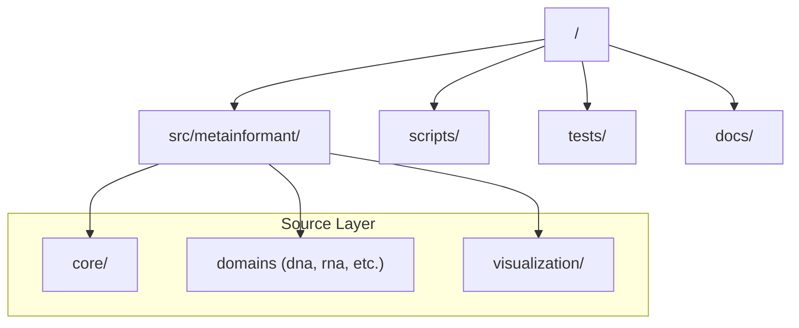

# Repository Specification: MetaInformAnt

MetaInformAnt is a domain-driven, modular bioinformatics toolkit designed for high-performance genomic and phenomic analysis.

## Design Philosophy

- **Domain-Driven Design (DDD)**: Logic is partitioned into biological domains (DNA, RNA, Phenotype, etc.).
- **Triple Play Documentation**: Every module must contain `README.md`, `AGENTS.md`, and `SPEC.md`.
- **No-Mock Testing**: Evolution of the codebase is verified using real, functional methods; mocks are strictly prohibited.
- **AI-Native Construction**: Designed to be navigated and maintained by AI agents, requiring high-fidelity function indices.

## Repository Structure

## Architectural Patterns

### 1. Sequential Failover (I/O)
The system prioritizes local data sources before attempting remote acquisition (NCBI, SRA).

### 2. Thin Wrapper Orchestration
Scripts in `scripts/` are "thin" wrappers around core modular methods, ensuring that business logic resides in `src/`.

### 3. TUI Progress Monitoring
Long-running workflows use a standardized `ProgressTracker` and Terminal UI (TUI) for real-time observability.

## Cross-Module Communication

Modules communicate via standard Python protocols and shared data structures (primarily `pandas` DataFrames and `numpy` arrays). The `core` module provides the shared infrastructure for I/O, configuration, and logging that all domain modules utilize.

## Documentation Standards

All specifications must detail:
1. Design Goals
2. Key Components
3. State Management (where applicable)
4. Data Flow
