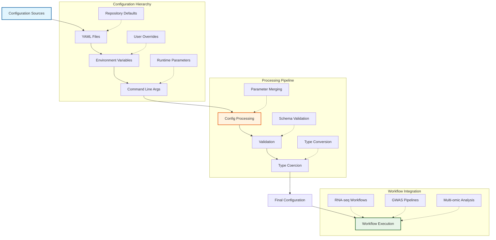
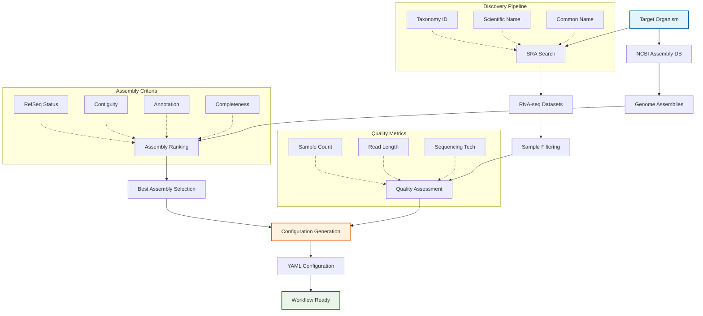
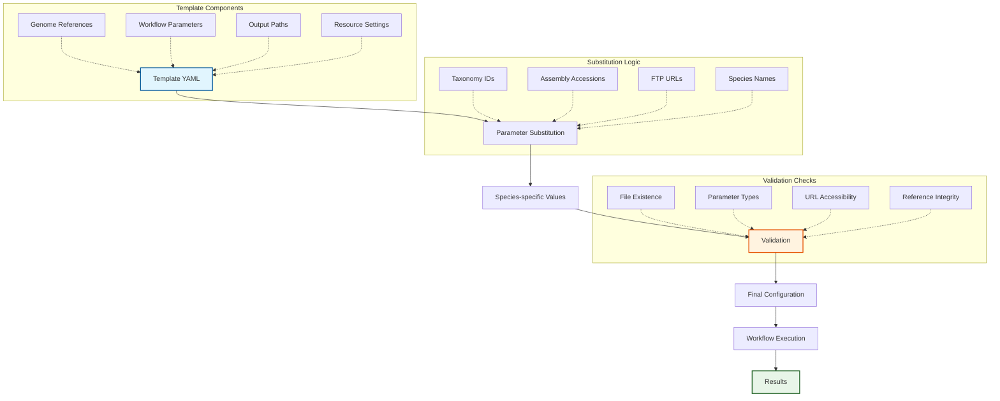

# Configuration Directory

This directory contains repository-level configuration files used by METAINFORMANT for various tools and workflows, with a focus on RNA-seq and GWAS analysis configurations for ant species. The configuration system provides a flexible, hierarchical approach to managing complex bioinformatics workflows.

## Configuration Architecture



## Automated Species Discovery System



## Configuration Template System



## Directory Structure

```
config/
├── amalgkit/          # RNA-seq workflow configurations for ant species
├── gwas/             # GWAS workflow configurations
├── archive/          # Archived/inactive configurations
├── ncbi.yaml         # NCBI API configuration (email, rate limiting)
├── README.md         # This file
└── AGENTS.md        # AI agent contribution documentation
```

## Amalgkit RNA-seq Configurations

### Active Species Configurations (`amalgkit/`)

- **`amalgkit_pogonomyrmex_barbatus.yaml`**: *Pogonomyrmex barbatus* (Red Harvester Ant) - Assembly GCF_000187915.1_Pbar_UMD_V03
- **`amalgkit_template.yaml`**: Template configuration file for creating new amalgkit workflows with customizable parameters
- **`amalgkit_test.yaml`**: Test configuration for validation and testing workflows

### Archived Configurations (`archive/`)

The archive contains 15 inactive configurations that have been moved from the active directory:

- **`amalgkit_acromyrmex_echinatior.yaml`**: *Acromyrmex echinatior* (Leafcutter Ant)
- **`amalgkit_amellifera.yaml`**: *Apis mellifera* (Western Honey Bee)
- **`amalgkit_atta_cephalotes.yaml`**: *Atta cephalotes* (Leafcutter Ant)
- **`amalgkit_camponotus_floridanus.yaml`**: *Camponotus floridanus* (Florida Carpenter Ant) - Assembly GCF_003227725.1_Cflo_v7.5
- **`amalgkit_harpegnathos_saltator.yaml`**: *Harpegnathos saltator* (Jerdon's Jumping Ant)
- **`amalgkit_lasius_neglectus.yaml`**: *Lasius neglectus* (Invasive Garden Ant)
- **`amalgkit_monomorium_pharaonis.yaml`**: *Monomorium pharaonis* (Pharaoh Ant) - Assembly GCF_013373865.1_ASM1337386v2
- **`amalgkit_myrmica_rubra.yaml`**: *Myrmica rubra* (European Fire Ant)
- **`amalgkit_ooceraea_biroi.yaml`**: *Ooceraea biroi* (Clonal Raider Ant)
- **`amalgkit_solenopsis_invicta.yaml`**: *Solenopsis invicta* (Red Fire Ant) - Assembly GCF_016802725.1_UNIL_Sinv_3.0
- **`amalgkit_temnothorax_curvispinosus.yaml`**: *Temnothorax curvispinosus* (Acorn Ant)
- **`amalgkit_temnothorax_longispinosus.yaml`**: *Temnothorax longispinosus* (Acorn Ant)
- **`amalgkit_temnothorax_rugatulus.yaml`**: *Temnothorax rugatulus* (Acorn Ant)
- **`amalgkit_vollenhovia_emeryi.yaml`**: *Vollenhovia emeryi* (Ant species)
- **`amalgkit_wasmannia_auropunctata.yaml`**: *Wasmannia auropunctata* (Little Fire Ant)

## GWAS Analysis Configurations

### GWAS Configurations (`gwas/`)

- **`gwas_pbarbatus.yaml`**: GWAS configuration for *Pogonomyrmex barbatus* - includes variant calling, QC, association testing
- **`gwas_template.yaml`**: Template configuration file for creating new GWAS workflows

## Additional Module Configuration Templates

### Network Analysis (`networks_template.yaml`)
Template for network analysis workflows including:
- Network construction and metrics
- Community detection
- Centrality analysis
- Pathway enrichment

### Multi-Omics Integration (`multiomics_template.yaml`)
Template for multi-omics data integration workflows including:
- Joint PCA, NMF, and canonical correlation analysis
- Sample mapping across omics layers
- Integration visualizations

### Single-Cell Analysis (`singlecell_template.yaml`)
Template for single-cell RNA-seq analysis workflows including:
- Quality control parameters
- Normalization settings
- Dimensionality reduction and clustering
- Marker gene identification

See orchestrator scripts in `scripts/` for usage examples.

## Usage Examples

### Amalgkit RNA-seq Workflows

Configuration files are used by RNA analysis workflows and can be customized for different species and computational requirements.

#### Quick Start Examples

**1. Run a complete species workflow:**
```bash
# Using the CLI
uv run metainformant rna run --config config/amalgkit/amalgkit_pogonomyrmex_barbatus.yaml

# Using the orchestrator script
python3 scripts/rna/run_workflow.py --config config/amalgkit/amalgkit_pogonomyrmex_barbatus.yaml
```

**2. Check workflow status:**
```bash
python3 scripts/rna/run_workflow.py --config config/amalgkit/amalgkit_pogonomyrmex_barbatus.yaml --status
```

**3. Create a new species configuration:**
```bash
# Use the discovery script to find and configure new species
python3 scripts/rna/discover_species.py --species "Apis_mellifera" --create-config
```

#### Complete Workflow Configuration Example

**Pogonomyrmex barbatus (Red Harvester Ant) - Active Configuration:**

```yaml
# config/amalgkit/amalgkit_pogonomyrmex_barbatus.yaml
work_dir: output/amalgkit/pbarbatus/work
log_dir: output/amalgkit/pbarbatus/logs
threads: 8
auto_install_amalgkit: true
species_list: ["Pogonomyrmex_barbatus"]

genome:
  accession: "GCF_000187915.1"
  assembly_name: "Pbar_UMD_V03"
  annotation_release: 100
  dest_dir: "output/amalgkit/pbarbatus/genome"
  include: ["genome", "gff3", "rna", "cds", "protein"]
  ftp_url: "https://ftp.ncbi.nlm.nih.gov/genomes/all/GCF/000/187/915/GCF_000187915.1_Pbar_UMD_V03"

metadata:
  enabled: true
  max_samples: 50
  min_read_length: 75

integrate:
  enabled: true

config:
  enabled: true

select:
  enabled: true
  criteria:
    min_reads: 1000000
    max_duplicates: 0.5

getfastq:
  enabled: true
  prefetch: true
  max_size: "20G"

quant:
  enabled: true
  index: "kallisto"
  bootstrap_samples: 100

merge:
  enabled: true

cstmm:
  enabled: false

curate:
  enabled: true

csca:
  enabled: false

sanity:
  enabled: true
```

**Configuration Template - For Creating New Species:**

```yaml
# config/amalgkit/amalgkit_template.yaml
work_dir: output/amalgkit/{species}/work
log_dir: output/amalgkit/{species}/logs
threads: 8
auto_install_amalgkit: true
species_list: ["{Scientific_Name}"]

genome:
  accession: "{NCBI_Assembly_Accession}"
  assembly_name: "{Assembly_Name}"
  annotation_release: {Release_Number}
  dest_dir: "output/amalgkit/{species}/genome"
  include: ["genome", "gff3", "rna", "cds", "protein"]
  ftp_url: "{NCBI_FTP_URL}"

# ... workflow steps as above
```

#### Loading Configurations
```python
from metainformant.core import config
from metainformant.rna import AmalgkitWorkflowConfig

# Load configuration from file
cfg = config.load_config("config/amalgkit/amalgkit_pogonomyrmex_barbatus.yaml")

# Create workflow configuration
workflow_cfg = AmalgkitWorkflowConfig(
    work_dir="output/amalgkit/pbarbatus/work",
    threads=cfg.threads,
    species_list=cfg.species_list,
    **cfg.steps
)
```

#### Command Line Usage
```bash
# Run amalgkit workflow with specific configuration
uv run python -m metainformant rna run \
  --config config/amalgkit/amalgkit_pogonomyrmex_barbatus.yaml \
  --work-dir output/amalgkit/pogonomyrmex_barbatus
```

### GWAS Workflows

#### Complete GWAS Configuration Example

**Pogonomyrmex barbatus GWAS Configuration:**

```yaml
# config/gwas/gwas_pbarbatus.yaml
work_dir: output/gwas/pbarbatus
threads: 8

# Genome reference
genome:
  accession: "GCF_000187915.1"
  assembly_name: "Pbar_UMD_V03"
  dest_dir: "output/gwas/pbarbatus/genome"

# Variant data sources
variants:
  vcf_path: "data/variants/pbarbatus.vcf.gz"
  # Alternative: call from BAM files
  # bam_files: ["data/alignments/sample1.bam", "data/alignments/sample2.bam"]
  # calling_method: "bcftools"

# Sample metadata and phenotypes
samples:
  phenotype_file: "data/phenotypes/traits.tsv"
  sample_column: "sample_id"
  trait_column: "phenotype"

# Quality control thresholds
qc:
  min_maf: 0.01
  max_missing: 0.1
  min_hwe_p: 1e-6

# Population structure analysis
structure:
  pca_components: 10
  kinship_method: "vanraden"

# Association testing
association:
  model: "linear"  # or "logistic" for binary traits
  covariates: ["pc1", "pc2", "pc3"]  # population PCs as covariates

# Multiple testing correction
correction:
  method: "bonferroni"  # bonferroni, fdr, genomic_control
  alpha: 0.05

# Output configuration
output:
  manhattan_plot: true
  qq_plot: true
  regional_plots: true
  significance_threshold: 5e-8
```

#### GWAS Quick Start Examples

**1. Run complete GWAS pipeline:**
```bash
# Using CLI
uv run metainformant gwas run --config config/gwas/gwas_pbarbatus.yaml

# Using orchestrator script
python3 scripts/gwas/run_genome_scale_gwas.py --config config/gwas/gwas_pbarbatus.yaml
```

**2. Generate GWAS configuration from data:**
```python
from metainformant.gwas.config import create_config_from_vcf

# Auto-create config from VCF and phenotype files
config = create_config_from_vcf(
    vcf_path="data/variants/cohort.vcf.gz",
    phenotype_path="data/phenotypes/traits.tsv",
    output_dir="config/gwas/"
)
```

**3. Validate GWAS configuration:**
```python
from metainformant.gwas.config import validate_config_parameters

errors = validate_config_parameters(config)
if errors:
    print("Configuration errors:", errors)
else:
    print("Configuration valid")
```

#### Loading GWAS Configurations
```python
from metainformant.core import config

# Load GWAS configuration
gwas_cfg = config.load_config("config/gwas/gwas_pbarbatus.yaml")

# Access configuration sections
genome_cfg = gwas_cfg.genome
variants_cfg = gwas_cfg.variants
qc_cfg = gwas_cfg.qc
```

#### Command Line Usage
```bash
# Run GWAS workflow with specific configuration
uv run python -m metainformant gwas run \
  --config config/gwas/gwas_pbarbatus.yaml \
  --work-dir output/gwas/pbarbatus
```

## Configuration Parameters

### Amalgkit Common Parameters

- **`work_dir`**: Working directory for analysis outputs (e.g., `output/amalgkit/pbarbatus/work`)
- **`log_dir`**: Directory for log files (e.g., `output/amalgkit/pbarbatus/logs`)
- **`threads`**: Number of parallel threads for processing (typically 6-8)
- **`auto_install_amalgkit`**: Automatically install amalgkit if not present (true/false)
- **`species_list`**: List of species for analysis (e.g., `["Pogonomyrmex_barbatus"]`)
- **`taxon_id`**: NCBI Taxonomy ID for the species

### Amalgkit Genome Configuration

- **`genome.accession`**: NCBI assembly accession (e.g., `GCF_000187915.1`)
- **`genome.assembly_name`**: Assembly name (e.g., `Pbar_UMD_V03`)
- **`genome.annotation_release`**: NCBI annotation release number
- **`genome.dest_dir`**: Local destination for genome files
- **`genome.include`**: List of genome file types to download (genome, gff3, rna, cds, protein, etc.)
- **`genome.ftp_url`**: NCBI FTP URL for genome files

### Amalgkit Workflow Steps

- **`metadata`**: Search and download metadata from NCBI SRA
- **`integrate`**: Integrate metadata with local samples
- **`config`**: Configure workflow parameters
- **`select`**: Select samples for analysis
- **`getfastq`**: Download FASTQ files from SRA (supports aws, gcp, ncbi mirrors)
- **`quant`**: Quantify transcript abundances with kallisto/salmon
- **`merge`**: Merge quantification results across samples
- **`cstmm`**: Custom metadata management
- **`curate`**: Curate and validate results
- **`csca`**: Custom comparative analysis
- **`sanity`**: Sanity checks and validation

### GWAS Configuration Parameters

- **`genome`**: Reference genome configuration (reuses amalgkit genome structure)
- **`variants`**: Variant data sources (VCF files, calling from BAM, or downloads)
- **`qc`**: Quality control thresholds (MAF, missing rate, HWE, etc.)
- **`samples`**: Sample metadata and phenotype files
- **`structure`**: Population structure analysis (PCA, kinship)
- **`association`**: Association testing parameters (model, trait, covariates)
- **`correction`**: Multiple testing correction methods
- **`output`**: Output directories and formats

### Supported Ant Species (Active Configurations)

- **`Pogonomyrmex_barbatus`**: Red Harvester Ant (NCBI Taxonomy: 144034) - Active configuration available

### Archived Species Configurations

The following species have configurations in the archive directory:
- **`Acromyrmex_echinatior`**: Leafcutter Ant
- **`Apis_mellifera`**: Western Honey Bee (NCBI Taxonomy: 7460)
- **`Atta_cephalotes`**: Leafcutter Ant
- **`Camponotus_floridanus`**: Florida Carpenter Ant (NCBI Taxonomy: 104421)
- **`Harpegnathos_saltator`**: Jerdon's Jumping Ant
- **`Lasius_neglectus`**: Invasive Garden Ant
- **`Monomorium_pharaonis`**: Pharaoh Ant (NCBI Taxonomy: 307658)
- **`Myrmica_rubra`**: European Fire Ant
- **`Ooceraea_biroi`**: Clonal Raider Ant
- **`Solenopsis_invicta`**: Red Fire Ant (NCBI Taxonomy: 13686)
- **`Temnothorax_curvispinosus`**: Acorn Ant
- **`Temnothorax_longispinosus`**: Acorn Ant
- **`Temnothorax_rugatulus`**: Acorn Ant
- **`Vollenhovia_emeryi`**: Ant species
- **`Wasmannia_auropunctata`**: Little Fire Ant

## Integration

### Module Integration

- **RNA Module**: `src/metainformant/rna/` - Amalgkit workflow configuration and execution
- **GWAS Module**: `src/metainformant/gwas/` - GWAS workflow configuration and execution
- **Core Config**: `src/metainformant/core/config.py` - Configuration loading with environment variable overrides
- **Core Paths**: `src/metainformant/core/paths.py` - Path validation and management

### Execution Environments

- Local execution with configurable thread/memory limits
- SLURM cluster integration (planned)
- PBS cluster integration (planned)
- Cloud execution (AWS/GCP for data downloads)

### NCBI Configuration (`ncbi.yaml`)

NCBI API configuration for Entrez access:
- **`email`**: Email address for NCBI API (required for API access)
- **`rate_limit_delay`**: Delay between requests in seconds (default: 0.34)
- **`max_retries`**: Maximum retry attempts (default: 3)
- **`retry_delay`**: Delay between retries in seconds (default: 1.0)

The email can be set in `config/ncbi.yaml` or via the `NCBI_EMAIL` environment variable. Environment variable takes precedence. Tests automatically load from config if `NCBI_EMAIL` is not set in the environment.

### Environment Variable Overrides

All configuration parameters can be overridden via environment variables:
```bash
export METAINFORMANT_THREADS=16
export METAINFORMANT_WORK_DIR=/scratch/user/amalgkit
export NCBI_EMAIL=user@example.com  # Overrides config/ncbi.yaml
```

## Modifying Configurations

When creating or modifying these files:
1. Test changes with small datasets first
2. Validate against existing test suites
3. Update corresponding documentation
4. Consider backward compatibility
5. Document any new parameters added
6. Add appropriate test configurations

## Best Practices

### Configuration Design
- Use descriptive parameter names
- Include comments explaining complex parameters
- Provide sensible defaults for optional parameters
- Group related parameters logically
- Support environment variable overrides

### Testing Configurations
- Create test-specific configurations for validation
- Include sample datasets for configuration testing
- Document expected outputs for each configuration
- Test both success and failure scenarios

### Version Control
- Track configuration changes in version control
- Document breaking changes in release notes
- Maintain backward compatibility when possible
- Use semantic versioning for configuration formats

## Related Documentation

### Configuration Management
- `config/AGENTS.md` - AI agent contributions to configuration system
- `src/metainformant/core/config.py` - Configuration loading implementation
- `src/metainformant/core/paths.py` - Path handling and validation

### Workflow Documentation
- `docs/rna/` - RNA-seq workflow documentation (if exists)
- `docs/gwas/` - GWAS workflow documentation (if exists)
- `src/metainformant/rna/README.md` - RNA module documentation (if exists)
- `src/metainformant/gwas/README.md` - GWAS module documentation (if exists)

### Testing
- Configuration validation tests in test suite
- Integration tests for workflow execution
- Template configuration validation

---

**Last Updated**: October 31, 2025  
**Maintainer**: METAINFORMANT Development Team  
**Status**: Active development - ant species RNA-seq and GWAS analysis
