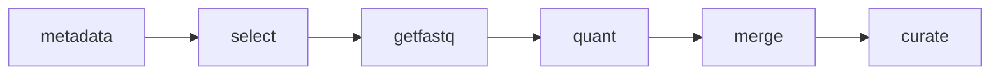

# Amalgkit Configuration

## Overview

YAML configurations for the **amalgkit** RNA-seq data integration pipeline. These configs control the full workflow: metadata retrieval → FASTQ download → transcript quantification → expression matrix generation → quality curation.

## 📦 Configuration Files

| File | Purpose | Status |
|------|---------|--------|
| `amalgkit_template.yaml` | Full reference template with all options documented | Reference |
| `amalgkit_test.yaml` | Minimal config for testing | Test |
| `amalgkit_pbarbatus_5sample.yaml` | 5-sample test run | Test |
| `amalgkit_pbarbatus_25sample.yaml` | 25-sample validation run | Test |
| `amalgkit_pbarbatus_all.yaml` | **Production**: All 110 P. barbatus samples | ✅ Complete |
| `amalgkit_pogonomyrmex_barbatus.yaml` | Full species configuration template | Reference |
| `amalgkit_apis_mellifera_all.yaml` | **Production**: All ~7,292 A. mellifera samples | 🔄 Pending |

## 🏆 Production Run Results

**P. barbatus Complete Dataset** (`amalgkit_pbarbatus_all.yaml`):

- **Samples quantified**: 95/110 (valid abundance files)
- **Expression matrices**: TPM, counts, effective length
- **Output location**: `output/amalgkit/pbarbatus_all/`

## 📊 Workflow Steps



## 🚀 Usage

### Run Complete Workflow

```bash
python scripts/rna/run_amalgkit_workflow.py --config config/amalgkit/amalgkit_pbarbatus_all.yaml
```

### Step-by-Step Execution

```bash
# Download and quantify
amalgkit getfastq --config config/amalgkit/amalgkit_pbarbatus_all.yaml
amalgkit quant --out_dir output/amalgkit/pbarbatus_all/work

# Merge results
amalgkit merge --out_dir output/amalgkit/pbarbatus_all/work

# Quality curation
amalgkit curate --out_dir output/amalgkit/pbarbatus_all/work
```

## ⚙️ Key Configuration Options

```yaml
# Basic settings
work_dir: output/amalgkit/{species}/work
threads: 12

# Species
species_list:
  - Pogonomyrmex_barbatus
taxon_id: 144034

# Critical step settings
steps:
  getfastq:
    redo: no          # Skip already-downloaded samples
    keep_fastq: no    # Delete FASTQs after quant (saves disk)
  quant:
    redo: no          # Skip already-quantified samples
    index_dir: ...    # Reuse existing kallisto index
```

## 💾 Disk Management

The workflow uses a **stream-and-clean** pattern:

1. Download sample FASTQs (~2-4 GB each)
2. Quantify with kallisto (~30 sec)
3. Delete FASTQs immediately
4. Final abundance file: ~2 MB per sample

This allows processing 100+ samples with only ~50GB free disk space.

## 🔗 Related Resources

- [Amalgkit Documentation](https://github.com/kfuku52/amalgkit)
- [Workflow Knowledge Base](/.gemini/antigravity/knowledge/metainformant_rna_workflow/)
- [Recovery Scripts](../../../scripts/rna/)
