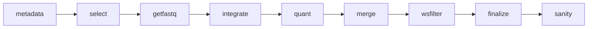

# Amalgkit configurations

These YAML files are the parent-repository mirror of the executable
Hymenoptera project configurations. They use the current command contract and
are validated against the installed Amalgkit environment.

## Default per-species chain


```mermaid
flowchart LR
    A[metadata] --> B[select]
    B --> C[getfastq]
    C --> D[integrate]
    D --> E[quant]
    E --> F[merge]
    F --> G[wsfilter]
    G --> H[finalize]
    H --> I[sanity]
```

Optional cross-species commands (`cstmm`, `csfilter`) are enabled only when
ortholog inputs are explicitly supplied.

## Validate

```bash
uv run python scripts/rna/validate_configs.py
uv run python scripts/rna/validate_all_species_workflow.py
```

Configuration presence is not data presence. Use
`AMALGKIT_DATA_ROOT=/Volumes/blue/data/amalgkit` and the project evidence
generator to report materialized species, sample counts, and completed output
contracts.
