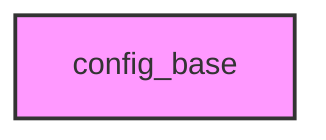

# CONFIG_BASE

## Overview
Functionality for config_base.

## 📦 Contents


## 📊 Structure


```mermaid
graph TD
    config_base[config_base]
    style config_base fill:#f9f,stroke:#333,stroke-width:2px
```

## Usage
Import module:
```python
from metainformant.config_base import ...
```
