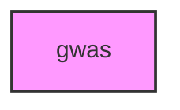

# GWAS

## Overview
Functionality for gwas.

## 📦 Contents


## 📊 Structure


```mermaid
graph TD
    gwas[gwas]
    style gwas fill:#f9f,stroke:#333,stroke-width:2px
```

## Usage
Import module:
```python
from metainformant.gwas import ...
```
