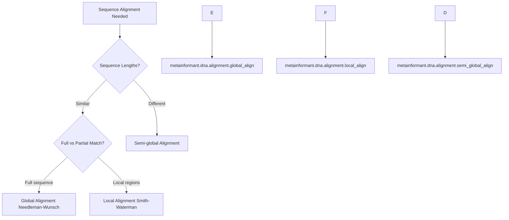
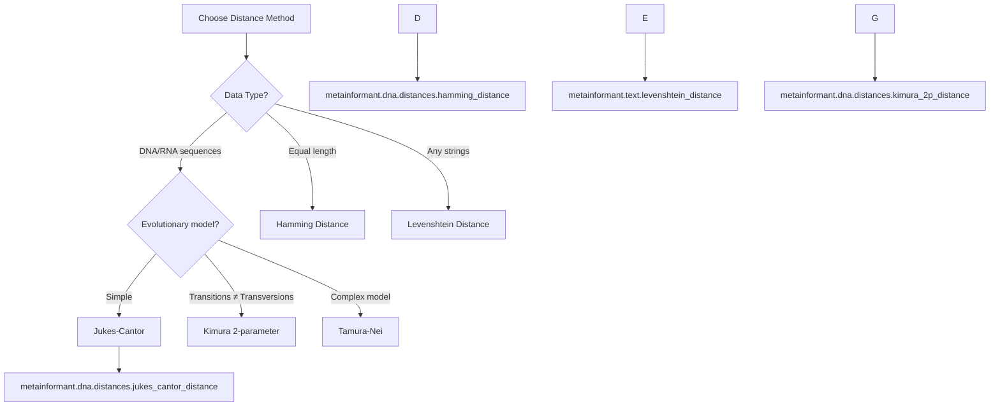
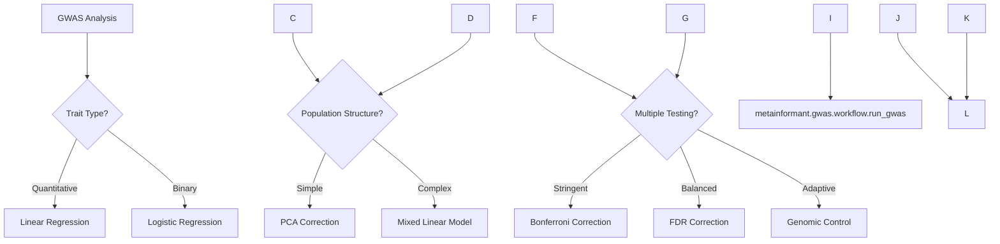
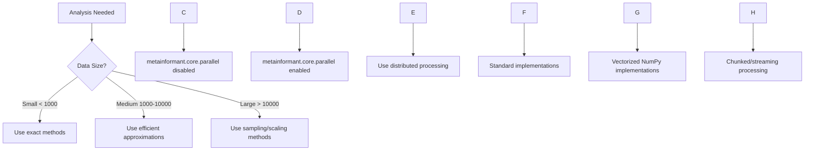
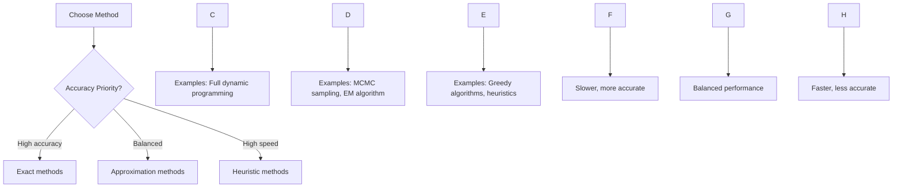

# METAINFORMANT Comparison Guides: Master Index

Decision-making guides for choosing between different analysis methods, algorithms, and approaches in METAINFORMANT.

> **New to METAINFORMANT?** → Start with the comprehensive cross-module comparison guides below before diving into method-specific details.

---

## 📚 Comprehensive Cross-Module Guides (NEW)

These guides provide full-module comparisons to help you select the right tool for your research:

| Guide | Focus | When to Read |
|-------|-------|--------------|
| **[Methods Matrix](comparisons/methods_matrix.md)** | All 28 modules compared across data types, scale, methods, outputs, best-use | **Start here** if you're unsure which module fits your data |
| **[DNA vs RNA vs Transcriptome](comparisons/dna_vs_rna_vs_transcriptome.md)** | dna, rna, singlecell, spatial, multiomics modules for transcriptomics | Choosing between bulk RNA-seq, scRNA-seq, or spatial methods |
| **[GWAS vs Phenotype vs Multi-omics](comparisons/gwas_vs_phenotype_vs_multiomics.md)** | Study design, power, integration strategies for association studies | Designing genetic association studies or multi-omic integration |
| **[Visualization Approaches](comparisons/visualization_approaches.md)** | 70+ plot types organized by domain, audience, interactivity | Choosing the right plot type for your data |

**Decision flowchart**:
```
Don't know which module?
  ↓
[Methods Matrix] → pick 2-3 candidate modules
  ↓
Read detailed comparison → choose one
  ↓
Consult method-specific section below for algorithmic details
```

---

## Method Comparison Guides

### 1. Sequence Alignment Methods

Choose the right alignment algorithm based on your sequence data and analysis goals.

#### When to Use Each Method

| Method | Best For | Advantages | Limitations | Performance |
|--------|----------|------------|-------------|-------------|
| **Global Alignment (Needleman-Wunsch)** | Similar sequences, full-length alignment | Finds optimal alignment of entire sequences | Poor with dissimilar sequences | O(n×m) time |
| **Local Alignment (Smith-Waterman)** | Subsequence similarity, database searching | Finds best matching subsequences | May miss global similarity | O(n×m) time |
| **Semi-global** | Sequences with different lengths, one complete | Handles terminal gaps appropriately | Limited use cases | O(n×m) time |

#### Decision Tree



#### Example Usage

```python
from metainformant.dna import alignment

# Short, similar sequences → Global alignment
seq1 = "ATCGATCGATCG"
seq2 = "ATCGATCGATCG"
global_result = alignment.global_align(seq1, seq2)

# Database search → Local alignment
query = "ATCGATCG"
database_seq = "TTTTATCGATCGTTTT"
local_result = alignment.local_align(query, database_seq)

# Different length sequences → Semi-global
short_seq = "ATCG"
long_seq = "TTTTATCGTTTT"
semi_result = alignment.semi_global_align(short_seq, long_seq)
```

**Related**: For full module capabilities, see [dna/index.md](dna/index.md) and [Methods Matrix](comparisons/methods_matrix.md) (dna row).

---

### 2. Population Genetics Statistics

Compare different measures of genetic diversity and selection.

#### Diversity Measures Comparison

| Statistic | Measures | Best For | Formula | Interpretation |
|-----------|----------|----------|---------|----------------|
| **π (Pi)** | Average pairwise differences | Total diversity | Σ d_ij / (n(n-1)/2) | Raw nucleotide diversity |
| **θ (Theta)** | Population mutation rate | Expected diversity | 4Nμ | Theoretical diversity |
| **Watterson's θ** | Segregating sites | Sample diversity | S / Σ(1/i) | Sites-based diversity |

#### Selection Tests Comparison

| Test | Detects | Method | Assumptions | Power |
|------|---------|--------|-------------|-------|
| **Tajima's D** | Deviation from neutrality | π vs θ comparison | Neutral evolution | High for sweeps |
| **Fu & Li's D** | Recent selective sweeps | External mutations | No recombination | High for recent events |
| **Fay & Wu's H** | Old selective sweeps | High-frequency variants | No recombination | High for old events |

#### Decision Guide

```python-snippet
from metainformant.dna import population
from metainformant.math import coalescent

# Calculate comprehensive population statistics
sequences = ["ATCG...", "GCTA...", ...]  # Your sequences

# Basic diversity
pi = population.nucleotide_diversity(sequences)
theta_w = population.wattersons_theta(sequences)

print(f"Observed diversity (π): {pi:.4f}")
print(f"Expected diversity (θ_W): {theta_w:.4f}")

# Selection tests
tajima_d = population.tajimas_d(sequences)
fu_li_d = population.fu_and_li_d_star_from_sequences(sequences)
fay_wu_h = population.fay_wu_h_from_sequences(sequences)

# Interpretation
if tajima_d < -2:
    print("Possible selective sweep or population expansion")
elif tajima_d > 2:
    print("Possible balancing selection or bottleneck")
else:
    print("Neutral evolution")
```

**Related**: For population-scale association, see [GWAS vs Phenotype vs Multi-omics](comparisons/gwas_vs_phenotype_vs_multiomics.md). For theoretical background, see [math/](math/index.md).

---

### 3. Distance/Similarity Measures

Choose appropriate distance metrics for different data types.

#### Sequence Distance Methods

| Method | Data Type | Properties | Use Case | Implementation |
|--------|-----------|------------|----------|----------------|
| **Hamming** | Equal length sequences | Counts differences | SNP analysis | `dna.distances.hamming_distance` |
| **Jukes-Cantor** | DNA sequences | Corrects multiple hits | Evolutionary distance | `dna.distances.jukes_cantor_distance` |
| **Kimura 2-parameter** | DNA/RNA | Transition/transversion | Nucleotide evolution | `dna.distances.kimura_2p_distance` |
| **Levenshtein** | Any strings | Insertions/deletions | Sequence editing | `text.levenshtein_distance` |

#### Decision Factors



**Related**: See [Methods Matrix](comparisons/methods_matrix.md) for comparison across all distance-capable modules.

---

### 4. Machine Learning Methods

Compare classification and regression approaches for biological data.

#### Classification Methods

| Method | Strengths | Weaknesses | Best For | Implementation |
|--------|-----------|------------|----------|----------------|
| **Random Forest** | Handles mixed data, feature selection | Can overfit, less interpretable | Complex biological data | `ml.classification.train_classifier(method="rf")` |
| **SVM** | Effective in high dimensions | Slow training, kernel choice | Gene expression classification | `ml.classification.train_classifier(method="svm")` |
| **Logistic Regression** | Interpretable, fast | Assumes linear relationships | Simple feature sets | `ml.classification.train_classifier(method="lr")` |
| **Naive Bayes** | Fast, works with small data | Independence assumption | Text/protein classification | `ml.classification.train_classifier(method="nb")` |

#### Feature Selection Methods

| Method | Type | Best For | Speed | Implementation |
|--------|------|----------|-------|----------------|
| **Mutual Information** | Filter | Non-linear relationships | Fast | `ml.features.select_features(method="mutual_info")` |
| **Recursive Elimination** | Wrapper | Any classifier | Slow | `ml.features.select_features(method="rfe")` |
| **LASSO** | Embedded | Linear relationships | Medium | `ml.features.select_features(method="lasso")` |
| **Variance Threshold** | Filter | High variance features | Fast | `ml.features.select_features(method="variance")` |

#### Usage Example

```python
from metainformant import ml
import numpy as np

# Prepare data
X = np.random.randn(1000, 100)  # Features
y = np.random.randint(0, 2, 1000)  # Binary labels

# Compare methods
methods = ["rf", "svm", "lr"]
results = {}

for method in methods:
    # Train classifier
    clf = ml.classification.train_classifier(X, y, method=method)

    # Cross-validate
    cv_scores = ml.classification.cross_validate_classifier(clf, X, y, cv=5)
    results[method] = cv_scores

# Compare results
print("Classification Method Comparison:")
for method, scores in results.items():
    print(f"{method}: Mean accuracy = {scores['accuracy']:.3f} (+/- {scores['accuracy_std']:.3f})")

# Feature selection comparison
feature_methods = ["mutual_info", "variance"]
for method in feature_methods:
    selected_X, mask = ml.features.select_features(X, y, method=method, k=20)
    print(f"{method}: Selected {selected_X.shape[1]} features")
```

**Related**: Full ML capabilities in [ml/](ml/index.md); see [Methods Matrix](comparisons/methods_matrix.md) ML row; also see [information/](information/index.md) for Mutual Information background.

---

### 5. GWAS Analysis Methods

Compare different approaches to genome-wide association studies.

#### Association Test Methods

| Method | Data Type | Advantages | Disadvantages | Use Case |
|--------|-----------|------------|---------------|----------|
| **Linear Regression** | Quantitative traits | Fast, interpretable | Assumes normality | Most GWAS |
| **Logistic Regression** | Binary traits | Handles case-control | Slower than linear | Disease studies |
| **Mixed Linear Model** | Related individuals | Controls population structure | Computationally intensive | Family studies |
| **Score Test** | Large datasets | Memory efficient | Less powerful | Biobank data |

#### Population Structure Control

| Method | Approach | Best For | Implementation |
|--------|----------|----------|----------------|
| **PCA** | Dimensionality reduction | Simple structure | `gwas.structure.compute_pca` |
| **Kinship Matrix** | Relatedness estimation | Complex pedigrees | `gwas.structure.compute_kinship_matrix` |
| **Admixture** | Ancestry proportions | Admixed populations | `gwas.structure.admixture_analysis` |

#### Multiple Testing Correction

| Method | Type | Conservative? | Power | Implementation |
|--------|------|---------------|-------|----------------|
| **Bonferroni** | Family-wise | Very conservative | Low power | `gwas.correction.bonferroni_correction` |
| **FDR (BH)** | False discovery | Balanced | Good power | `gwas.correction.fdr_correction` |
| **Genomic Control** | Inflation correction | Adaptive | Medium power | `gwas.correction.genomic_control` |

#### GWAS Workflow Decision Tree



**Related**: Full GWAS documentation [gwas/index.md](gwas/index.md); study design comparison see [GWAS vs Phenotype vs Multi-omics](comparisons/gwas_vs_phenotype_vs_multiomics.md); fine-mapping and colocalization (eQTL) in [eqtl/](eqtl/index.md).

---

### 6. Information Theory Measures

Compare different information-theoretic approaches to biological data analysis.

#### Entropy Measures

| Measure | Formula | Interpretation | Best For |
|---------|---------|----------------|----------|
| **Shannon Entropy** | H(X) = -Σ p(x) log p(x) | Information content | Sequence complexity |
| **Rényi Entropy** | H_α(X) = (1/(1-α)) log Σ p(x)^α | Generalized entropy | Fractal analysis |
| **Tsallis Entropy** | S_q(X) = (1/(q-1)) (Σ p(x)^q - 1) | Non-extensive entropy | Complex systems |

#### Mutual Information Measures

| Measure | Properties | Use Case | Implementation |
|---------|------------|----------|----------------|
| **MI** | Symmetric, non-negative | Feature selection | `information.syntactic.mutual_information` |
| **CMI** | Conditional independence | Causal inference | `information.syntactic.conditional_mutual_information` |
| **Normalized MI** | Bounded [0,1] | Similarity comparison | `information.syntactic.normalized_mutual_information` |

#### Usage Comparison

```python-snippet
from metainformant.information import syntactic

# Compare entropy measures
sequence = "ATCGATCGATCGATCG"
prob_dist = [0.25, 0.25, 0.25, 0.25]  # Uniform

shannon = syntactic.shannon_entropy(prob_dist)
renyi = syntactic.renyi_entropy(prob_dist, alpha=2.0)
tsallis = syntactic.tsallis_entropy(prob_dist, q=2.0)

print(f"Shannon entropy: {shannon:.3f}")
print(f"Rényi entropy (α=2): {renyi:.3f}")
print(f"Tsallis entropy (q=2): {tsallis:.3f}")

# Compare MI measures
x = [1, 0, 1, 0, 1]  # Binary variable 1
y = [1, 1, 0, 0, 1]  # Binary variable 2
z = [0, 1, 0, 1, 0]  # Conditional variable

mi = syntactic.mutual_information(x, y)
cmi = syntactic.conditional_mutual_information(x, y, z)
nmi = syntactic.normalized_mutual_information(x, y)

print(f"Mutual Information: {mi:.3f}")
print(f"Conditional MI: {cmi:.3f}")
print(f"Normalized MI: {nmi:.3f}")
```

**Related**: MI for feature selection in [ml/feature selection](ml/index.md#feature-selection); [Methods Matrix](comparisons/methods_matrix.md) information row; visualization of information measures [visualization/information.md](visualization/information.md).

---

### 7. Network Analysis Methods

Compare graph algorithms for biological network analysis.

#### Community Detection

| Algorithm | Method | Strengths | Weaknesses | Implementation |
|-----------|--------|-----------|------------|----------------|
| **Louvain** | Modularity optimization | Fast, hierarchical | Resolution limit | `networks.community.louvain_communities` |
| **Leiden** | Louvain improvement | Faster, more accurate | Less established | `networks.community.leiden_communities` |
| **Girvan-Newman** | Edge betweenness | Intuitive | Slow, no hierarchy | `networks.community.girvan_newman` |

#### Centrality Measures

| Measure | Calculates | Best For | Example Use |
|---------|------------|----------|-------------|
| **Degree** | Node connectivity | Hub identification | Protein interaction hubs |
| **Betweenness** | Bridge importance | Information flow | Key regulatory genes |
| **Closeness** | Average distance | Efficiency | Central metabolites |
| **Eigenvector** | Influence importance | Prestige | Important pathways |

#### Network Construction Methods

| Method | Data Source | Properties | Use Case |
|--------|-------------|------------|----------|
| **PPI Networks** | Protein interactions | Undirected, weighted | Functional modules |
| **Regulatory Networks** | TF-target relationships | Directed, signed | Gene regulation |
| **Co-expression** | Correlation networks | Undirected, weighted | Expression modules |
| **Metabolic Networks** | Biochemical reactions | Directed, bipartite | Pathway analysis |

**Related**: Network visualization [visualization/networks.md](visualization/networks.md); integration with multi-omics [multiomics/](multiomics/index.md); [Methods Matrix](comparisons/methods_matrix.md) networks row.

---

### 8. Multi-Omic Integration Methods

Compare approaches for combining multiple biological data types.

#### Integration Strategies

| Strategy | Method | Advantages | Disadvantages | Implementation |
|----------|--------|------------|---------------|----------------|
| **Early Integration** | Concatenation | Simple, preserves features | High dimensionality | `multiomics.integration.concatenate` |
| **Intermediate** | Joint dimensionality reduction | Balances complexity | Information loss | `multiomics.integration.joint_pca` |
| **Late Integration** | Separate models + ensemble | Preserves data types | Complex optimization | `multiomics.integration.ensemble_integration` |

#### Dimensionality Reduction

| Method | Properties | Best For | Implementation |
|--------|------------|----------|----------------|
| **PCA** | Linear, unsupervised | Global structure | `multiomics.integration.pca_integration` |
| **CCA** | Linear, supervised | Cross-modal correlation | `multiomics.integration.cca_integration` |
| **NMF** | Parts-based | Non-negative data | `multiomics.integration.nmf_integration` |
| **Autoencoders** | Non-linear | Complex relationships | `multiomics.integration.ae_integration` |

**Related**: Full multi-omics guide [multiomics/index.md](multiomics/index.md); eQTL integration [eqtl/](eqtl/index.md); [GWAS vs Phenotype vs Multi-omics](comparisons/gwas_vs_phenotype_vs_multiomics.md) for integration strategies; [Methods Matrix](comparisons/methods_matrix.md) multiomics row.

---

## Performance Comparison Tables

### Computational Complexity

| Method | Time Complexity | Space Complexity | Scalability |
|--------|-----------------|------------------|-------------|
| Sequence alignment | O(n×m) | O(n×m) | Low (1000s bp) |
| GWAS association | O(n×p) | O(n×p) | Medium (10^5 SNPs) |
| Network analysis | O(v+e) | O(v+e) | High (10^4 nodes) |
| ML classification | O(n×f) | O(n×f) | High (10^6 samples) |
| Information theory | O(n) | O(n) | Very high |

### Memory Requirements

| Analysis Type | Minimum RAM | Recommended RAM | Example Dataset |
|---------------|-------------|-----------------|-----------------|
| DNA alignment | 1GB | 4GB | 100 sequences × 10kb |
| GWAS | 8GB | 32GB | 10^4 samples × 10^6 SNPs |
| RNA-seq | 16GB | 64GB | 100 samples × 50M reads |
| Single-cell | 32GB | 128GB | 10^4 cells × 20K genes |
| Network analysis | 4GB | 16GB | 10^4 nodes × 10^5 edges |

**Related**: For detailed per-module resource estimates, see [Methods Matrix](comparisons/methods_matrix.md) table by module.

---

## Decision Frameworks

### Data Size Decision Tree



### Accuracy vs Speed Trade-off



---

## Best Practices

### Method Selection Guidelines

1. **Start Simple**: Begin with basic methods to establish baseline results
2. **Validate Assumptions**: Ensure your data meets method assumptions
3. **Compare Methods**: Use multiple approaches to validate findings
4. **Consider Scale**: Choose methods appropriate for your data size
5. **Validate Results**: Cross-check results with known biological expectations

### Performance Optimization

1. **Profile First**: Identify bottlenecks before optimizing
2. **Use Appropriate Data Structures**: Choose efficient representations
3. **Leverage Parallelization**: Use multiple cores when possible
4. **Implement Caching**: Cache expensive computations
5. **Consider Streaming**: Process large files incrementally

### Result Validation

1. **Biological Plausibility**: Do results make biological sense?
2. **Statistical Rigor**: Are p-values and confidence intervals appropriate?
3. **Reproducibility**: Can results be reproduced with different methods?
4. **Sensitivity Analysis**: How robust are results to parameter changes?

---

## Cross-Reference Navigation

**Quick links to related comparison guides**:

| From Method… | To Guide |
|--------------|----------|
| Alignment algorithms | [Methods Matrix → dna row](comparisons/methods_matrix.md#dna) |
| GWAS association tests | [GWAS vs Phenotype → Study Design](comparisons/gwas_vs_phenotype_vs_multiomics.md) |
| ML classification | [Visualization → ROC, decision boundaries](comparisons/visualization_approaches.md) |
| Multi-omics PCA/CCA | [DNA vs RNA → Multi-omics section](comparisons/dna_vs_rna_vs_transcriptome.md) |
| Information entropy | [ML → Feature Selection using MI](ml/features.md) |
| Network community detection | [Visualization → Network plots](comparisons/visualization_approaches.md) |
| All variability in sample size needs | [Performance Tables → Memory Requirements](#performance-comparison-tables) |

---

## Quick-Starts by Data Type (One-Liners)

```bash
# DNA sequences → alignment, phylogeny
uv run python -m metainformant dna align --method global seq1.fasta seq2.fasta

# RNA-seq FASTQ → quantification (bulk)
uv run python -m metainformant rna workflow --config rna_config.yaml

# Genotype VCF + phenotype → GWAS
uv run python -m metainformant gwas run --config gwas_config.yaml

# Single-cell h5ad → clustering + trajectory
uv run python -m metainformant singlecell analyze --input cells.h5ad

# Multi-omic datasets → joint PCA
uv run python -m metainformant multiomics integrate --dna variants.tsv --rna expr.tsv

# Any plot → visualization
uv run python -m metainformant viz manhattan --gwas results.tsv --out fig.pdf
```

---

## Summary

These comparison guides help you:
1. **Select the right module** for your data and question ([Methods Matrix](comparisons/methods_matrix.md))
2. **Understand trade-offs** between approaches (DNA vs RNA, GWAS vs Phenotype)
3. **Choose visualization types** for publication and exploration ([Visualization Approaches](comparisons/visualization_approaches.md))
4. **Optimize performance** via resource planning tables and decision trees
5. **Follow best practices** for method selection, validation, and reproducibility

**Need more detail?** → See each module's own documentation at `docs/<module>/index.md` for complete API reference and tutorials.
