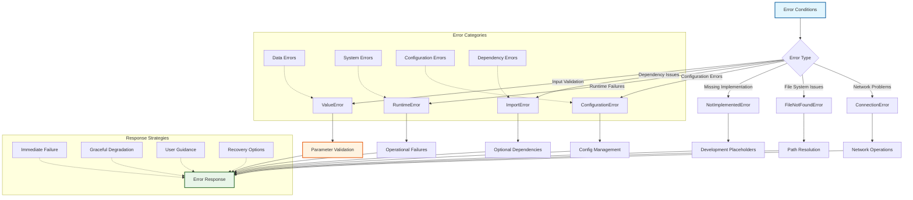
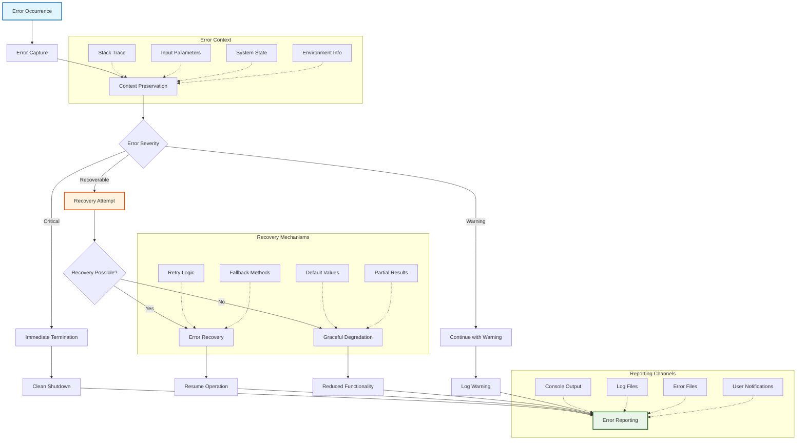
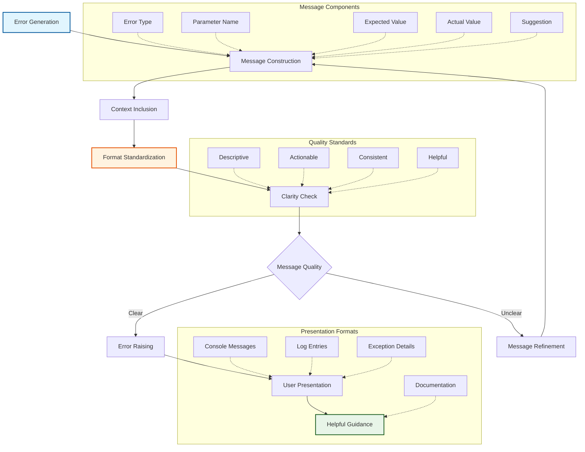
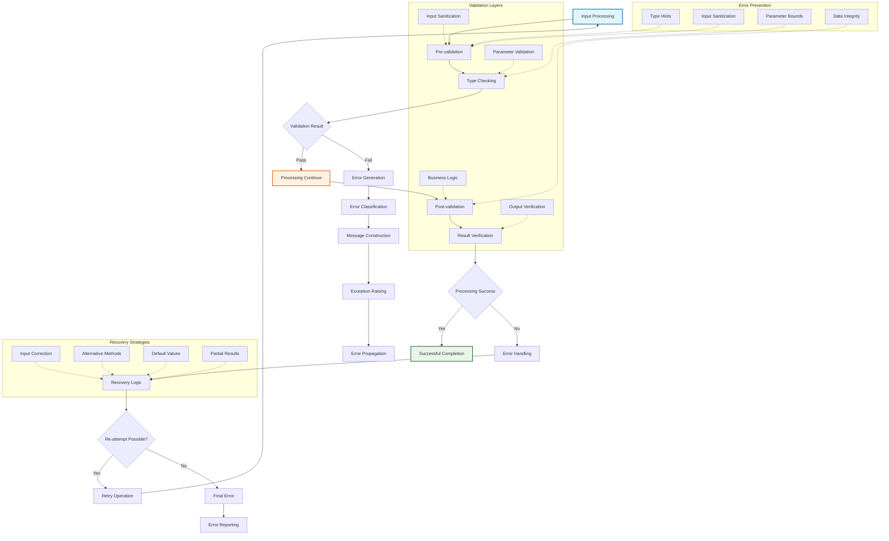

# Error Handling Policy

This document defines the comprehensive error handling policy for the METAINFORMANT codebase, ensuring consistent error reporting, graceful failure recovery, and user experience across all modules.

## Error Handling Architecture

### Error Classification Framework



### Error Propagation and Recovery



### Error Message Standardization



### Validation and Error Prevention



## Error Handling Principles

### 1. Error Types and Usage

#### ValueError
- **When to use**: Invalid input parameters or data that violates domain constraints
- **Examples**:
  - Empty sequences when non-empty required
  - Mismatched array lengths
  - Invalid parameter values (negative where positive required)
  - Malformed data structures

#### ImportError
- **When to use**: Missing optional dependencies required for functionality
- **Examples**:
  - scipy not available for statistical functions
  - matplotlib not available for plotting
  - External tools not on PATH (bcftools, GATK, amalgkit)

#### NotImplementedError
- **When to use**: Functionality not yet implemented (placeholders)
- **Examples**:
  - Placeholder functions awaiting implementation
  - Optional features not yet developed
  - API methods without concrete implementation

#### RuntimeError
- **When to use**: Runtime failures in valid operations
- **Examples**:
  - Network failures during downloads
  - File system errors during I/O
  - External tool execution failures

#### FileNotFoundError
- **When to use**: Required files or directories not found
- **Examples**:
  - Missing input data files
  - Invalid output directory paths

### 2. Error Message Guidelines

#### Format
```python
raise ValueError(f"Parameter '{param_name}' must be {requirement}, got {actual_value}")
```

#### Requirements
- **Clear**: Explain what went wrong and why
- **Actionable**: Suggest how to fix the problem
- **Consistent**: Use similar phrasing for similar errors
- **Contextual**: Include relevant parameter names and values

#### Examples
```python
# Good
raise ValueError(f"Sequence cannot be empty for correlation calculation")

# Good
raise ImportError(
    "scipy is required for fisher_exact_test(). "
    "Install with: pip install metainformant[scientific] or pip install scipy"
)

# Good
raise NotImplementedError(
    "Full attention weight extraction not yet implemented. "
    "This function returns uniform weights as placeholder."
)
```

### 3. Function Return Behavior

#### Invalid Input Handling
- **Validation functions**: Raise exceptions for invalid inputs
- **Computational functions**: Validate inputs, raise exceptions for violations
- **I/O functions**: Raise specific exceptions (FileNotFoundError, PermissionError)

#### Edge Cases
- **Empty inputs**: Raise ValueError unless mathematically valid (e.g., empty sum = 0)
- **Zero variance**: Return 0.0 (mathematically correct) or raise ValueError based on context
- **Division by zero**: Raise ValueError or return appropriate sentinel value

### 4. Optional Dependencies

#### Import Patterns
```python
try:
    import scipy.stats
    SCIPY_AVAILABLE = True
except ImportError:
    SCIPY_AVAILABLE = False
    scipy = None  # type: ignore
```

#### Function Implementation
```python
def statistical_function(data):
    if not SCIPY_AVAILABLE:
        raise ImportError(
            "scipy required for statistical functions. "
            "Install with: pip install scipy"
        )
    # Use scipy functionality
```

#### Documentation
- Clearly indicate optional dependencies in docstrings
- Provide installation instructions in error messages
- Use conditional imports to avoid hard failures

### 5. Logging Integration

#### Error Logging
```python
logger.error(f"Operation failed: {error}", extra={"context": relevant_data})
raise  # Re-raise after logging
```

#### Warning for Degraded Functionality
```python
logger.warning("Optional dependency unavailable, using fallback method")
```

### 6. Testing Error Conditions

#### Error Test Patterns
```python
def test_invalid_input():
    with pytest.raises(ValueError, match="cannot be empty"):
        function_with_validation(empty_input)

def test_missing_dependency():
    # Mock import failure
    with patch.dict('sys.modules', {'scipy': None}):
        with pytest.raises(ImportError, match="scipy required"):
            scipy_dependent_function()
```

### 7. Module-Specific Guidelines

#### Core Utilities
- **I/O functions**: Raise specific exceptions (FileNotFoundError, PermissionError)
- **Validation functions**: Raise ValueError with clear parameter names
- **Caching**: Log warnings for cache misses, raise exceptions for corruption

#### Domain Modules (DNA, RNA, etc.)
- **Data validation**: ValueError for invalid biological data
- **External tools**: ImportError with installation instructions
- **Computational limits**: ValueError for sequences too large to process

#### Statistical Modules (Math, ML)
- **Invalid parameters**: ValueError with mathematical context
- **Numerical instability**: Warning logs, return NaN or appropriate fallback
- **Convergence failures**: RuntimeError with convergence details

### 8. User Experience Considerations

#### Error Message Quality
- **Helpful**: Include parameter names, expected vs actual values
- **Educational**: Explain why the constraint exists when relevant
- **Recoverable**: Suggest alternative approaches when possible

#### Graceful Degradation
- **Optional features**: Warn and continue with reduced functionality
- **Fallback methods**: Use simpler algorithms when advanced ones fail
- **Partial results**: Return partial results with warnings when possible

### 9. Implementation Checklist

For new functions, ensure:
- [ ] Input validation with appropriate exceptions
- [ ] Clear error messages following guidelines
- [ ] Optional dependency handling
- [ ] Logging for significant errors
- [ ] Tests for error conditions
- [ ] Documentation of error behavior

### 10. Migration Guide

#### Updating Existing Code
1. **Identify silent failures**: Functions returning 0.0/None for errors
2. **Add proper validation**: Raise ValueError for invalid inputs
3. **Update tests**: Add tests for new exception behavior
4. **Update documentation**: Document new error conditions
5. **Consider backward compatibility**: Use deprecation warnings if needed

#### Example Migration
```python
# Before
def covariance(x, y):
    if len(x) != len(y):
        return 0.0  # Silent failure
    # ...

# After
def covariance(x, y):
    if len(x) != len(y):
        raise ValueError(f"Sequences must have same length: {len(x)} != {len(y)}")
    if not x:
        raise ValueError("Sequences cannot be empty")
    # ...
```

This policy ensures consistent, helpful error handling throughout METAINFORMANT, improving both developer experience and user reliability.
