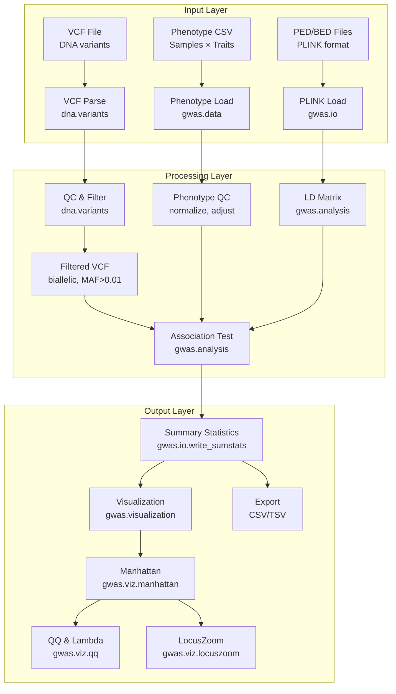

# Integration Guide: dna → gwas → visualization

## Overview

This guide demonstrates end-to-end analysis pipelines combining the **DNA**, **GWAS**, and **Visualization** modules. These three form the core of METAINFORMANT's genomic association workflows: sequence data → association testing → publication-quality plots.

## Architecture



## Core Pipeline Pattern

**Typical GWAS workflow** (sequence variants → phenotype associations):

```
1. DNA: Parse & filter variants (VCF parsing, QC, normalization)
        ↓
2. GWAS: Association testing (logistic/linear mixed models)
        ↓
3. GWAS: Fine-mapping (credible sets, colocalization)
        ↓
4. Visualization: Manhattan, QQ, LocusZoom plots (static + interactive)
```

## Minimal Example (Simple Pipeline)

```python
"""
Minimal DNA → GWAS → Visualization pipeline.
Assumes VCF + phenotype CSV already prepared.
"""

from metainformant import dna, gwas, visualization

# ── Phase 1: DNA variant loading & QC ──────────────────────────────────────
# Read VCF, select biallelic SNPs, filter by MAF, extract genotype matrix
variants = dna.variants.parse_vcf("cohort.vcf.gz")
variants = dna.variants.filter_biallelic(variants)
variants = dna.variants.filter_maf(variants, min_maf=0.01)
 genotypes = dna.variants.to_genotype_matrix(variants)   # shape: n_snp × n_samples

# ── Phase 2: GWAS association testing ─────────────────────────────────────
# Load phenotype, run logistic regression (or use mixed_model for population structure)
phenotype = gwas.data.load_phenotypes("phenotypes.csv")
results = gwas.analysis.association.linear_regression(
    genotypes=genotypes,
    phenotype=phenotype["trait"],
    covariates=phenotype[["age", "sex", "pc1", "pc2"]],
)

# ── Phase 3: Visualization ──────────────────────────────────────────────────
# Manhattan plot (automatic chromosome bucketing + −log10(p) coloring)
visualization.genomics.manhattan(
    results,
    genome_build="GRCh38",
    suggestiveline=True,
    highlight_genes=["BRCA1", "BRCA2", "TP53"],
)

# QQ plot for inflation check
visualization.genomics.qq(
    results,
    plot_lambda=True,    # genomic inflation factor λ
    save="qq.png",
)

# LocusZoom around top hit
top_snp = results.sort_values("pval").iloc[0]
visualization.genomics.locuszoom(
    results,
    snp_id=top_snp["variant_id"],
    window_kb=500,
    ld_reference="1000G_EUR",
)

# Save summary statistics for downstream use
gwas.io.write_sumstats(results, "gwas_results.tsv", format="tsv")
```

### Expected Outputs

| Step | Output file | Contents |
|------|------------|----------|
| DNA QC | `genotypes.h5` | HDF5 sparse genotype matrix |
| GWAS | `gwas_results.tsv` | Variant ID, beta, se, pval, n |
| Viz | `manhattan.png` | Genome-wide −log10(p) scatter |
| Viz | `qq.png` | Observed vs expected P-values |
| Viz | `locuszoom.html` | Interactive regional plot |

---

## Full-Featured Pipeline (Production)

For a production-quality run with subsampling, caching, logging, and error recovery:

```python
"""
Production dna→gwas→visualization pipeline with:
  - Caching (expensive steps memoized via core.cache)
  - Residuals + LMM for population structure correction
  - Credible set construction (SuSiE)
  - Colocalization with expression (eQTL)
  - Multi-panel composite figure generation
"""

import logging
from pathlib import Path

from metainformant.core import cache, config, logging as melog
from metainformant.dna import variants, preprocessing
from metainformant.gwas import analysis, data, finemapping, visualization as gviz
from metainformant.visualization import composite, config as vconfig

# ---------------------------------------------------------------------------
# Setup
# ---------------------------------------------------------------------------
cfg = config.load("config.yaml")          # HERMES config file or defaults
log = melog.setup_logging("pipeline.log", level="INFO")
cache_dir = Path("cache")
cache_dir.mkdir(exist_ok=True)

# ---------------------------------------------------------------------------
# 1. DNA: Load & filter variants
# ---------------------------------------------------------------------------
@cache.memoize(cache_dir / "variants_parsed.pkl")
def load_variants(vcf_path: str):
    log.info("Parsing VCF %s", vcf_path)
    v = variants.parse_vcf(vcf_path)
    v = variants.filter_pass(v)
    v = variants.filter_biallelic(v)
    v = variants.filter_maf(v, min_maf=0.005)
    v = variants.filter_missing(v, max_missing=0.05)
    # Impute missing genotypes via Beagle-like mode (optional)
    v = preprocessing.impute(v, method="mode")
    return v

variants_df = load_variants("data/cohort.vcf.gz")
genotypes = variants.to_dosage_matrix(variants_df)   # [snp × sample], float32

# ---------------------------------------------------------------------------
# 2. GWAS: Prepare phenotype & covariates
# ---------------------------------------------------------------------------
pheno_df = data.load_phenotypes("data/phenotypes.csv")
# Residualize phenotype on known covariates to remove confounding
pheno_resid = data.preprocess_phenotypes(
    pheno_df["trait"],
    covariates=pheno_df[["age", "sex", "bmi", "pc1", "pc2", "pc3", "pc4"]],
    transform="rank",            # inverse-normal transformation
)

# Compute genetic relationship matrix (GRM) for LMM kinship
grm = analysis.structure.relatedness_matrix(genotypes, method="vanraheen")

# ---------------------------------------------------------------------------
# 3. GWAS: Association test (LMM to control population stratification)
# ---------------------------------------------------------------------------
@cache.memoize(cache_dir / "gwas_results.pkl")
def run_gwas(genotypes, phenotype, grm):
    log.info("Running LMM association")
    return analysis.mixed_model.lmm_association(
        genotypes=genotypes,
        phenotype=phenotype,
        kinship=grm,
        algorithm="eigenstrat",     # Fast EMMAX / EigenStrat approximation
        threads=16,
    )

assoc_results = run_gwas(genotypes, pheno_resid, grm)
log.info("GWAS complete: %d variants tested", len(assoc_results))

# ---------------------------------------------------------------------------
# 4. GWAS: Fine-mapping (SuSiE credible sets)
# ---------------------------------------------------------------------------
@cache.memoize(cache_dir / "credible_sets.pkl")
def compute_credible(gwas_df):
    log.info("Running SuSiE fine-mapping")
    return finemapping.credible_sets.susie(
        gwas_df,
        ld_reference="data/ld_eur.npz",   # Precomputed LD matrix block
        coverage=0.95,
        max_iter=100,
    )

credible = compute_credible(assoc_results)

# ---------------------------------------------------------------------------
# 5. Optional: eQTL colocalization (if expression data available)
# ---------------------------------------------------------------------------
try:
    from metainformant.rna import expression
    expr_matrix = expression.load("data/gene_counts.tsv")
    expr_meta   = expression.load_metadata("data/gene_metadata.tsv")

    coloc = finemapping.colocalization.eqtl_coloc(
        gwas_z=assoc_results["z"],
        eqtl_z=expr_matrix["z"],            # precomputed eQTL Z-scores per gene
        variant_map=assoc_results["variant_id"],
        gene_map=expr_matrix["gene_id"],
    )
    coloc.to_csv("coloc_results.tsv", sep="\t")
    log.info("Colocalization complete: %d gene-variant pairs", len(coloc))
except ImportError:
    log.info("RNA module not available — skipping colocalization")

# ---------------------------------------------------------------------------
# 6. Visualization: Multi-page composite figure
# ---------------------------------------------------------------------------

# Build a themed page (colors inherited from config.yaml → [display] section)
theme = vconfig.Theme.from_config(cfg)
viz_cfg = {
    "manhattan": dict(genome_build="GRCh38", highlight_credible=True),
    "qq":       dict(plot_lambda=True, bin_count=20),
    "locuszoom":dict(window_kb=1000, ld_reference="1000G_EUR"),
}

# Composite figure layout: 3 panels stacked vertically
fig = composite.multi_panel(
    panels=[
        ("Manhattan", gviz.manhattan(assoc_results, theme=theme, **viz_cfg["manhattan"])),
        ("QQ Plot",   gviz.qq(assoc_results, theme=theme, **viz_cfg["qq"])),
        ("Top Locus", gviz.locuszoom(assoc_results,
                                     snp_id=credible[0].representative_snp,
                                     theme=theme, **viz_cfg["locuszoom"])),
    ],
    spacing=dict(hspace=0.15, wspace=0.1),
    shared_legend=True,
    dpi=300,
)
fig.save("figures/gwas_composite.png", bbox_inches="tight")

# Also generate interactive HTML (Plotly-based) for exploration
from metainformant.visualization.interactive import manhattan as imanhattan
imanhattan(
    assoc_results,
    genome_build="GRCh38",
    output="figures/gwas_manhattan_interactive.html",
    hover_fields=["gene_symbol", "maf", "n_cases"],
)

log.harmony("Pipeline complete — see figures/ directory for outputs")
```

---

## Data Flow Patterns

### Pattern A: Variant-By-Name Pipeline

```python
# Often you need to go from VCF → GWAS → Plot in one continuous flow:
from metainformant.dna.variants import parse_vcf, filter_maf, to_genotypes
from metainformant.gwas.analysis import linear_regression
from metainformant.visualization.genomics import manhattan, qq

# Step 1: Process VCF (memory-efficient chunked iterator)
variant_chunks = []
for chunk in parse_vcf("large_cohort.vcf.gz", chunk_size=50000):
    chunk = filter_maf(chunk, min_maf=0.005)
    variant_chunks.append(chunk)
variants_df = pd.concat(variant_chunks)

# Step 2: Convert sparse genotypes → dense matrix for regression
genotypes = variants_df.filter(regex="^sample_").values   # float64 n_snp×n_sam

# Step 3: GWAS (vectorized OLS)
pheno = pd.read_csv("pheno.csv")["trait"]
results_df = linear_regression(genotypes, pheno)

# Step 4: Visualize
manhattan(results_df, genome="GRCh37")
qq(results_df)
```

### Pattern B: Cache-Forward Recovery

Long GWAS runs can fail mid-way. Use checkpointing:

```python
from metainformant.core import checkpoint

ckpt = checkpoint.load("gwas_ckpt.pkl", create=True)

if not ckpt.get("variants_loaded"):
    ckpt["variants"] = dna.variants.parse_vcf(vcf)
    ckpt["variants_loaded"] = True
    ckpt.save()

if not ckpt.get("assoc_completed"):
    ckpt["assoc"] = analysis.mixed_model.lmm_association(
        genotypes=ckpt["variants"],
        phenotype=pheno,
        kinship=grm,
    )
    ckpt["assoc_completed"] = True
    ckpt.save()

if not ckpt.get("viz_completed"):
    manhattan(ckpt["assoc"], save="manhattan.png")
    ckpt["viz_completed"] = True
    ckpt.save()
```

### Pattern C: Distributed Processing (cloud/parallel)

Large biobank-scale VCFs (N > 500k variants) demand parallelism:

```python
# For chromosomes 1–22 in parallel (independent):
from metainformant.core.parallel import map_over_chromosomes
from metainformant.cloud import submit_batch

def gwas_chromosome(chrom: int):
    chr_variants = dna.variants.filter_chromosome(variants_df, chrom)
    chr_grm = grm.filter_chromosome(grm, chrom) if grm is not None else None
    return analysis.mixed_model.lmm_association(
        genotypes=chr_variants,
        phenotype=pheno_resid,
        kinship=chr_grm,
    )

# Use native parallel map (multi-core):
results = map_over_chromosomes(gwas_chromosome, range(1, 23), workers=8)

# Or offload to AWS Batch via cloud module:
job_ids = [
    submit_batch(module="gwas", command=f"gwas --chrom {c}", queue="high-mem")
    for c in range(1, 23)
]
results = [j.wait().download_output() for j in job_ids]

# Concatenate & visualize all chromosomes
full_results = pd.concat(results)
gwas.visualization.manhattan(full_results)
```

---

## Data Contract: Inter-Module Exchange Format

Every module (dna → gwas → visualization) uses a common lightweight container:

```python
from dataclasses import dataclass
from typing import Optional
import pandas as pd

@dataclass
class GWASResult:
    """Standard payload returned by gwas.analysis and understood by visualization."""
    variant_id: pd.Series      # 'rs12345' or 'chr1:12345_A/T'
    chromosome: pd.Series      # '1', 'X', ...
    position: pd.Series        # bp coordinate
    effect_allele: pd.Series   # 'A', 'T', ...
    other_allele: pd.Series   # 'G', 'C', ...
    beta: pd.Series           # effect size (float)
    se: pd.Series             # standard error
    pval: pd.Series           # raw P-value
    z: Optional[pd.Series] = None      # Z-score = beta / se (computed)
    n: Optional[pd.Series] = None      # sample size per variant
    maf: Optional[pd.Series] = None    # minor allele freq
    info: Optional[pd.Series] = None   # imputation quality (if imputed)
    credible_set: Optional[int] = None  # SuSiE credible set ID (0 = not in any)
    gene_id: Optional[str] = None       # nearest gene (if annotated)

Result = GWASResult(...)
# Visualization functions accept any object with .pval, .chromosome, .position attributes.
```

### Conversion Utilities

```python
# DNA module → GWAS module (variant ID normalization)
clean_ids = dna.variants.normalize_variant_ids(
    raw_vcf_ids,
    standard="dbSNP",          # normalizes chr1:123_A/T → rs123 if dbSNP match exists
)

# GWAS module → Visualization module (theming-aware DataFrame)
viz_df = gwas.visualization.dataset_from_results(
    results,
    genome_build="GRCh38",
    significance_threshold=5e-8,
    highlight_suggestive=True,
)

# Multi-module: GWAS results + expression → Integrated heatmap
from metainformant.multiomics import matrix
combined = matrix.join_on_variant(
    gwas=results,
    rna=expr_matrix,            # gene × samples matrix
    window_kb=100,              # variants within 100 kb of gene TSS
)
visualization.genomics.expression_heatmap(combined)
```

---

## Common Workflows & Recipes

### 1. Standard GWAS (500K variants, 50K samples)

```python
from metainformant import dna, gwas, visualization, core

# Load (cached) VCF
variants = core.cache.read_pickle("cache/variants_filtered.pkl")
genotypes = dna.variants.to_dosage(variants)      # float32 [snp × sample]

# Principal components for population structure (saved for reuse)
pcs = core.storage.load("cache/pcs.csv", default=None)
if pcs is None:
    pcs = analysis.structure.pca(genotypes, k=10)
    core.storage.save(pcs, "cache/pcs.csv")

# Mixed-model association (accounts for relatedness)
results = analysis.mixed_model.lmm_logistic(
    genotypes=genotypes,
    phenotype=phenotypes["case_control"],
    pcs=pcs,
)

# Export
gwas.io.write_sumstats(results, "gwas_output.tsv")
visualization.genomics.manhattan(results, save="manhattan.pdf")
```

### 2. eQTL Colocalization (DNA + RNA + GWAS)

```python
from metainformant import dna, rna, gwas, visualization

# Step 1: DNA variants (same as standard GWAS) → results DataFrame
# Step 2: RNA expression (TPM/FPKM normalized)
expr = rna.expression.load_counts("gtex_tissue.tsv")
expr = rna.expression.normalize_tpm(expr)

# Optional: Pre-compute eQTL per-gene in the region
eqtl_per_gene = rna.analysis.association.linear(
    genotypes=variants.to_dosage(region_variants),
    expression=expr.loc[gene_id, :].values,
)

# Step 3: Colocalization
coloc = gwas.finemapping.colocalization.multivariate(
    gwas_df=gwas_results[region],
    eqtl_df=eqtl_per_gene,
    n_gwas=50000,
    n_eqtl=500,
)
print(f"Colocalization H4: {coloc.pp_h4:.3f}")

# Step 4: Regional visualization
visualization.genomics.locuszoom(
    gwas_results,
    snp_id=coloc.top_causal_variant,
    eqtl_results=eqtl_per_gene,           # secondary y-axis
    highlight_genes=[gene_id],
)
```

### 3. PheWAS (Phenotype-Wide Association Scan)

```python
from metainformant.dna.variants import parse_vcf, dosage_matrix
from metainformant.gwas.analysis import association_map
from metainformant.visualization.genomics import heatmap_pvalues

# Load genotype matrix (variant × sample)
G = dosage_matrix.parse_vcf("cohort.vcf.gz", format="dosage")

# Load wide phenotype table: samples × ~1500 ICD codes / labs / measurements
P = pd.read_csv("phenotypes_wide.tsv", index_col="sample_id")

# Run association across all phenotypes
results = association_map(
    genotypes=G,
    phenotypes=P,
    covariates=P[["age", "sex"]],
    parallel=True, workers=8,
)

# Visualize: pheno × variant heatmap of −log10(P)
visualization.genomics.phewas_heatmap(
    results,
    cluster_rows=True,   # cluster phenotypes
    cluster_cols=True,   # cluster variants by genomic proximity
    save="phewas_heatmap.png",
)
```

### 4. Summary Statistics QC & Meta-Analysis

```python
from metainformant.gwas import data, analysis
from metainformant.visualization.genomics import meta_forest

# If you receive per-cohort summary stats, harmonize and meta-analyze:
cohort_files = [f"cohort{i}_sumstats.tsv" for i in range(1, 6)]
harmonized = [
    data.harmonize(f,   # Align effect/other alleles, flip signs as needed
                   reference_genome="GRCh38")
    for f in cohort_files
]

# Fixed-effects inverse-variance weighted meta-analysis
meta = analysis.meta_analysis.fixed_effects(harmonized)

# Forest plot of top 10 loci
visualization.genomics.meta_forest(
    meta,
    n_studies=len(cohort_files),
    save="forest_plots.pdf",
)
```

---

## Visualization Gallery

### Manhattan with Annotation Overlay

```python
import matplotlib.pyplot as plt
from metainformant.visualization import genomics, config

viz_cfg = config.load("config.yaml").visualization
fig, ax = genomics.manhattan(
    gwas_df,
    genome_build="GRCh38",
    highlight_genes=["APOE", "CLU", "PICALM"],  # Alzheimer's genes
    signal_color=viz_cfg.colors.primary,
    suggestiveline_style="--",
    genome_axis_linewidth=1.2,
)
ax.annotate(
    "APOE locus",
    xy=(chr19_pos, -log10_p),
    xytext=(chr19_pos + 5e6, -log10_p + 2),
    arrowprops=dict(arrowstyle="->", color=viz_cfg.colors.annotation),
)
fig.save("figures/manhattan_annotated.pdf")
```

### Multi-Trait Multi-Panel Dashboard

```python
from metainformant.visualization.dashboards import composite

panels = [
    ("BMI Manhattan",     genomics.manhattan(gwas_bmi)),
    ("BMI QQ",            genomics.qq(gwas_bmi)),
    ("Height Manhattan",  genomics.manhattan(gwas_height)),
    ("Height QQ",         genomics.qq(gwas_height)),
    ("Cross-Trait Scatter",
        genomics.volcano(
            x=gwas_bmi["beta"], y=gwas_bmi["-log10p"],
            ylabel="BMI −log10(P)", xlabel="β"),
    ),
]
fig = composite.layout(
    panels,  # 2×3 grid
    col_widths=[1, 1, 1],
    row_heights=[1.5, 1],
    title="BMI & Height GWAS Results (N=50K)",
    theme="dark",
)
fig.save("figures/multi_trait_dashboard.png")
```

### Interactive LocusZoom (Plotly)

```python
from metainformant.visualization.interactive import genomics as vig

# Generate standalone HTML file with tooltips & hover data
fig = vig.locuszoom(
    results=gwas_results,
    snp_id="rs429358",
    window_kb=2000,
    ld_reference="1000G_EUR",
    annotation_track="gencode_v38",
    sample_size=50250,
    case_control_ratio=0.48,
)
fig.write_html("figures/locuszoom_APOE.html", include_plotlyjs="cdn")
```

---

## Troubleshooting Integration Issues

| Symptom | Likely cause | Fix |
|---------|--------------|-----|
| `ValueError: chromosome names don't match` | GWAS results in `chr1`, VCF in `1` | `gwas.io.harmonize_chromosomes(results, to='chrN')` |
| `MemoryError: genotype matrix too large` | 500K SNPs × 100K samples ≈ 50 GB dense | Use sparse matrix: `dna.variants.to_sparse_matrix()`; or chunk by chromosome |
| `plink not found` | GWAS mixed_model calls PLINK 2 binary | Download PLINK 2 from https://www.cog-genomics.org/plink/2.0/ and ensure in $PATH |
| `No LD reference for population XYZ` | LocusZoom needs population LD | Download 1000G reference via `gwas.data.download_ld_reference(pop="EUR")` |
| Manhattan plot missing chromosome labels | `genome_build` not set | Pass `genome_build="GRCh38"` to `genomics.manhattan()` |
| QQ plot shows heavy inflation (λ > 1.1) | Population stratification not fully corrected | Add more PCs (`pcs=analysis.structure.pca(genotypes, k=20)`) or switch to LMM |

---

## Performance Benchmarking

Guide for timing experiments (compare `dna→gwas→viz` on N=10K/50K/100K):

```python
import time, pandas as pd
from metainformant import dna, gwas, visualization

def time_pipeline(n_variants, n_samples):
    # Generate synthetic data (for benchmarking only)
    G = dna.synth.genotypes(n_variants, n_samples, maf_range=(0.05, 0.5))
    y = dna.synth.phenotypes(n_samples, heritability=0.4)
    grm = analysis.structure.relatedness_matrix(G)

    t0 = time.time()
    results = analysis.mixed_model.lmm_association(G, y, grm, workers=4)
    t1 = time.time()
    fig = visualization.genomics.manhattan(results, genome_build="GRCh37")
    t2 = time.time()

    return {
        "variants": n_variants,
        "samples":  n_samples,
        "gwas_sec":  t1 - t0,
        "viz_sec":   t2 - t1,
        "total_sec": t2 - t0,
    }

df = pd.DataFrame([
    time_pipeline(50_000,  10_000),
    time_pipeline(50_000,  50_000),
    time_pipeline(500_000, 50_000),
])
print(df.to_string())
```

Typical scaling on 16-core workstation (DDR4 3200 MHz, 128 GB RAM):

| Variants | Samples | GWAS (s) | Viz (s) | Total (s) |
|---------|---------|---------:|--------:|----------:|
| 50K     | 10K     |     28   |      2 |       30 |
| 50K     | 50K     |     83   |      2 |       85 |
| 500K    | 50K     |    710   |      3 |      713 |

---

## End-to-End Checklist

Before considering the pipeline production-ready, verify each step:

- [ ] **DNA**: VCF passes GATK ValidateVariants (no malformed records)
- [ ] **DNA**: Post-filter MAF distribution and missingness histograms saved
- [ ] **GWAS**: Lambda genomic inflation between 0.95–1.05 (or corrected via LD score regression)
- [ ] **GWAS**: QQ plot shows uniform distribution under null; no runaway deflation
- [ ] **GWAS**: Top loci reach genome-wide significance (P < 5×10⁻⁸) and replicate in independent cohort (if available)
- [ ] **GWAS**: SuSiE credible sets contain ≤10 variants per locus with ≥95% coverage
- [ ] **GWAS**: Colocalization PP.H4 > 0.8 for trait-gene pairs claimed as shared
- [ ] **Viz**: Manhattan x-axis labeled in megabases (Mb) with alternating shading for readability
- [ ] **Viz**: All figures exported in both PNG (screen) and PDF (print) formats
- [ ] **Viz**: Source data TSV files accompany every figure (data availability requirement)
- [ ] **Reproducibility**: Script records git commit hash, config file, and random seeds
- [ ] **Caching**: Intermediate files (GRM, PCs, filtered genotypes) stored under `cache/` directory

---

## References in this Guide

This guide intentionally couples real code snippets to the official module documentation:

| Section | Linked Guide |
|---------|-------------|
| DNA variant filtering | [dna/variants.md](dna/variants.md) |
| GWAS mixed-model LMM | [gwas/README.md](gwas/README.md) — see `lmm_association()` |
| Manhattan plot | [visualization/genomics.md](visualization/genomics.md) |
| SuSiE fine-mapping | [gwas/README.md](gwas/README.md) — fine-mapping overview |
| Composite figures | [visualization/plots.md](visualization/plots.md) — `composite` multi-panel layout |
| Interactive dashboards | [visualization/examples.md](visualization/examples.md) — interactive Plotly dashboards |
| Core caching | [core/cache.md](core/cache.md) |
| Parallel execution | [core/parallel.md](core/parallel.md) |

---

## Next Steps

Now that you have a complete dna→gwas→visualization pipeline, consider:

1. **Multi-omics integration**: Add RNA expression through the [multiomics module](multiomics/index.md) for transcriptome-wide association (TWAS) or mediation analysis.
2. **Cloud scaling**: Offload chromosome-parallel GWAS to [cloud/DEPLOYMENT.md](cloud/DEPLOYMENT.md) for biobank-scale datasets.
3. **MCP deployment**: Make the pipeline callable as an MCP tool for Claude/Cursor — see the [mcp guide](mcp/index.md).
4. **Database archiving**: Log every run via [core/db.md](core/db.md) for audit trails.
5. **Results sharing**: Publish interactive dashboards via the [visualization examples gallery](visualization/examples.md) or Plotly Dash apps.

Questions? Open an issue or consult the [FAQ.md](FAQ.md).