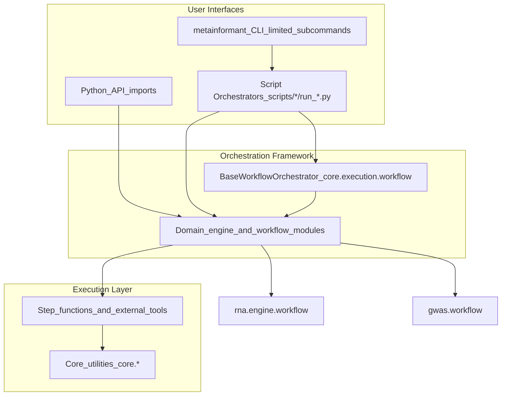
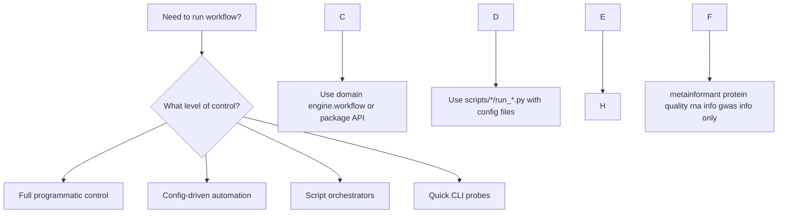

# METAINFORMANT Orchestration Guide

## Overview

METAINFORMANT provides a layered orchestration architecture for running bioinformatics workflows across multiple domains. This guide explains the orchestration paradigm and when to use each layer.

## Orchestration Layers



## When to Use Each Layer

### Decision Tree



### Layer Descriptions

#### 1. CLI Interface (`metainformant`)

**Purpose**: Narrow entry point for a few utilities (`protein`, `quality batch-detect`, module `info` stubs). Not used for full RNA or GWAS pipelines.

**When to use:**
- Protein FASTA/PDB one-liners
- Batch-effect probe from CSV + labels
- Listing modules (`--modules`) or version

**Examples:**
```bash
uv run metainformant --modules
uv run metainformant protein comp --fasta data/example.faa
uv run metainformant quality batch-detect --data matrix.csv --batches batches.txt
uv run metainformant rna info
```

Full workflows: [cli.md](cli.md), [rna/workflow.md](rna/workflow.md), `scripts/rna/run_workflow.py`.

#### 2. Script Orchestrators (`scripts/*/run_*.py`)

**Purpose**: Production-ready workflow automation

**When to use:**
- End-to-end workflows with configuration
- Batch processing and automation
- Production deployments
- CI/CD integration
- Reproducible research pipelines

**Examples:**
```bash
# Full RNA-seq workflow
python3 scripts/rna/run_workflow.py --config config/amalgkit/species.yaml

# GWAS analysis pipeline
python3 scripts/gwas/run_genome_scale_gwas.py --config config/gwas/species.yaml

# Multi-omics integration
python3 scripts/multiomics/run_multiomics_integration.py --input data/ --output output/
```

#### 3. BaseWorkflowOrchestrator (`core.execution.workflow`)

**Purpose**: Framework for building complex workflows

**When to use:**
- Building new workflow orchestrators
- Custom workflow logic beyond domain defaults
- Research workflows with custom steps
- Integration of multiple domains

**Pattern:**
```python
from metainformant.core.execution.workflow import BaseWorkflowOrchestrator

class CustomWorkflow(BaseWorkflowOrchestrator):
    def get_steps(self) -> List[str]:
        return ["preprocess", "analyze", "postprocess"]

    def execute_step(self, step_name: str, step_config: Dict[str, Any]) -> Dict[str, Any]:
        # Custom step logic
        pass

workflow = CustomWorkflow("custom", Path("output/custom"))
results = workflow.run_workflow()
```

#### 4. Domain workflows (RNA engine, GWAS workflow package)

**Purpose**: Domain-specific workflow execution from Python

**When to use:**
- Direct programmatic control
- Embedding in notebooks or services
- Steps beyond what a single script exposes

**Examples:**
```python
from pathlib import Path

from metainformant.gwas import execute_gwas_workflow
from metainformant.gwas.workflow.workflow_config import load_gwas_config
from metainformant.rna.engine.workflow import execute_workflow, load_workflow_config

rna_cfg = load_workflow_config(Path("config/amalgkit/amalgkit_pogonomyrmex_barbatus.yaml"))
rna_results = execute_workflow(rna_cfg, check=False)

gwas_cfg = load_gwas_config("config/gwas/gwas_template.yaml")
gwas_results = execute_gwas_workflow(gwas_cfg)
```

## Thin Script Wrapper Pattern

### Overview

Most script orchestrators follow a "thin wrapper" pattern: they parse arguments and call domain workflow functions with minimal logic.

### Pattern Structure

```python
#!/usr/bin/env python3
"""Thin wrapper script for domain workflow orchestration."""

# 1. Setup imports and environment
import argparse
from pathlib import Path
# Import the domain workflow entrypoint (path varies), e.g.:
# from metainformant.rna.engine.workflow import execute_workflow

# 2. Parse arguments (config, output dir, etc.)
parser = argparse.ArgumentParser()
parser.add_argument("--config", required=True)
parser.add_argument("--output", default="output/domain")
args = parser.parse_args()

# 3. Call domain workflow (all logic in src/) — example for RNA:
# from metainformant.rna.engine.workflow import execute_workflow, load_workflow_config
# results = execute_workflow(load_workflow_config(Path(args.config)))

# 4. Handle results and exit codes (shape depends on domain)
# if not getattr(results, "success", True):
#     exit(1)
```

### Benefits

- **Logic Centralization**: All workflow logic in `src/metainformant/`
- **Testability**: Domain functions can be tested independently
- **Reusability**: Same logic usable from scripts, CLI, or direct API calls
- **Maintainability**: Changes in one place affect all entry points

## Step Function Standards

### Signature Pattern

All step functions follow a consistent signature:

```python
def run_step_name(config: Dict[str, Any], **kwargs) -> Dict[str, Any]:
    """Execute step_name workflow step.

    Args:
        config: Step configuration dictionary
        **kwargs: Additional parameters

    Returns:
        Dictionary with step results:
        {
            "status": "completed|failed|skipped",
            "output": {...},  # Step-specific results
            "errors": [...],  # Error messages if failed
            "warnings": [...], # Warning messages
            "metadata": {...} # Additional metadata
        }
    """
```

### Error Handling

- Return `{"status": "failed", "errors": ["error message"]}` on failure
- Use `{"status": "skipped", "reason": "reason message"}` for conditional skips
- Include `warnings` for non-fatal issues
- Log progress with `metainformant.core.utils.logging`

### Result Structure

```python
{
    "status": "completed",  # "completed" | "failed" | "skipped"
    "output": {
        "files_created": ["path/to/output.txt"],
        "metrics": {"accuracy": 0.95},
        # Step-specific results
    },
    "errors": [],  # List of error messages
    "warnings": [],  # List of warning messages
    "metadata": {
        "execution_time": 45.2,
        "memory_used": "1.2GB",
        # Additional metadata
    }
}
```

## Configuration Patterns

### Config Loading Hierarchy

1. **Base config**: `config/domain/default.yaml`
2. **Environment overrides**: `DOMAIN_*` environment variables
3. **User config**: `--config path/to/config.yaml`
4. **Command-line overrides**: `--param value`

### Config Structure

```yaml
# config/domain/workflow.yaml
work_dir: output/domain/workflow
threads: 8
verbose: true

domain_specific:
  parameter1: value1
  parameter2: value2

steps:
  step1:
    enabled: true
    config: {...}
  step2:
    enabled: false
    config: {...}
```

## Best Practices

### Script Development

1. **Keep scripts thin**: Parse args, call domain functions
2. **Use core utilities**: Import from `metainformant.core.*`
3. **Handle errors gracefully**: Check return status, log appropriately
4. **Document usage**: Include comprehensive `--help` text

### Workflow Development

1. **Inherit from BaseWorkflowOrchestrator**: For complex workflows
2. **Follow step standards**: Consistent signatures and return values
3. **Use core logging**: `get_logger(__name__)` for all logging
4. **Validate inputs**: Check config and file paths early

### Integration

1. **Cross-domain calls**: Use domain workflow functions directly
2. **Shared utilities**: Leverage `core.*` modules for common tasks
3. **Config patterns**: Follow established config loading patterns
4. **Error propagation**: Maintain error context across layers

## Related Documentation

- **[Core Workflow Guide](core/workflow.md)** - BaseWorkflowOrchestrator details
- **[Domain Workflows](rna/workflow.md)** - RNA workflow orchestration
- **[Configuration Guide](core/config.md)** - Configuration management
- **[CLI Reference](cli.md)** - Command-line interface
- **[Testing Guide](testing.md)** - Workflow testing patterns

