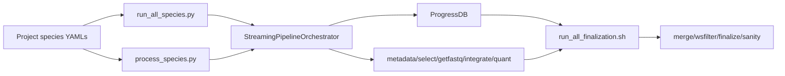

# Workflow orchestration

MetaInformAnt uses thin, domain-specific entrypoints over typed source
modules. The RNA production contract is implemented by the Hymenoptera project
launcher and the shared `StreamingPipelineOrchestrator`.

## RNA entrypoints


```mermaid
flowchart LR
    Y[Project species YAMLs] --> C[run_all_species.py]
    Y --> S[process_species.py]
    C --> P[StreamingPipelineOrchestrator]
    S --> P
    P --> DB[ProgressDB]
    P --> Q[metadata/select/getfastq/integrate/quant]
    DB --> R[run_all_finalization.sh]
    Q --> R
    R --> M[merge/wsfilter/finalize/sanity]
```

Inspect the cohort:

```bash
export AMALGKIT_DATA_ROOT=/Volumes/external_drive/Data/amalgkit
uv run python scripts/rna/run_all_species.py \
  --config-dir projects/hymenoptera_amalgkit/config/amalgkit \
  --data-root "$AMALGKIT_DATA_ROOT" --dry-run
```

Execute the complete campaign:

```bash
bash projects/hymenoptera_amalgkit/scripts/run_full_campaign.sh
```

The launcher owns the producer/downstream lock boundary. Do not start another
producer against the same data root while the lock is present.

## Other domains

Other module scripts remain domain-specific thin wrappers. Their documentation
is located under `docs/<module>/` and each script exposes `--help`. The core
workflow utilities are reusable building blocks, but a domain entrypoint must
declare its data root, configuration, outputs, and completion evidence.

## Completion

An orchestration process is not an analysis result. The RNA campaign is complete
only when current stage receipts, sample-ID reconciliation, valid matrices,
and the regenerated evidence manifest agree. See the [RNA validation protocol](rna/VALIDATION.md)
and [Hymenoptera reproducibility checklist](../projects/hymenoptera_amalgkit/doc/manuscript/reproducibility_checklist.md).
