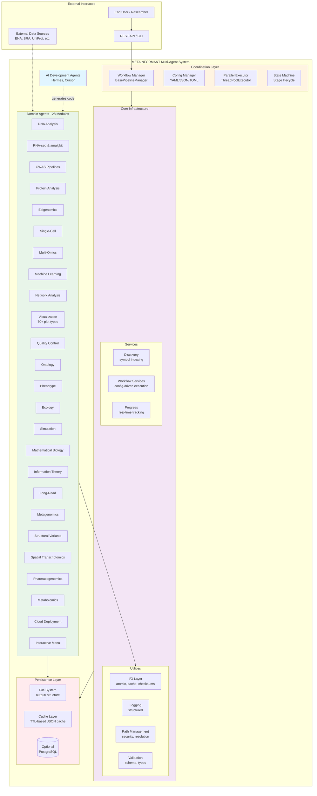
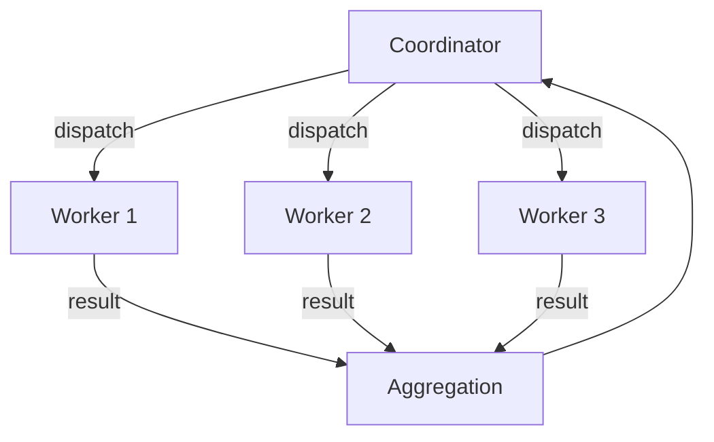
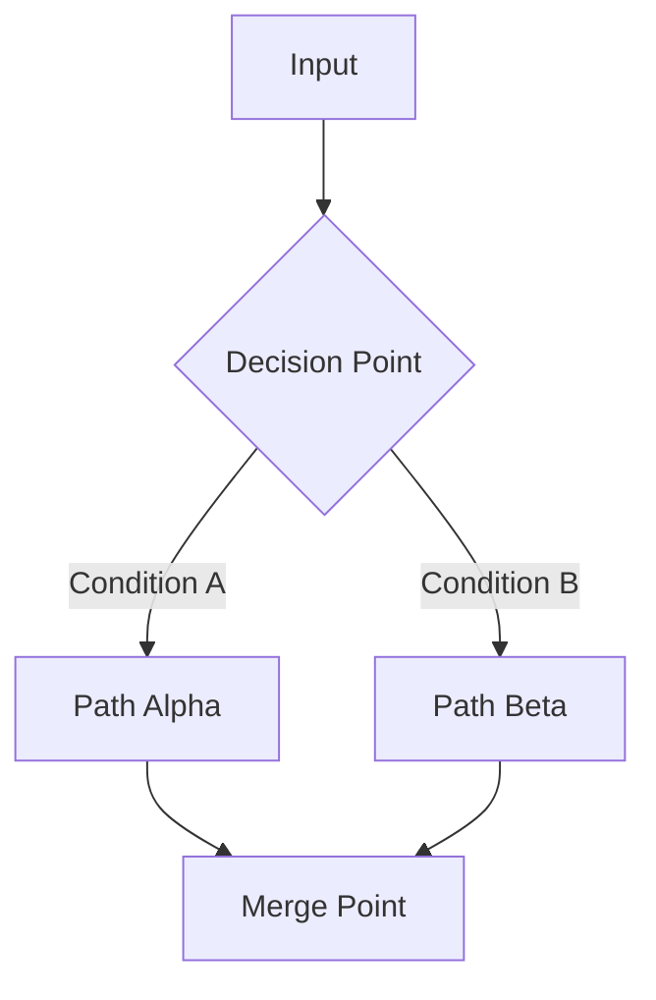
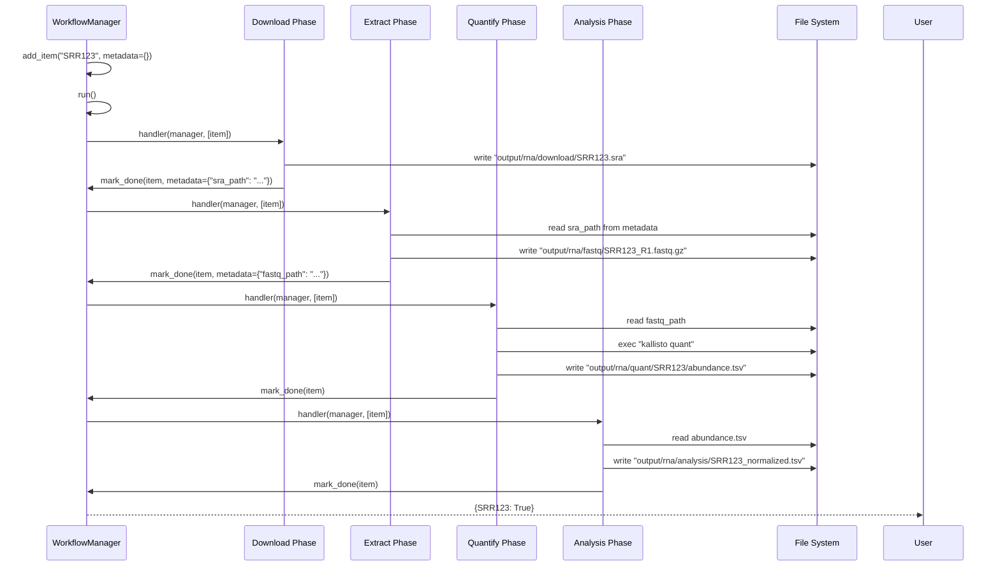
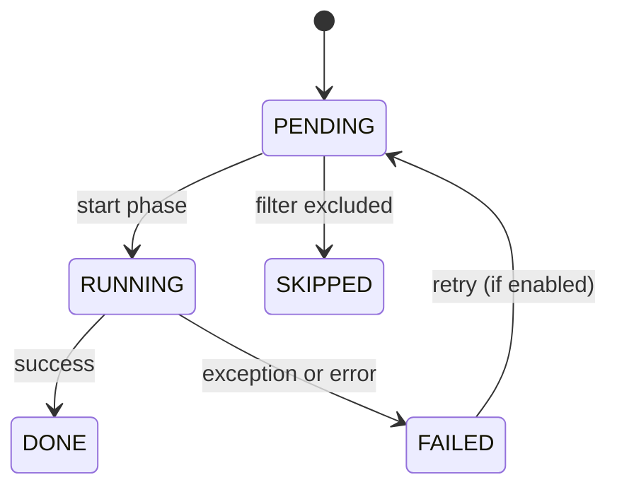

# Architecture: Agent Coordination in METAINFORMANT

**Status**: Stable  
**Audience**: System architects, advanced developers, contributors  
**Scope**: Multi-agent architecture, coordination patterns, data flow

## Executive Summary

METAINFORMANT employs a layered multi-agent architecture enabling 28 specialized bioinformatics modules to operate independently while coordinating through well-defined protocols. The system handles industrial-scale workflows (documented: 8,300+ samples across 28 Hymenoptera species) with robust error handling, parallel execution, and real-time visualization.

## System Context



## Layered Coordination Model

### Layer 1: AI Development Agents (Hermes, Cursor)

- Generate/refactor code following [Agent Directives](AGENTS.md)
- Create/modify documentation per [Documentation Standards](../../CONTRIBUTING.md)
- Operate within [Cursor Rules](rules/) for module-specific patterns

### Layer 2: Orchestration Layer

**Workflow Manager** (`metainformant.core.engine.workflow_manager`):

| Component | Purpose | API |
|-----------|---------|-----|
| `BasePipelineManager` | Generic multi-phase orchestrator | `add_item()`, `run()`, `mark_*()` |
| `PipelinePhase` | Named execution stage with handler | `handler(manager, items)` |
| `PipelineItem` | Work item with lifecycle tracking | `item_id`, `metadata`, `stage`, `error` |
| `Stage` enum | Lifecycle states | `PENDING → RUNNING → DONE/FAILED` |

**Config-Driven Execution** (`metainformant.core.execution.workflow`):
- Declarative YAML/JSON configurations
- Schema validation (`validate_config_file()`)
- Template generation (`create_sample_config()`)

**Parallel Execution** (`metainformant.core.execution.parallel`):
- Resource-aware worker allocation
- `thread_map()`, `process_map()` utilities
- `resource_aware_workers()` for CPU/memory constraints

### Layer 3: Domain Pipeline Agents

Each module (`dna/`, `rna/`, `gwas/`, etc.) implements:

- **Entry points**: CLI commands, Python APIs
- **Phase handlers**: Functions compatible with `PipelinePhase.handler`
- **Domain logic**: Bioinformatic algorithms, statistical methods
- **Output generation**: Results to `output/{module}/`

**Dependency Rule**: Domain agents use only Core utilities (I/O, logging, paths). Never depend on other domain modules directly — coordinate through config/CLI boundaries.

### Layer 4: Core Utilities

Shared infrastructure accessed by all agents:

| Subpackage | Exports | Purpose |
|------------|---------|---------|
| `io/` | `load_json`, `dump_json`, `read_csv`, `write_csv` | Atomic, gzip-aware I/O |
| `utils/logging` | `get_logger` | Structured logging with context |
| `paths/` | `expand_and_resolve`, `is_within` | Secure path operations |
| `config/` | `load_mapping_from_file`, `apply_env_overrides` | Configuration management |
| `cache/` | `JsonCache` | TTL-based result caching |
| `discovery/` | `discover_functions`, `index_symbols` | Symbol indexing and cross-reference |
| `parallel/` | `thread_map`, `resource_aware_workers` | Task parallelism |

## Coordination Patterns

### Pattern 1: Sequential Pipeline

Simple left-to-right execution:


**Used by**: Single-sample workflows, deterministic processing chains.

**Implementation**: Default `BasePipelineManager.run()` loops through phases sequentially.

**Example modules**: `rna` (per-sample processing), `quality` (QC steps).

### Pattern 2: Parallel Fan-Out / Fan-In

Horizontal scaling of independent tasks:



**Used by**: Batch processing of hundreds/thousands of samples.

**Implementation**: `PipelinePhase.handler` submits work to `manager.executor.submit()`, collects via `as_completed()`.

**Example modules**: `rna` (download 8,300 SRAs concurrently), `gwas` (batch association tests), `metagenomics` (multiple samples).

### Pattern 3: Conditional Branching

Dynamic workflow selection:



**Used by**: Multi-omic integration, quality-dependent processing paths.

**Implementation**: Handler decides next action based on `item.metadata` or external data; may modify remaining phase list dynamically (advanced).

**Example modules**: `multiomics` (integration method depends on data types), `simulation` (scenario-dependent paths).

### Pattern 4: Nested/Recursive Workflows

Sub-pipeline invocation:

```python
def _parent_phase(manager, items):
    for item in items:
        # Create child workflow
        child = SubWorkflow(item.metadata["config"])
        child_results = child.run()
        item.metadata["child_results"] = child_results
        manager.mark_done(item)
```

**Used by**: Complex multi-stage analyses (e.g., GWAS fine-mapping after association).

**Example modules**: `gwas` (association → fine-mapping → colocalization), `rna` (retrieval → QC → quantification → normalization).

### Pattern 5: Event-Driven / Reactive

Workflow continues upon external triggers:

```python
def wait_for_data(manager, items):
    for item in items:
        while not data_available(item):
            time.sleep(10)  # or use file watcher
        process(item)
        manager.mark_done(item)
```

**Used by**: Long-running monitoring pipelines, data deposition triggers.

**Example modules**: `cloud` (VM provisioning callbacks), `menu` (user-driven navigation).

## Communication Channels

Agents communicate through three primary channels:

### 1. PipelineItem Metadata (In-Memory)

```python
item.metadata["key"] = value  # Write
value = item.metadata["key"]  # Read
```

- **Scope**: Single pipeline run, in-process
- **Use for**: Passing computed values between phases (paths, intermediate results)
- **Thread-safe**: When confined to single item within handler

### 2. Configuration Files / Config Objects

```python
config = manager.config
threads = config.get("max_workers", 5)
```

- **Scope**: Pipeline instance, constructed before run
- **Use for**: Global parameters, thresholds, flags
- **Persistence**: Configs stored as YAML/JSON for reproducibility

### 3. File System (output/ directory)

```python
# Phase A writes:
io.dump_json(results, "output/phase_a/sample1.json")

# Phase B reads:
data = io.load_json("output/phase_a/sample1.json")
```

- **Scope**: Across processes, persists between runs
- **Use for**: Large data transfer, checkpointing, audit trail
- **Convention**: `output/{module}/{phase}/{item_id}.{ext}`

## Data Flow Example: RNA-seq Pipeline



**Coordination highlights**:
- Each phase writes outputs to `output/`, passes path via metadata
- TUI updated at each stage transition
- Errors per-item allow other items to continue (fault isolation)
- Thread pool enables concurrent downloads of multiple SRAs

## State Management

### PipelineItem State Machine



### Manager State

`BasePipelineManager` maintains:

- `manager.items: dict[str, PipelineItem]` — All tracked items
- `manager.phases: list[PipelinePhase]` — Ordered execution plan
- `manager.executor: ThreadPoolExecutor` — Worker pool
- `manager.config: dict` — Global configuration
- `manager.ui: TerminalInterface` — Real-time dashboard

State transitions are **synchronous** from phase handler calls (`mark_*` methods), ensuring TUI and result dictionary remain consistent.

## Error Isolation Strategy

```mermaid
flowchart LR
    subgraph ErrorIsolation[Per-Item Fault Isolation]
        I1[Item A] -->|success| OUT[Output A]
        I2[Item B] -->|failure| ERR[Error B<br/>logged + skipped]
        I3[Item C] -->|success| OUT
        I4[Item D] -->|success| OUT
    end

    OUT --> AGG[Aggregate Results<br/>{A: True, B: False, C: True, D: True}]
    ERR --> LOG[Error Log<br/>per-item stacktrace]
```

**Benefits**:
- One failed sample doesn't block others
- Partial success reported with granular item status
- Failed items can be retried independently

**Implementation**: Each `PipelineItem` tracks its own `stage` and `error`; `run()` returns per-item success dict.

## Scalability Considerations

### Horizontal Scaling: Workers

`max_threads` configurable per workflow. Default heuristic from `resource_aware_workers()`:

| Task Type | Worker Count | Rationale |
|-----------|--------------|-----------|
| I/O-bound (downloads) | `min(cores * 4, 32)` | Overlap network latency |
| CPU-bound (quantification) | `max(1, cores - 1)` | Avoid CPU contention |
| Mixed | Split phases: I/O phases use many workers; CPU phases use few |

**Example** (RNA-seq):Downloads phase uses 32 workers (I/O bound); quantification phase uses 3 workers (CPU bound per sample).

### Vertical Scaling: Memory

Memory-monitored worker allocation (requires `psutil`):

```python
workers = resource_aware_workers(
    task_type="cpu",
    memory_per_worker_mb=2048,  # Estimated per-worker footprint
)
```

If system has 32 GB RAM and each worker needs 2 GB, cap at 16 workers.

### Data Locality

Pipeline stores intermediate files on local SSD (`output/`), avoiding repeated downloads. Checkpointing pattern:

```python
# Handler checks existence before work
if Path(output_path).exists():
    self.mark_done(item, status="Cached")
    return  # skip recompute
```

**Result**: Re-run of pipeline with same config completes in minutes (cached) vs hours (fresh).

## Cross-Cutting Concerns

### Security

- Path validation (`paths.is_safe_path()`, `paths.is_within()`)
- No shell injection: Subprocess calls use list arguments (no `shell=True`)
- Download integrity: Checksums via `io.checksums`

### Observability

- Structured logs with `logger = get_logger(__name__)`
- TUI dashboard via `TerminalInterface` (cellular progress bars, live footer)
- Per-item state visible: `item.stage`, `item.error`

### Reproducibility

- Config files committed to repo
- Output paths deterministic based on config hash
- Version stamps in output metadata

### Testing

- Zero mocks — real file I/O, real external commands
- `tmp_path` for test isolation
- End-to-end validation of full workflow (e.g., `tests/core/test_core_pipeline.py`)

## Module Integration Guide

When adding a new module to the multi-agent ecosystem:

1. **Decide coordination model**: Does your module need a pipeline manager or is it a single CLI?
   - If batch processing of multiple independent items → Use `BasePipelineManager`
   - If single-shot analysis → Use config-driven `download_and_process_data()` or custom script

2. **Define phase handlers** (if pipelined):

   ```python
   def my_phase(manager: BasePipelineManager, items: list[PipelineItem]) -> None:
       for item in items:
           manager.mark_running(item)
           try:
               result = my_domain_function(item.item_id, item.metadata)
               item.metadata["result"] = result
               manager.mark_done(item)
           except Exception as exc:
               manager.mark_failed(item, str(exc))
   ```

3. **Wire phases together**:

   ```python
   phases = [
       PipelinePhase("Fetch", fetch_handler),
       PipelinePhase("Process", process_handler),
       PipelinePhase("Report", report_handler),
   ]
   manager = BasePipelineManager(phases, max_threads=5)
   ```

4. **Integrate with CLI** (see `src/metainformant/menu/` for interactive menu pattern)

5. **Document coordination pattern** in your module's `docs/{module}/README.md` and `docs/agents/rules/{module}.md`

6. **Cross-link**: Add your module to the [Module Overview Matrix](../../docs/index.md#module-overview-matrix) and relevant toctrees.

## References

### Source Code

- [workflow_manager.py](../../src/metainformant/core/engine/workflow_manager.py) — Core orchestration engine
- [workflow.py](../../src/metainformant/core/execution/workflow.py) — Config-driven execution
- [parallel.py](../../src/metainformant/core/execution/parallel.py) — Parallel task utilities
- [tui.py](../../src/metainformant/core/ui/tui.py) — Real-time dashboard

### Specification Documents

- [Agent Directives](AGENTS.md) — Rules for agent behavior
- [Orchestration](ORCHESTRATION.md) — API reference and usage patterns
- [Multi-Agent Workflows](MULTI_AGENT_WORKFLOWS.md) — Real-world examples
- [Communication Protocols](COMMUNICATION_PROTOCOLS.md) — Inter-agent messaging
- [Safety](SAFETY.md) — Error handling and recovery

### Related Modules

- [core](../core/) — Infrastructure used by all agents
- [rna](../rna/) — Industrial-scale orchestration example (8,300+ samples)
- [cloud](../cloud/) — Distributed orchestration on GCP
- [menu](../menu/) — Interactive workflow discovery & selection
