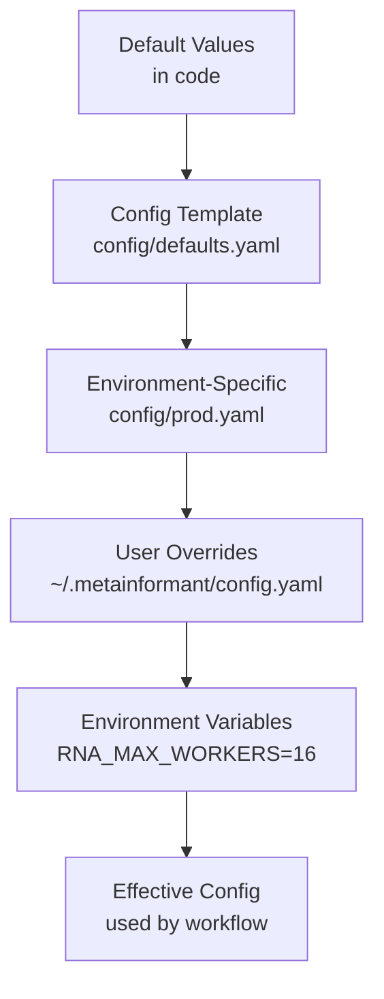

# Best Practices: Agent Configuration and Operations

**Audience**: Operators, bioinformaticians running workflows, developers  
**Scope**: Configuration management, operational guidelines, maintenance

## Table of Contents

- [Configuration Management](#configuration-management)
- [Environment Setup](#environment-setup)
- [Execution Strategies](#execution-strategies)
- [Output Management](#output-management)
- [Performance Tuning](#performance-tuning)
- [Monitoring and Observability](#monitoring-and-observability)
- [Maintenance](#maintenance)
- [Troubleshooting](#troubleshooting)
- [Production Deployment](#production-deployment)

## Configuration Management

### Configuration Hierarchy

METAINFORMANT uses a layered configuration system:



### Recommended Structure

```yaml
# config/pipeline.yaml
pipeline:
  name: "RNA-seq Analysis"
  version: "1.0.0"

resources:
  max_workers: 8
  memory_per_worker_gb: 4
  disk_space_threshold_gb: 100

input:
  sample_manifest: "data/samples.tsv"
  reference:
    genome: "references/GRCh38.fa"
    annotation: "references/GRCh38.gtf"

output:
  base_dir: "output/"
  formats: ["tsv", "parquet", "json"]

stages:
  download:
    enabled: true
    retry_attempts: 3
    timeout_seconds: 600

  quantify:
    tool: "kallisto"
    bootstrap_samples: 100

logging:
  level: "INFO"
  file: "output/logs/pipeline.log"
```

### Environment Variable Overrides

```bash
export METAINFORMANT_CONFIG_PATH="./config/custom.yaml"
export RNA_MAX_WORKERS=16           # Override worker count
export METAINFORMANT_LOG_LEVEL=DEBUG  # Verbose logging
```

Convention: `{MODULE}_{KEY}` for module-specific overrides, `METAINFORMANT_*` for global.

### Config Discovery

```python
from metainformant.core.utils.config import discover_config_files

configs = discover_config_files(repo_root=".", domain="rna")
# Returns list of matching config files sorted by precedence
```

---

## Environment Setup

### Dependency Management (UV)

**Always use `uv`** — never `pip` directly:

```bash
# Create isolated environment
uv venv .venv
source .venv/bin/activate  # or .venv\Scripts\activate on Windows

# Install project with all optional dependencies
uv sync --all-extras

# Add a new package
uv add biopython
uv add --dev pytest-cov

# Update lockfile after changes
uv lock
```

**Package groups** (defined in `pyproject.toml`):

| Group | Purpose | Install |
|-------|---------|---------|
| `rna` | RNA-seq analysis (amalgkit) | `uv sync --group rna` |
| `gwas` | GWAS tools (PLINK, SAIGE) | `uv sync --group gwas` |
| `viz` | Visualization (matplotlib, seaborn, plotly) | `uv sync --group viz` |
| `dev` | Testing, linting, docs | `uv sync --group dev` |
| `all` | Everything (default) | `uv sync --all-extras` |

### Python Version

**Requirement**: Python 3.11+ (uses `from __future__ import annotations`).

Check:

```bash
python --version  # must be >= 3.11
```

### System Dependencies

Some modules require external tools:

| Tool | Package | Module |
|------|---------|--------|
| kallisto | `kallisto` (binary) | `rna` |
| SRA toolkit | `sratoolkit` (NCBI) | `rna.retrieval` |
| PLINK | `plink1.9` / `plink2` | `gwas` |
| BWA | `bwa` (binary) | `dna` |
| Docker (optional) | `docker` daemon | `cloud` |

Install system packages via conda/apt/brew:

```bash
conda install -c bioconda kallisto plink bwa
# or
apt-get install plink bwa
```

---

## Execution Strategies

### Strategy 1: Direct CLI Execution

```bash
# Run specific workflow
python -m metainformant.rna.workflow --config config/rna_pipeline.yaml

# Or use entry point script
rna-pipeline --samples samples.tsv --output output/
```

### Strategy 2: Python API

```python
from pathlib import Path
from metainformant.core.engine.workflow_manager import BasePipelineManager, PipelinePhase
from metainformant.rna.engine.workflow import RNAWorkflowManager

# Programmatic construction
workflow = RNAWorkflowManager(
    work_dir=Path("output/rna_run1"),
    config={"samples": "samples.tsv"},
    max_threads=8,
)
results = workflow.run()

# Inspect results
successful = [sid for sid, ok in results.items() if ok]
failed = [sid for sid, ok in results.items() if not ok]
```

### Strategy 3: Interactive Menu

```bash
# Launch interactive workflow selector
python -m metainformant.menu

# Or programmatically
from metainformant.menu import WorkflowMenu
menu = WorkflowMenu()
choice = menu.select_workflow()
menu.run_workflow(choice)
```

---

## Output Management

### Directory Layout

```
output/
 {module}/
 {phase}/
 {item_id}.{ext}
 logs/
 pipeline_20250426.log
 reports/
 summary.tsv
 qc_plots/
 checkpoint.json
 shared/
 references/
 tmp/
 archive/
 2025-04-26/
```

### Output Retention Policy

Automate cleanup of stale runs:

```python
import shutil
from datetime import datetime, timedelta

def cleanup_old_runs(output_dir: Path, retention_days: int = 30):
    cutoff = datetime.now() - timedelta(days=retention_days)
    for run_dir in output_dir.glob("runs/*"):
        if run_dir.is_dir():
            mtime = datetime.fromtimestamp(run_dir.stat().st_mtime)
            if mtime < cutoff:
                shutil.rmtree(run_dir)
                logger.info(f"Removed old run: {run_dir}")
```

Schedule via cron:

```cron
0 2 * * * /usr/bin/python /path/to/cleanup.py
```

### Output Compression

Compress intermediate files not currently in use:

```python
import gzip

def compress_directory(dir_path: Path):
    for file in dir_path.rglob("*.json"):
        with open(file, "rb") as f_in, gzip.open(f"{file}.gz", "wb") as f_out:
            shutil.copyfileobj(f_in, f_out)
        file.unlink()  # delete original
```

---

## Performance Tuning

### Worker Count Selection

**Rule of thumb**:

| Resource | Task Type | Formula |
|----------|-----------|---------|
| CPU | CPU-bound (alignment, quantification) | `max(1, os.cpu_count() - 1)` |
| I/O | Downloads, API calls | `min(os.cpu_count() * 4, 32)` |
| Memory | Memory-heavy (large matrix ops) | `min(memory_available_gb // per_worker_gb, 8)` |

**Use function**:

```python
from metainformant.core.execution.parallel import resource_aware_workers

workers = resource_aware_workers(
    task_type="io",
    memory_per_worker_mb=2048,
)
```

### Memory Optimization

- **Stream large files**: Use iterators, not `read()` all at once:

  ```python
  with io.open_text_auto("large.jsonl.gz") as f:
      for line in f:  # line-by-line, not load_json()
          process(line)
  ```

- **Delete large objects** explicitly when no longer needed:

  ```python
  del large_dataframe
  import gc; gc.collect()
  ```

- **Use chunking**: Process 1,000 records at a time instead of 1 million.

### I/O Optimization

- **SSD preferred**: `output/` on fast SSD (NVMe) for temp files
- **RAM disk for temp**: If enough RAM:

  ```bash
  mount -t tmpfs -o size=50G tmpfs /mnt/ramdisk
  METAINFORMANT_TEMP_DIR=/mnt/ramdisk python -m ...
  ```

- **Compress intermediate**: Gzip `.json` after use; decompress on read

### Network Optimization

- **Parallel downloads**: Use `max_threads` > 8 for I/O bound
- **Retry with backoff**: Avoid hammering flaky endpoints
- **Cache DNS**: Pre-resolve hosts if possible

---

## Monitoring and Observability

### Logging Configuration

```python
from metainformant.core.utils.logging import setup_logging

setup_logging(
    level="INFO",  # or "DEBUG" for verbose
    format="json",  # structured JSON logs for ingestion
    log_file="output/logs/pipeline.log",
)
```

**Log levels**:
- `DEBUG`: Detailed per-item state transitions (verbose)
- `INFO`: Phase start/end, item completion
- `WARNING`: Recoverable issues (missing optional data)
- `ERROR`: Item failures, phase failures
- `CRITICAL`: Pipeline abort, system-level errors

### TUI (Terminal User Interface)

**Default**: `BasePipelineManager` auto-starts TUI.

**Disable** (for logging-only runs):

```python
manager = BasePipelineManager(phases, use_tui=False)
```

**Non-interactive** (CI/CD):

```bash
METAINFORMANT_NO_TUI=1 python -m metainformant.rna.workflow ...
```

### Metrics Collection (Optional)

If `prometheus_client` installed:

```python
from metainformant.monitoring import start_metrics_server
start_metrics_server(port=8000)  # exposes /metrics
```

Metrics include:
- `pipeline_items_total`
- `phase_duration_seconds`
- `phase_failures_total`
- `bytes_downloaded_total`

---

## Maintenance

### Dependency Updates

Keep dependencies current:

```bash
# Check for outdated packages
uv pip list --outdated

# Update specific
uv add --upgrade biopython

# Update all
uv pip compile --upgrade pyproject.toml -o uv.lock
uv sync
```

**Frequency**: Monthly, or before major analysis runs.

### Log Rotation

Configure `logging.handlers.RotatingFileHandler` in `setup_logging()`:

```python
from logging.handlers import RotatingFileHandler

handler = RotatingFileHandler(
    "output/logs/pipeline.log",
    maxBytes=100 * 1024 * 1024,  # 100 MB
    backupCount=10,
)
```

**Cron cleanup**:

```bash
# Find and compress old logs
find output/logs/ -name "*.log" -mtime +30 -exec gzip {} \;
```

### Configuration Versioning

- Keep `config/` directory under version control
- Tag releases with config hash: `git tag -a run-20250426-$(sha256sum config.yaml)`
- Document config changes in `docs/CHANGELOG.md`

### Database Maintenance (if used)

If `metainformant.core.data.db` is active:

```python
# Vacuum to reclaim space
db.execute("VACUUM FULL;")

# Analyze for query planning
db.execute("ANALYZE;")

# Backup
db.backup("backup.sql")
```

Schedule monthly if production deployment.

---

## Troubleshooting

### Common Issues and Resolutions

| Issue | Symptoms | Diagnosis | Fix |
|-------|----------|-----------|-----|
| **Pipeline hangs** | No TUI updates, CPU idle | Handler blocking main thread | Move I/O to executor, add timeouts |
| **Out of Memory** | Process killed, system swap thrashing | Too many parallel workers | Reduce `max_threads`, use batch processing |
| **Permission denied** | `OSError: [Errno 13]` | Output dir not writable | `chmod -R u+w output/` or choose different dir |
| **Disk full** | `OSError: [Errno 28]` | No space left | Clean old runs, increase storage |
| **Slow downloads** | 1 MB/s vs expected 100 MB/s | Network saturating, too few workers | Increase `max_threads` for I/O phase |
| **Checksum mismatch** | `ValueError: Checksum mismatch` | Corrupted download or mirror issue | Delete partial file, re-download, check source |
| **Module import error** | `ModuleNotFoundError` | Dependencies not installed | `uv sync --all-extras` or install specific group |
| **TUI garbled output** | Weird characters, layout broken | stdout not a TTY (piped) | Disable TUI: `use_tui=False` or `METAINFORMANT_NO_TUI=1` |

### Debugging Checklist

- [ ] Check `output/core/logs/*.log` for ERROR/CRITICAL lines
- [ ] Verify `output/` directory structure exists and is writable
- [ ] Run with `METAINFORMANT_LOG_LEVEL=DEBUG` for verbose trace
- [ ] Inspect `checkpoint.json` (if exists) for partial state
- [ ] Test handler in isolation with single item
- [ ] Confirm external tools installed (kallisto, plink): `which kallisto`
- [ ] Validate config schema: `python -m metainformant.core.execution.workflow --validate config.yaml`

### Reproducibility Verification

Document exact environment:

```bash
# Capture environment
uv export --all-extras > requirements.txt
git rev-parse HEAD > commit.txt
python -c "import metainformant; print(metainformant.__version__)" > version.txt

# Bundle
tar czf run_metadata.tar.gz requirements.txt commit.txt version.txt config/
```

---

## Production Deployment

### Systemd Service

```ini
# /etc/systemd/system/metainformant-rna.service
[Unit]
Description=METAINFORMANT RNA Pipeline
After=network.target

[Service]
Type=simple
User=bioinformatics
WorkingDirectory=/home/bioinformatics/projects/analysis
Environment="METAINFORMANT_LOG_LEVEL=INFO"
ExecStart=/home/bioinformatics/.venv/bin/python -m metainformant.rna.workflow --config /home/bioinformatics/configs/rna.yaml
Restart=on-failure
RestartSec=300

[Install]
WantedBy=multi-user.target
```

```bash
sudo systemctl enable metainformant-rna
sudo systemctl start metainformant-rna
sudo journalctl -u metainformant-rna -f  # follow logs
```

### Docker Container

```dockerfile
FROM python:3.11-slim

RUN apt-get update && apt-get install -y \
    kallisto \
    plink2 \
    && rm -rf /var/lib/apt/lists/*

WORKDIR /app
COPY . .
RUN uv sync --all-extras

ENTRYPOINT ["uv", "run", "python", "-m", "metainformant.rna.workflow"]
CMD ["--config", "/config/pipeline.yaml"]
```

Build and run:

```bash
docker build -t metainformant/rna .
docker run -v /data:/data -v /config:/config metainformant/rna --config /config/pipeline.yaml
```

### Slurm Cluster Execution

```bash
#!/bin/bash
#SBATCH --job-name=metainformant_rna
#SBATCH --ntasks=1
#SBATCH --cpus-per-task=16
#SBATCH --mem=64G
#SBATCH --time=24:00:00
#SBATCH --output=slurm-%j.out

module load python/3.11
source /path/to/venv/bin/activate

python -m metainformant.rna.workflow --config $1
```

Submit:

```bash
sbatch run_rna.slurm configs/experiment1.yaml
```

---

## Advanced Topics

### Dynamic Configuration

Modify config at runtime based on data characteristics:

```python
def adaptive_handler(manager, items):
    # Examine first item to determine parameters
    sample = items[0]
    size = Path(sample.metadata["fastq"]).stat().st_size

    if size > 10e9:  # >10 GB
        manager.config["threads"] = 16
    else:
        manager.config["threads"] = 8

    # Proceed with adaptive config
    process_batch(items, manager.config["threads"])
```

### Multi-Tenant Configuration

Isolate runs per user/project:

```python
import getpass
user = getpass.getuser()
output_base = Path(f"/shared/runs/{user}/{run_id}/")
user_config = load_mapping_from_file(f"/home/{user}/.metainformant/config.yaml")
```

### Secrets Management

Never store credentials in config files. Use:

- **Environment variables**: `export NCBI_API_KEY=xxx`
- **Secret managers**: HashiCorp Vault, AWS Secrets Manager
- **Protected files**: `~/.netrc` with restrictive permissions (`chmod 600`)

Access:

```python
import os
api_key = os.environ.get("NCBI_API_KEY")
if not api_key:
    raise ValueError("Set NCBI_API_KEY environment variable")
```

---

## Checklist for New Module

When adding a new domain module that participates in coordination:

- [ ] Define clear `PipelinePhase` handlers or config-driven schema
- [ ] Use `BasePipelineManager` if >2 phases needed
- [ ] Document metadata keys produced/consumed
- [ ] Implement **per-item** try/except calling `mark_failed()`
- [ ] Write outputs atomically via `io.dump_json()`
- [ ] Add validation at start of each handler (inputs, paths exist)
- [ ] Verify idempotency (re-run doesn't duplicate/corrupt)
- [ ] Integrate with TUI (`manager.ui.update()`)
- [ ] Add module rule in `docs/agents/rules/{module}.md`
- [ ] Cross-link from `docs/index.md` matrix
- [ ] Provide example configuration in module README

---

## Further Reading

- [Safety](SAFETY.md) detailed error handling
- [Communication Protocols](COMMUNICATION_PROTOCOLS.md) for metadata sharing
- [Orchestration](ORCHESTRATION.md) API reference
- [Multi-Agent Workflows](MULTI_AGENT_WORKFLOWS.md) — patterns in action
