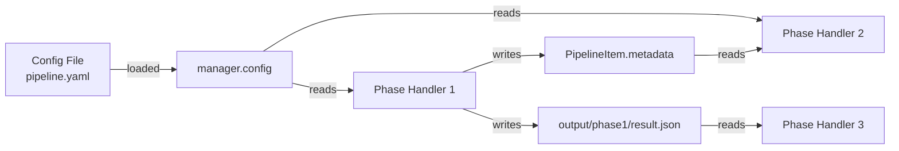

# Communication Protocols: Inter-Agent Messaging and Data Sharing

**Status**: Stable conventions  
**Audience**: All developers implementing or coordinating agents  
**Scope**: How agents exchange data, pass context, and synchronize state

## Table of Contents

- [Overview](#overview)
- [Communication Channels](#communication-channels)
- [PipelineItem Metadata](#pipelineitem-metadata)
- [Configuration Objects](#configuration-objects)
- [File System Bridge](#file-system-bridge)
- [Logging as Side-Channel](#logging-as-side-channel)
- [Error Propagation](#error-propagation)
- [Synchronization Patterns](#synchronization-patterns)
- [Data Serialization](#data-serialization)
- [Best Practices](#best-practices)
- [Anti-Patterns](#anti-patterns)

## Overview

Agents in METAINFORMANT coordinate through three primary channels:

1. **In-Memory Metadata** (`PipelineItem.metadata`) — short-lived state passed between phases within a single workflow run
2. **Configuration Objects** (`manager.config`, YAML/JSON files) — immutable parameters shared across agents
3. **File System** (`output/` directory) — persistent artifacts exchanged between runs or coarse-grained agents



## Communication Channels

### 1. PipelineItem Metadata

**Scope**: Single workflow instance, in-process memory  
**Lifetime**: Item creation → completion (DONE/FAILED)  
**Access mode**: Read/write by phase handlers  
**Thread safety**: Single item accessed by one handler at a time (phases are sequential), but metadata may be read by parallel workers (handle with care)

#### Basic Pattern

```python
def phase_a(manager, items):
    for item in items:
        result = compute(item.item_id)
        item.metadata["intermediate"] = result  # write
        manager.mark_done(item)

def phase_b(manager, items):
    for item in items:
        intermediate = item.metadata["intermediate"]  # read
        final = refine(intermediate)
        item.metadata["final"] = final
        manager.mark_done(item)
```

**Best practices**:
- Use serializable values (dict, list, str, int, float, bool, None) — enables checkpoint persistence
- Namespace keys to avoid collisions: `item.metadata["rna:fastq_dir"]` rather than just `"fastq_dir"`
- Document metadata schema in handler docstrings

**Common keys** (informal convention):

| Key | Value | Producer | Consumer |
|-----|-------|----------|----------|
| `download_url` | str | Download phase | All downstream |
| `file_path` | str | Download | Extract, validate |
| `sample_id` | str | Registration | All phases |
| `qc_report` | dict | QC phase | Filtering, analysis |
| `error` | str | Any (on failure) | Error aggregator |

#### Metadata Propagation Diagram

```mermaid
flowchart LR
    subgraph ItemLifecycle[PipelineItem Lifecycle]
        direction LR
        M1[Metadata<br/>empty] --> A[Phase A handler]
        A -->|writes<br/>"file_path"| M2[Metadata<br/>{file_path: /path}]
        M2 --> B[Phase B handler]
        B -->|writes<br/>"abundance"| M3[Metadata<br/>{..., abundance}]
        M3 --> C[Phase C handler]
        C -->|writes<br/>"normalized"| M4[Metadata<br/>{..., normalized}]
    end
```

### 2. Configuration Objects

**Scope**: Pipeline-wide constants, thresholds, flags  
**Lifetime**: Entire `BasePipelineManager` instance  
**Access**: `manager.config["key"]` (dict-style) or typed accessor

#### Configuration Pattern

```python
# Create manager with config
manager = BasePipelineManager(
    phases,
    config={
        "max_workers": 8,
        "retry_attempts": 3,
        "reference_genome": "GRCh38",
        "output_formats": ["tsv", "parquet"],
    }
)

# Handler reads config
def phase_handler(manager, items):
    genome = manager.config["reference_genome"]
    workers = manager.config.get("max_workers", 5)  # with default
```

#### Config File to Config Object

```python
from metainformant.core.utils.config import load_mapping_from_file, apply_env_overrides

cfg = load_mapping_from_file("config.yaml")
cfg = apply_env_overrides(cfg, prefix="RNA")  # env vars override, e.g., RNA_MAX_WORKERS=16
manager = BasePipelineManager(phases, config=cfg)
```

**Best practices**:
- Keep config immutable after `BasePipelineManager` construction
- Document all config keys in module README or SPEC
- Use `config.get("key", default)` to avoid KeyError

### 3. File System Bridge

**Scope**: Across processes, persistent between runs  
**Lifetime**: Until manually deleted  
**Concurrency**: Multiple agents may read/write (coordinate via path conventions)

#### Pattern: Checkpoint via Files

```python
def phase_handler(manager, items):
    for item in items:
        output_path = Path(f"output/{item.item_id}/phase_result.json")
        if output_path.exists():
            # Already done — skip (idempotent)
            item.metadata["result"] = io.load_json(output_path)
            manager.mark_done(item)
            continue

        result = compute(item)
        io.dump_json(result, output_path)  # atomic write
        item.metadata["result"] = str(output_path)
        manager.mark_done(item)
```

**Advantages**:
- Resumable workflows: restart after crash without recompute
- Visible audit trail: `output/` directory is self-documenting
- Other processes can consume outputs outside pipeline (e.g., analysis scripts)

#### Path Naming Convention

```
output/
  {module}/
    {phase_name}/
      {item_id}.{ext}
    checkpoint.json  # global state (optional)
```

Example: `output/rna/download/SRR123456.sra`, `output/rna/quant/SRR123456/abundance.tsv`

**Best practices**:
- Use `io.dump_json()` (atomic) not `open().write()`
- Validate paths with `paths.is_within(output_dir, user_provided)` to prevent directory traversal
- Include item ID in directory name for easy globbing: `glob(f"output/rna/quant/{item_id}/*")`

## Error Propagation

### Error Flow Through Pipeline

```mermaid
flowchart TD
    H[Phase Handler] -->|try/except| E{Exception?}
    E -->|No| D[edit mark_done()]
    E -->|Yes| L[Log full traceback]
    L --> F[mark_failed(error)]
    F --> I[Item.stage = FAILED]
    I --> R[Results[item_id] = False]

    subgraph Isolation[Error Isolation per Item]
 I1[Item A ] -.->|unaffected| R1[True]
 I2[Item B ] --> R2[False]
 I3[Item C ] -.->|unaffected| R3[True]
    end
```

### Structured Error Reporting

```python
ERROR_CODES = {
    "NETWORK": "ERR_NET_001",
    "FORMAT": "ERR_DATA_002",
    "MEMORY": "ERR_SYS_003",
}

def safe_handler(manager, items):
    for item in items:
        try:
            do_work(item)
            manager.mark_done(item)
        except NetworkError as e:
            msg = f"{ERROR_CODES['NETWORK']}: {e.url} unreachable"
            manager.mark_failed(item, msg)
        except ValueError as e:
            msg = f"{ERROR_CODES['FORMAT']}: {e}"
            manager.mark_failed(item, msg)
```

**Benefits**:
- Machine-parseable errors (helpful for dashboards)
- Consistent format across all handlers
- Errors per item allow pipeline to continue

### Aggregation Pattern

```python
def error_report_phase(manager, items):
    errors = []
    for item in items:
        if item.stage == Stage.FAILED:
            errors.append({"item": item.item_id, "error": item.error})
    io.dump_json(errors, "output/errors.json")
    manager.mark_done(items[0])  # single aggregate
```

---

## Synchronization Patterns

### Barrier Synchronization (Fan-In)

When a phase needs all prior work to complete:

```python
def wait_for_all_previous(manager: BasePipelineManager, phase_idx: int):
    """Block until all items have reached DONE/FAILED in all earlier phases."""
    while True:
        all_done = True
        for item in manager.items.values():
            # Check item's history (if you track it)
            # BasePipelineManager doesn't track per-phase history natively
            # You can store phase completion in metadata
            history = item.metadata.get("phase_history", [])
            if len(history) < phase_idx:
                all_done = False
                break
        if all_done:
            break
        time.sleep(0.5)
```

**Better**: Use config-driven workflow with explicit dependencies, or separate manager per sub-workflow.

### Producer-Consumer (Queue)

When phase A produces many small outputs consumed by phase B in chunks:

```python
from queue import Queue

class QueueBasedWorkflow(BasePipelineManager):
    def __init__(self):
        self.queue = Queue(maxsize=100)
        # Phase A puts items into queue
        # Phase B gets from queue
```

**Recommendation**: Prefer `PipelineItem` metadata passing over explicit queues; simpler within single pipeline manager.

### Leader-Follower

One item (coordinator) directs others:

```python
def coordinator_phase(manager, items):
    # items[0] is leader
    leader = items[0]
    manager.mark_running(leader)
    # Broadcast to followers
    for follower in items[1:]:
        follower.metadata["instruction"] = leader.metadata["decision"]
        manager.mark_done(follower)  # followers ready for next phase
    manager.mark_done(leader)
```

**Use case**: Master-worker pattern where master item holds global configuration.

---

## Data Serialization

### JSON / JSONL (Default)

```python
# Write
io.dump_json(data, "output/result.json")

# Read
data = io.load_json("output/result.json")
```

**Advantages**:
- Human-readable
- Cross-language compatible
- Atomic writes (temp file → rename)

### CSV / TSV

```python
df.to_csv("output/table.tsv", sep="\t", index=False)
df = io.read_csv("output/table.tsv", sep="\t")
```

**Use for**: Tabular data (expression matrices, variant tables).

### Parquet (Optional, requires `pyarrow`)

```python
df.to_parquet("output/data.parquet", compression="snappy")
df = pd.read_parquet("output/data.parquet")
```

**Advantages**: Columnar compression, fast for large dataframes.

### Protocol Buffers / MessagePack (Advanced)

For binary efficiency and schema validation, consider external libraries. Not standard in METAINFORMANT yet.

---

## Best Practices

### Do:

1. **Prefer metadata for ephemeral state**

   ```python
   # Good: ephemeral, in-memory, no cleanup needed
   item.metadata["temp_result"] = compute()
   ```

2. **Use files for persistent artifacts**

   ```python
   # Good: survives process restart, visible in output/
   io.dump_json(result, f"output/{item_id}/result.json")
   ```

3. **Encode data provenance**

   ```python
   item.metadata["produced_by"] = "rna.amalgkit.quantify"
   item.metadata["version"] = "2.1.0"
   item.metadata["config_hash"] = hash_config(config)
   ```

4. **Keep metadata small**

   Metadata kept in memory; avoid storing large arrays there. Store paths to data files instead:

   ```python
   # Good: metadata only has path
   item.metadata["matrix_path"] = str(output_matrix_file)
   # Large data on disk
   ```

5. **Define metadata schemas per phase**

   Document expected keys in docstring:

   ```python
   def download_handler(manager, items):
       """Populates item.metadata with:
       - 'sra_path': Path to downloaded .sra file
       - 'file_size': int, bytes
       - 'checksum': str, sha256
       """
   ```

### Don't:

1. **Don't pass large objects in metadata**

   ```python
   # BAD: huge in-memory DataFrame increases memory pressure
   item.metadata["matrix"] = df  # WRONG
   ```

2. **Don't rely on phase ordering for metadata availability**

   ```python
   # BAD: unclear which phase provides which key
   value = item.metadata["some_key"]  # from where??
   ```

3. **Don't mutate shared manager-level state without synchronization**

   ```python
   # BAD: race condition if multiple items write to same dict
   manager.shared_results[item.item_id] = compute()  # Thread-safe? No!
   ```

4. **Don't assume metadata survives checkpoint/restore**

   Checkpoint may only persist `stage` and selected metadata; ensure handlers can recompute missing keys or handle absence:

   ```python
   if "intermediate" not in item.metadata:
       item.metadata["intermediate"] = recompute()
   ```

---

## Anti-Patterns

### Anti-Pattern: Global Variables

```python
# WRONG: Global mutable state breaks pipeline isolation
GLOBAL_RESULTS = {}

def phase_handler(manager, items):
    for item in items:
        GLOBAL_RESULTS[item.item_id] = compute()  # shared mutable state!
```

**Why bad**: Test isolation fails, parallel handlers race.

### Anti-Pattern: Direct Manager Attribute Mutation

```python
# WRONG: modifying manager internals bypasses hooks
def handler(manager, items):
    manager.items["extra"] = PipelineItem("extra")  # don't add items mid-run
```

**Why bad**: `run()` iterates over `self.items` captured at phase start; new items won't be processed.

### Anti-Pattern: Hidden Side Channels

```python
# WRONG: writing random files outside output/
def handler(manager, items):
    with open("/tmp/temp.txt", "w") as f:  # not tracked by pipeline
        f.write(data)
```

**Why bad**: Files not cleaned up, not in `output/`, reproducibility broken.

### Anti-Pattern: Blocking Main Thread in Long-Running Handler

```python
# WRONG: TUI freezes, no progress updates
def slow_handler(manager, items):
    for item in items:
        result = subprocess.run(["slow_command"], check=True)  # blocks main thread
        manager.mark_done(item)
```

**Fix**: Use `manager.executor.submit()` to run blocking I/O in thread pool; keep main thread responsive to TUI updates.

---

## Inter-Agent Contracts

When two phases (agents) communicate, define an informal contract:

```
Phase A → Phase B Contract
--------------------------
Producer: A
Consumer: B

Metadata keys produced:
- "file_path": str — Path to output file
- "checksum": str — SHA256 hash
- "n_records": int — Number of records written

Invariant: B runs only after A completes for same item_id.
Error propagation: If A fails, item.stage = FAILED; B skipped (filter excludes FAILED).
```

Document these contracts in docstrings or module design docs.

---

## Versioning and Compatibility

### Metadata Version Tag

Include version in metadata for future migration:

```python
item.metadata["_version"] = "1.0"
```

Downstream handlers can check:

```python
if item.metadata.get("_version") != "1.0":
    # migrate or raise error
    migrate_metadata(item)
```

### Backward Compatibility

When adding new keys, default to sensible values if missing:

```python
def consumer_handler(manager, items):
    for item in items:
        new_opt = item.metadata.get("new_key", "default_value")
```

---

## Security Considerations

### Path Traversal Prevention

Never trust item-provided paths:

```python
user_proposed = item.metadata["user_path"]
# Validate it's within allowed directory
if not paths.is_within(user_proposed, manager.config["allowed_root"]):
    raise ValueError("Path outside allowed directory")
```

### Sensitive Data in Metadata

Avoid storing secrets (API keys, passwords) in `item.metadata`. Use environment variables or config instead.

### Input Validation

Validate all data received from prior phase:

```python
def consumer(manager, items):
    for item in items:
        path = Path(item.metadata["file_path"])
        if not path.exists():
            manager.mark_failed(item, f"Missing file: {path}")
            continue
        # Validate size, checksum if declared
```

---

## Troubleshooting Communication Issues

| Symptom | Likely Cause | Debugging | Fix |
|---------|--------------|-----------|-----|
| KeyError in phase B | Phase A didn't set metadata key | Log `item.metadata.keys()` at end of Phase A | Add missing assignment in Phase A |
| FileNotFoundError | Meta path incorrect or file missing | Validate `Path(metadata["path"]).exists()` | Ensure Phase A writes atomically and to correct directory |
| Memory blowup | Metadata storing large data | Check `sys.getsizeof(item.metadata)` | Store paths, not objects |
| Stale data (not updated) | Item reused from cached run | Print `item.stage` and timestamps of files | Invalidate by checking modification time or config hash |

### Debug Logging Pattern

```python
logger = get_logger(__name__)

def handler(manager, items):
    for item in items:
        logger.debug("Entering phase", extra={
            "item_id": item.item_id,
            "metadata_keys": list(item.metadata.keys()),
        })
        # ... work ...
        logger.debug("Exiting phase", extra={
            "item_id": item.item_id,
            "metadata_after": item.metadata,
        })
```

Set log level to DEBUG:

```bash
export METAINFORMANT_LOG_LEVEL=DEBUG
python -m metainformant.rna.pipeline ...
```

---

## References

- [Architecture](ARCHITECTURE.md) — System-level view of agents and layers
- [Orchestration](ORCHESTRATION.md) — PipelineItem and BasePipelineManager API
- [Multi-Agent Workflows](MULTI_AGENT_WORKFLOWS.md) — Examples of communication in action
- [Safety](SAFETY.md) — Validation and error handling strategies
