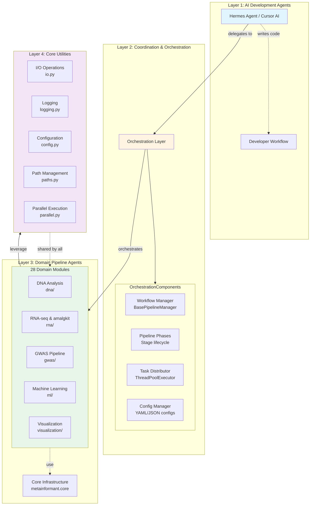

# METAINFORMANT Agent Coordination Hub

This documentation hub provides comprehensive guidance on agent coordination, multi-agent workflows, and orchestration patterns used throughout the METAINFORMANT project.

## Overview

METAINFORMANT employs a multi-agent architecture where specialized AI agents and software components collaborate to execute complex bioinformatics workflows across 28 domains. This hub documents the coordination patterns, communication protocols, and orchestration mechanisms that enable seamless multi-agent operations.

## Key Concepts

### What is an Agent?

In METAINFORMANT, an **agent** can refer to:
- **AI Development Agents**: Hermes Agent, Cursor AI assistants that write and review code
- **Pipeline Agents**: Software components that perform specific bioinformatics tasks (download, process, analyze)
- **Workflow Managers**: Orchestration agents that coordinate multi-stage pipelines

### Coordination Layers

### Coordination Patterns

METAINFORMANT supports multiple coordination patterns:

1. **Sequential Pipeline** - Stages executed in strict order (e.g., download → process → analyze)
2. **Parallel Fan-Out** - Independent tasks processed concurrently (e.g., batch download of 8,300 samples)
3. **Conditional Branching** - Workflow paths chosen based on data or config
4. **Fan-In Aggregation** - Results collected from parallel workers for consolidation
5. **Event-Driven** - Reactive execution triggered by data availability

## Documentation Structure

This hub organizes documentation into the following sections:

| Section | Content |
|---------|---------|
| [Architecture](ARCHITECTURE.md) | System-level coordination architecture |
| [Agent Directives](AGENTS.md) | Rules and constraints for all agents |
| [Orchestration](ORCHESTRATION.md) | Workflow manager internals and usage |
| [Multi-Agent Workflows](MULTI_AGENT_WORKFLOWS.md) | Complex workflow examples |
| [Communication](COMMUNICATION_PROTOCOLS.md) | Inter-agent messaging and data sharing |
| [Safety](SAFETY.md) | Error handling, validation, rollback |
| [Best Practices](BEST_PRACTICES.md) | Configuration and operational guidelines |

## Quick Start

### Understanding Agent Coordination

Read [Architecture](ARCHITECTURE.md) to understand the layered design and coordination patterns.

### Learning the Orchestration System

Study [Orchestration](ORCHESTRATION.md) to learn how `BasePipelineManager` coordinates multi-stage workflows.

### Building Multi-Agent Workflows

See [Multi-Agent Workflows](MULTI_AGENT_WORKFLOWS.md) for practical examples of complex pipeline compositions.

### Implementing Safe Operations

Review [Safety](SAFETY.md) for error handling, validation, and rollback strategies.

## Related Resources

- [Core Module](../core/) - Shared utilities (I/O, logging, parallel execution)
- [RNA Module](../rna/) - Example of sophisticated orchestration (8,300+ samples across 28 species)
- [Workflow Manager API](../../src/metainformant/core/engine/workflow_manager.py) - Source code reference
- [Parallel Execution](../../src/metainformant/core/execution/parallel.py) - ThreadPoolExecutor patterns
- [Zero-Mocking Policy](../../tests/NO_MOCKING_POLICY.md) - Testing philosophy requiring real implementations
