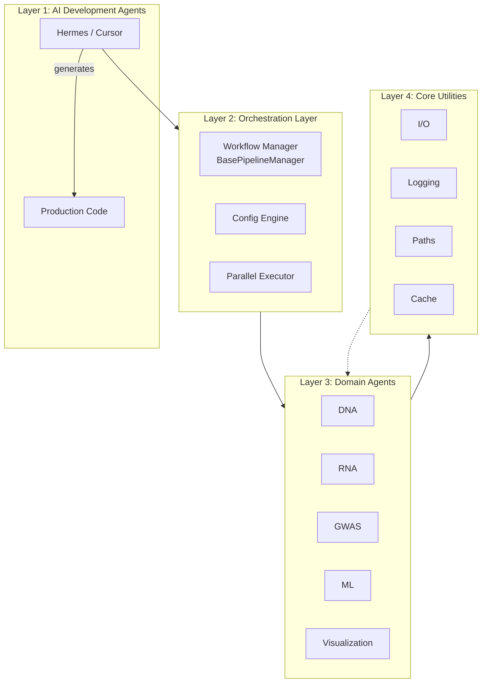
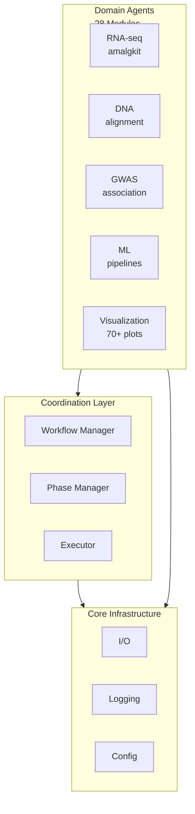

# Agent Coordination Documentation

This section documents METAINFORMANT's agent coordination architecture, multi-agent workflows, and orchestration patterns.

## Contents

```{toctree}
---
maxdepth: 2
---

README
ARCHITECTURE
AGENTS
ORCHESTRATION
MULTI_AGENT_WORKFLOWS
COMMUNICATION_PROTOCOLS
SAFETY
BEST_PRACTICES
TROUBLESHOOTING
rules/index
```

## Overview

METAINFORMANT uses a coordinated multi-agent architecture where specialized AI agents and software components collaborate to execute complex bioinformatics workflows across 28 domains. This hub documents the coordination patterns, communication protocols, and orchestration mechanisms that enable seamless multi-agent operations.

## Key Concepts

### What is an Agent?

In METAINFORMANT, an **agent** can refer to:
- **AI Development Agents**: Hermes Agent, Cursor AI assistants that write and review code
- **Orchestration Agents**: Workflow managers that coordinate multi-stage pipelines
- **Domain Pipeline Agents**: Specialized modules that perform bioinformatics tasks

### Coordination Layers



**See [Architecture](ARCHITECTURE.md) for detailed diagram and explanation.**

## Quick Navigation

| Need | Read First |
|------|------------|
| General overview | [README](README.md) |
| Understanding the system design | [Architecture](ARCHITECTURE.md) |
| Rules for all agents | [Agent Directives](AGENTS.md) |
| How to build a workflow | [Orchestration](ORCHESTRATION.md) |
| Real-world examples | [Multi-Agent Workflows](MULTI_AGENT_WORKFLOWS.md) |
| How agents exchange data | [Communication Protocols](COMMUNICATION_PROTOCOLS.md) |
| Error handling & recovery | [Safety](SAFETY.md) |
| Production operations | [Best Practices](BEST_PRACTICES.md) |
| Debugging failures | [Troubleshooting](TROUBLESHOOTING.md) |

## Core Coordination Mechanisms

### 1. BasePipelineManager

Generic multi-phase orchestrator:

```python
from metainformant.core.engine.workflow_manager import (
    BasePipelineManager, PipelinePhase, PipelineItem
)

phases = [
    PipelinePhase("Download", download_handler),
    PipelinePhase("Process", process_handler),
    PipelinePhase("Analyze", analyze_handler),
]

manager = BasePipelineManager(phases, max_threads=8)
for sample in samples:
    manager.add_item(sample.id)

results = manager.run()  # dict[sample_id, success_bool]
```

**Learn more**: [Orchestration](ORCHESTRATION.md) — API reference and handler patterns

### 2. Config-Driven Workflow

Declarative YAML/JSON pipelines:

```yaml
downloads:
  data: {url: "https://...", filename: "file.dat"}
processing:
  step1: {type: "transform"}
  step2: {type: "analyze"}
```

```python
from metainformant.core.execution.workflow import download_and_process_data
results = download_and_process_data("config.yaml", output_dir="output/")
```

**Learn more**: [Orchestration — Configuration-Driven](ORCHESTRATION.md#configuration-driven-workflows)

### 3. Parallel Fan-Out

Independent tasks executed concurrently:

```python
futures = [manager.executor.submit(process, item) for item in items]
for future in as_completed(futures):
    # handle each result as it completes
```

**Learn more**: [Multi-Agent Workflows — Pattern 2](MULTI_AGENT_WORKFLOWS.md#2-parallel-fan-out--fan-in)

## Architecture at a Glance



**Full diagram**: [Architecture](ARCHITECTURE.md#system-context)

## Cross-Module Dependencies

| Coordination Aspect | Documented In |
|---------------------|---------------|
| Pipeline composition | [Multi-Agent Workflows](MULTI_AGENT_WORKFLOWS.md) |
| Metadata sharing | [Communication Protocols](COMMUNICATION_PROTOCOLS.md) |
| Error handling | [Safety](SAFETY.md) |
| Resource tuning | [Best Practices](BEST_PRACTICES.md) |
| Debugging | [Troubleshooting](TROUBLESHOOTING.md) |
| Module-specific patterns | [rules/](rules/index.md) |

## For Module Developers

If you are implementing a new module that needs to participate in workflows:

1. **Read** [Agent Directives](AGENTS.md) for universal rules
2. **Study** [Orchestration](ORCHESTRATION.md) to understand `BasePipelineManager`
3. **Follow** your domain rule file in [rules/](rules/index.md)
4. **Add** your module to `docs/index.md` table and this hub's examples (optional)

**Minimal integration**:

```python
# src/metainformant/mymodule/workflow.py
from metainformant.core.engine.workflow_manager import BasePipelineManager, PipelinePhase

class MyWorkflow(BasePipelineManager):
    def __init__(self, config):
        phases = [
            PipelinePhase("Fetch", self._fetch),
            PipelinePhase("Process", self._process),
        ]
        super().__init__(phases, max_threads=4)
```

See [Orchestration — Phase Handler Patterns](ORCHESTRATION.md#phase-handler-patterns) for complete examples.

## For Operators

Running workflows at scale? See:

- [Best Practices — Configuration Management](BEST_PRACTICES.md#configuration-management)
- [Best Practices — Performance Tuning](BEST_PRACTICES.md#performance-tuning)
- [Safety — Resource Limits](SAFETY.md#resource-limits)
- [Safety — Checkpoint/Restart](SAFETY.md#checkpointrestart)
- [Troubleshooting](TROUBLESHOOTING.md) — diagnostic commands

## Related Documentation

- [Root AGENTS.md](../../AGENTS.md) — High-level AI agent philosophy
- [Core Infrastructure](../core/README.md) — Shared utilities reference
- [RNA Module](../rna/README.md) — Industrial-scale orchestration example (8,300 samples)
- [Testing Guide](../../tests/NO_MOCKING_POLICY.md) — Zero mock policy

## Contributing

Found an issue or want to add a workflow pattern?

1. Open an issue in the repository
2. Propose changes to relevant `.md` file in `docs/agents/`
3. Submit PR with documentation-only changes (no code required)

**Style**: Follow existing Markdown; include runnable code examples where applicable.

---

*This hub is living documentation. Update it when you discover new coordination patterns or safety techniques.*
