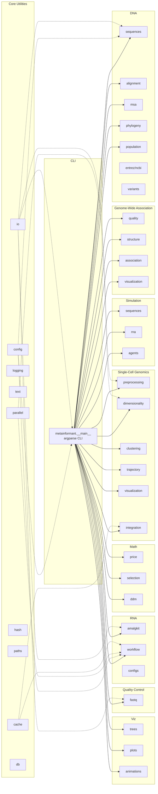

# Architecture

High-level architecture of METAINFORMANT.

## Project directories and conventions

- **`config/`**: Declarative configuration and options for runs. Read by `metainformant.core.config` and consumed across domains. Environment variables may override values.
- **`data/`**: Canonical datasets and local databases. Treated as read-mostly inputs and long-lived artifacts under versioned subfolders.
- **`output/`**: All run and test outputs. Ephemeral, reproducible, safe to delete. Modules must default to writing here unless a user-specified path is provided.

Guidelines:

- `core` owns config loading and path resolution; domain modules do not hardcode absolute paths.
- Prefer parameters and env variables to override locations, but default to `config/`, `data/`, and `output/` at repo root.
- Tests and CLI runs should not write outside `output/`.

See also: [CLI](./cli.md), [Core](./core.md).
