# Architecture

High-level architecture of METAINFORMANT.

```mermaid
flowchart LR
  subgraph CLI
    A[metainformant.__main__\nargparse CLI]
  end
  subgraph Core[Core Utilities]
    C1[config]
    C2[io]
    C3[logging]
    C4[text]
    C5[parallel]
    C6[hash]
    C7[paths]
    C8[cache]
    C9[db]
  end
  subgraph DNA
    D1[sequences]
    D2[alignment]
    D3[msa]
    D4[phylogeny]
    D5[population]
    D6[entrez/ncbi]
    D7[variants]
  end
  subgraph RNA
    R1[amalgkit]
    R2[workflow]
    R3[configs]
  end
  subgraph GWAS[Genome-Wide Association]
    G1[quality]
    G2[structure]
    G3[association]
    G4[visualization]
  end
  subgraph SingleCell[Single-Cell Genomics]
    SC1[preprocessing]
    SC2[dimensionality]
    SC3[clustering]
    SC4[trajectory]
    SC5[visualization]
    SC6[integration]
  end
  subgraph Quality[Quality Control]
    Q1[fastq]
  end
  subgraph Simulation
    S1[sequences]
    S2[rna]
    S3[agents]
  end
  subgraph Math
    M1[price]
    M2[selection]
    M3[ddm]
  end
  subgraph Viz
    V1[trees]
    V2[plots]
    V3[animations]
  end
  subgraph Information[Information Theory]
    I1[entropy]
    I2[mutual-information]
    I3[profile]
  end
  subgraph LifeEvents[Life Events]
    L1[embed]
    L2[predict]
    L3[interpret]
  end
  subgraph Other
    O1[protein]
    O2[ontology]
    O3[phenotype]
    O4[epigenome]
    O5[ecology]
    O6[ml]
    O7[multiomics]
    O8[networks]
  end
  A --> D1 & D2 & D3 & D4 & D5
  A --> R1 & R2
  A --> G1 & G2 & G3 & G4
  A --> SC1 & SC2 & SC3 & SC4 & SC5 & SC6
  A --> Q1
  A --> S1 & S2 & S3
  A --> M1 & M2 & M3
  A --> V1 & V2 & V3
  A --> I1 & I2 & I3
  A --> L1 & L2 & L3
  A --> O1 & O2 & O3 & O4 & O5 & O6 & O7 & O8
  C1 -.-> A
  C2 -.-> A
  C1 -.-> D1
  C2 -.-> D1
  C1 -.-> R2
  C2 -.-> R1
  C2 -.-> SC1
  C5 -.-> SC2
  C8 -.-> SC6
  C2 -.-> Q1
  C5 -.-> R2
  C8 -.-> R2
  C1 -.-> O6
  C2 -.-> O6
  C1 -.-> O7
  C2 -.-> O7
  C1 -.-> O8
  C2 -.-> O8
```



## Project directories and conventions

- **`config/`**: Declarative configuration and options for runs. Read by `metainformant.core.config` and consumed across domains. Environment variables may override values.
- **`data/`**: Canonical datasets and local databases. Treated as read-mostly inputs and long-lived artifacts under versioned subfolders.
- **`output/`**: All run and test outputs. Ephemeral, reproducible, safe to delete. Modules must default to writing here unless a user-specified path is provided.

Guidelines:

- `core` owns config loading and path resolution; domain modules do not hardcode absolute paths.
- Prefer parameters and env variables to override locations, but default to `config/`, `data/`, and `output/` at repo root.
- Tests and CLI runs should not write outside `output/`.

## Module Relationships and Dependencies

### Core Dependencies
All modules depend on `core` utilities:
- **config**: Configuration loading and environment variable handling
- **io**: File I/O operations (JSON, CSV, TSV, compressed formats)
- **logging**: Structured logging across all modules
- **paths**: Path validation and containment checks
- **cache**: JSON-based caching for expensive operations

### Domain Module Dependencies

#### Core Module
- **Purpose**: Shared infrastructure and utilities for all modules
- **Depends on**: None (base module)
- **Used by**: All modules (infrastructure layer)
- **Key Components**:
  - **config**: Configuration loading with environment variable overrides
  - **io**: File I/O operations (JSON, CSV, TSV, gzip-aware)
  - **logging**: Structured logging with consistent formatting
  - **paths**: Path validation and containment checks
  - **cache**: JSON-based caching for expensive operations
  - **parallel**: Parallel processing utilities
  - **hash**: Hashing and checksum functions
  - **text**: Text processing utilities
  - **db**: Database utilities
- **Integrates with**: All domain modules as the foundation layer

#### DNA Module
- **Depends on**: `core` (all utilities)
- **Used by**: `gwas`, `rna` (for genomic coordinates), `information` (sequence analysis)
- **Integrates with**: `visualization` (phylogenetic trees), `math.popgen` (population genetics theory)

#### RNA Module
- **Depends on**: `core`, `dna` (for genomic coordinates)
- **Used by**: `multiomics` (transcriptomics integration)
- **Integrates with**: External `amalgkit` CLI tool

#### GWAS Module
- **Depends on**: `core`, `dna.variants`, `dna.population`, `math.popgen`, `ml.regression`
- **Used by**: `multiomics` (genomics integration)
- **Integrates with**: `visualization` (Manhattan plots, Q-Q plots), external tools (bcftools, GATK)

#### Protein Module
- **Depends on**: `core`
- **Used by**: `networks` (protein-protein interactions), `multiomics` (proteomics integration)
- **Integrates with**: External databases (UniProt, InterPro, AlphaFold, PDB)

#### Single-Cell Module
- **Depends on**: `core`, `rna` (expression data), `ml.dimensionality`
- **Used by**: `multiomics` (single-cell omics integration), `information` (single-cell information analysis)
- **Integrates with**: External tools (scanpy, anndata) when available

#### Multi-Omics Module
- **Depends on**: `core`, `dna`, `rna`, `protein`, `singlecell`, `ml.dimensionality`
- **Used by**: Workflow orchestration scripts
- **Integrates with**: All omics modules for cross-platform integration

#### Networks Module
- **Depends on**: `core`, `protein` (PPI networks), `ontology` (functional annotation)
- **Used by**: `multiomics` (network-based integration)
- **Integrates with**: `visualization` (network plots)

#### Information Theory Module
- **Depends on**: `core`
- **Used by**: All modules (can analyze any biological data)
- **Integrates with**: `dna`, `rna`, `singlecell`, `multiomics` (cross-module integration functions)

#### Life Events Module
- **Depends on**: `core`
- **Used by**: `phenotype` (life course phenotype extraction)
- **Integrates with**: `ml` (sequence models), `visualization` (event timeline plots)

#### Phenotype Module
- **Depends on**: `core`, `life_events` (optional, for life course integration)
- **Used by**: `gwas` (phenotype-genotype associations)
- **Integrates with**: `ontology` (trait functional annotation)

#### Quality Module
- **Depends on**: `core`, `dna.fastq`
- **Used by**: `rna` (FASTQ quality control), `gwas` (variant QC)
- **Integrates with**: External tools (FastQC) when available

#### Math Module
- **Depends on**: `core`
- **Used by**: `dna.population` (population genetics theory), `gwas` (statistical models)
- **Integrates with**: Domain modules for theoretical analysis

#### Visualization Module
- **Depends on**: `core` (optional matplotlib/seaborn)
- **Used by**: All modules (plotting support)
- **Integrates with**: Domain-specific visualization (phylogenetic trees, network graphs)

#### ML Module
- **Depends on**: `core`
- **Used by**: `gwas` (regression models), `singlecell` (dimensionality reduction), `life_events` (sequence models)
- **Integrates with**: Domain modules for biological data preprocessing

#### Ontology Module
- **Depends on**: `core`
- **Used by**: `networks` (functional enrichment), `phenotype` (trait annotation)
- **Integrates with**: External databases (Gene Ontology)

#### Epigenome Module
- **Depends on**: `core`, `dna` (for genomic coordinates)
- **Used by**: `multiomics` (epigenomics integration)
- **Integrates with**: `visualization` (methylation plots)

#### Ecology Module
- **Depends on**: `core`
- **Used by**: Workflow scripts
- **Integrates with**: `math` (diversity calculations)

#### Simulation Module
- **Depends on**: `core`
- **Used by**: All modules (for generating synthetic test data)
- **Key Components**:
  - **sequences**: Synthetic sequence generation (DNA, RNA, protein)
  - **rna**: RNA expression count simulation
  - **agents**: Agent-based modeling and ecosystem simulation
- **Integrates with**: All modules for testing and validation purposes

### Common Integration Patterns

#### Multi-Omics Integration Workflow
```
DNA (genomics) → Multi-Omics
RNA (transcriptomics) → Multi-Omics  
Protein (proteomics) → Multi-Omics
Single-Cell → Multi-Omics
→ Joint PCA/NMF/CCA
→ Visualization
```

#### Genotype-Phenotype Association
```
DNA (variants) → GWAS
Phenotype (traits) → GWAS
→ Association Testing
→ Visualization (Manhattan plots)
```

#### Functional Annotation Pipeline
```
DNA/RNA/Protein (sequences) → Ontology
Networks (modules) → Ontology
→ Enrichment Analysis
→ Visualization
```

#### Quality Control Pipeline
```
DNA (FASTQ) → Quality
RNA (FASTQ) → Quality
→ QC Metrics
→ Filtering
→ Downstream Analysis
```

### Data Flow Patterns

1. **Input → Processing → Output**: Most modules follow this pattern using `core.io` for I/O
2. **Configuration → Workflow → Results**: Workflow modules use `core.config` for configuration
3. **Cache → Compute → Cache**: Expensive operations use `core.cache` for results
4. **Logging**: All modules use `core.logging` for consistent log messages

See also: [CLI](./cli.md), [Core](./core/README.md).
