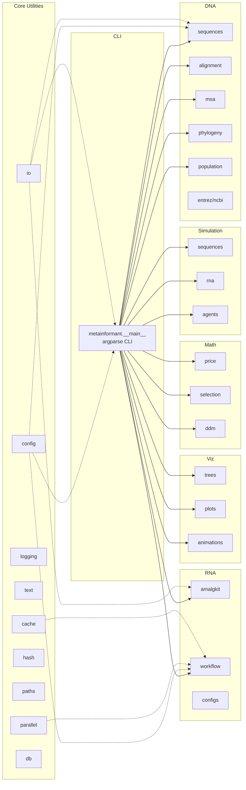

### Architecture

High-level architecture of METAINFORMANT.

```mermaid
flowchart LR
  subgraph CLI
    A[metainformant.__main__\nargparse CLI]
  end
  subgraph Core[Core Utilities]
    C1[config]
    C2[io]
    C3[logging]
    C4[text]
    C5[parallel]
    C6[hash]
    C7[paths]
    C8[cache]
    C9[db]
  end
  subgraph DNA
    D1[sequences]
    D2[alignment]
    D3[msa]
    D4[phylogeny]
    D5[population]
    D6[entrez/ncbi]
  end
  subgraph RNA
    R1[amalgkit]
    R2[workflow]
    R3[configs]
  end
  subgraph Simulation
    S1[sequences]
    S2[rna]
    S3[agents]
  end
  subgraph Math
    M1[price]
    M2[selection]
    M3[ddm]
  end
  subgraph Viz
    V1[trees]
    V2[plots]
    V3[animations]
  end
  A --> D1 & D2 & D3 & D4 & D5
  A --> R1 & R2
  A --> S1 & S2 & S3
  A --> M1 & M2 & M3
  A --> V1 & V2 & V3
  C1 -.-> A
  C2 -.-> A
  C1 -.-> D1
  C2 -.-> D1
  C1 -.-> R2
  C2 -.-> R1
  C5 -.-> R2
  C8 -.-> R2
```

See also: [CLI](./cli.md), [Core](./core.md).

