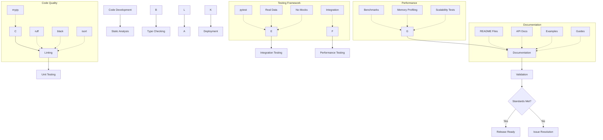

# Architecture

Comprehensive system architecture of METAINFORMANT, showing the modular design, data flow patterns, and integration relationships across all biological domains.

## System Overview

METAINFORMANT is a comprehensive bioinformatics toolkit designed for multi-omic data analysis. The architecture follows a modular, domain-driven design with clear separation of concerns and extensive integration capabilities.

### Core Design Principles

- **Modular Architecture**: Each biological domain is self-contained with well-defined interfaces
- **Data Flow Integration**: Seamless data exchange between modules through standardized formats
- **Quality Assurance**: Comprehensive validation and error handling throughout
- **Extensibility**: Easy addition of new analysis methods and data types
- **Performance**: Optimized algorithms for large-scale biological data processing

## Module Architecture

```mermaid
graph TB
    %% Core Infrastructure Layer
    subgraph "Core Infrastructure"
        COREcoreUtilitiesConfig•Io•LoggingParallel•Paths•CacheWorkflow•Validation[Core Utilities_config • io • logging_parallel • paths • cache_workflow • validation]
    end

    %% Data Processing Layer
    subgraph "Data Processing"
        DNAdnaModuleSequences•AlignmentPhylogeny•Population[DNA Module_sequences • alignment_phylogeny • population]
        RNArnaModuleAmalgkit•QuantificationTranscriptomics•Workflow[RNA Module_amalgkit • quantification_transcriptomics • workflow]
        PROTEINproteinModuleSequences•StructureAlphafold•Analysis[Protein Module_sequences • structure_AlphaFold • analysis]
        EPIGENOMEepigenomeModuleMethylation•Chip-seqAtac-seq•Chromatin[Epigenome Module_methylation • ChIP-seq_ATAC-seq • chromatin]
    end

    %% Analysis Layer
    subgraph "Analysis Methods"
        GWASgwasModuleAssociation•QcPopulation•Visualization[GWAS Module_association • QC_population • visualization]
        MATHmathModulePopulationGeneticsCoalescent•Selection[Math Module_population genetics_coalescent • selection]
        MLmlModuleClassification•RegressionFeatureSelection[ML Module_classification • regression_feature selection]
        INFOinfoTheoryModuleEntropy•Mi•SimilaritySemanticMeasures[Info Theory Module_entropy • MI • similarity_semantic measures]
    end

    %% Systems Biology Layer
    subgraph "Systems Biology"
        NETWORKSnetworksModulePpi•PathwaysCommunityDetection[Networks Module_PPI • pathways_community detection]
        MULTIOMICSmulti-omicsModuleIntegration•HarmonizationJointAnalysis[Multi-Omics Module_integration • harmonization_joint analysis]
        SINGLECELLsingle-cellModulePreprocessing•ClusteringTrajectory•De[Single-Cell Module_preprocessing • clustering_trajectory • DE]
        SIMULATIONsimulationModuleSequences•EcosystemsAgent-based•Evolution[Simulation Module_sequences • ecosystems_agent-based • evolution]
    end

    %% Knowledge Layer
    subgraph "Knowledge & Metadata"
        ONTOLOGYontologyModuleGo•FunctionalAnnotationSemanticSimilarity[Ontology Module_GO • functional annotation_semantic similarity]
        PHENOTYPEphenotypeModuleTraits•LifeCourseAntwiki•Curation[Phenotype Module_traits • life course_AntWiki • curation]
        ECOLOGYecologyModuleCommunities•DiversityEnvironmentalAnalysis[Ecology Module_communities • diversity_environmental analysis]
        LIFEEVENTSlifeEventsModuleSequences•EmbeddingsTemporalPrediction[Life Events Module_sequences • embeddings_temporal prediction]
    end

    %% Utilities Layer
    subgraph "Utilities"
        QUALITYqualityModuleFastq•AssemblyMetrics•Validation[Quality Module_FASTQ • assembly_metrics • validation]
        VISUALIZATIONvisualizationModulePlots•AnimationsTrees•Networks[Visualization Module_plots • animations_trees • networks]
    end

    %% Data Flow
    CORE --> DNA
    CORE --> RNA
    CORE --> PROTEIN
    CORE --> EPIGENOME
    CORE --> GWAS
    CORE --> MATH
    CORE --> ML
    CORE --> INFO
    CORE --> NETWORKS
    CORE --> MULTIOMICS
    CORE --> SINGLECELL
    CORE --> SIMULATION
    CORE --> ONTOLOGY
    CORE --> PHENOTYPE
    CORE --> ECOLOGY
    CORE --> LIFEEVENTS
    CORE --> QUALITY
    CORE --> VISUALIZATION

    DNA --> RNA
    DNA --> PROTEIN
    DNA --> GWAS
    RNA --> SINGLECELL
    RNA --> MULTIOMICS
    PROTEIN --> NETWORKS
    PROTEIN --> ONTOLOGY
    EPIGENOME --> DNA
    EPIGENOME --> NETWORKS
    ONTOLOGY --> MULTIOMICS
    PHENOTYPE --> GWAS
    PHENOTYPE --> LIFEEVENTS
    ECOLOGY --> NETWORKS
    MATH --> GWAS
    MATH --> DNA
    INFO --> NETWORKS
    INFO --> ONTOLOGY
    NETWORKS --> MULTIOMICS
    SINGLECELL --> MULTIOMICS
    QUALITY --> allAnalysisModulesallAnalysisModules[All Analysis Modules]
    VISUALIZATION --> ALL_MODULES

    %% External Dependencies
    RNA -.->|"Amalgkit CLI"| RNA
    SINGLECELL -.->|"scanpy, anndata"| SINGLECELL
    PROTEIN -.->|"AlphaFold"| PROTEIN
    GWAS -.->|"bcftools, GATK"| GWAS

    %% Data Sources
    NCBI(ncbiGenomes)[(NCBI Genomes)] --> DNA
    SRA(sraSequences)[(SRA Sequences)] --> RNA
    SRA --> SINGLECELL
    SRA --> GWAS
    PDB(pdbStructures)[(PDB Structures)] --> PROTEIN
    GEO(geoExpression)[(GEO Expression)] --> RNA
    GO(geneOntology)[(Gene Ontology)] --> ONTOLOGY

    %% Styling

    class CORE core
    class DNA,RNA,PROTEIN,EPIGENOME data
    class GWAS,MATH,ML,INFO analysis
    class NETWORKS,MULTIOMICS,SINGLECELL,SIMULATION systems
    class ONTOLOGY,PHENOTYPE,ECOLOGY,LIFEEVENTS knowledge
    class QUALITY,VISUALIZATION utility
    class NCBI,SRA,PDB,GEO,GO external
```

### Data Flow Architecture

```mermaid
graph TD
    ArawBiologicalData[Raw Biological Data] --> BingestionLayer[Ingestion Layer]
    B --> CformatDetection[Format Detection]
    C --> DdataValidation[Data Validation]

    D --> E{Data Type}
    E -->|Genomic| FdnaProcessingPipeline[DNA Processing Pipeline]
    E -->|Transcriptomic| GrnaProcessingPipeline[RNA Processing Pipeline]
    E -->|Proteomic| HproteinProcessingPipeline[Protein Processing Pipeline]
    E -->|Epigenomic| IepigenomeProcessingPipeline[Epigenome Processing Pipeline]

    F --> JqualityControl[Quality Control]
    G --> J
    H --> J
    I --> J

    J --> KfeatureExtraction[Feature Extraction]
    K --> LstatisticalAnalysis[Statistical Analysis]

    L --> M{Integration Strategy}
    M -->|Single-omic| NindividualAnalysis[Individual Analysis]
    M -->|Multi-omic| OjointAnalysis[Joint Analysis]

    N --> Pdomain-specificResults[Domain-Specific Results]
    O --> Qsystems-levelResults[Systems-Level Results]

    P --> R[Visualization]
    Q --> R

    R --> SpublicationFigures[Publication Figures]
    S --> TscientificInsights[Scientific Insights]


    subgraph "Data Sources"
        U[NCBI] -.-> F
        V[SRA] -.-> G
        W[PDB] -.-> H
        X[ENCODE] -.-> I
    end

    subgraph "Processing Stages"
        Y[Normalization] -.-> K
        Z[Transformation] -.-> K
        AA[Filtering] -.-> K
        BB[Scaling] -.-> K
    end

    subgraph "Analysis Types"
        CCdifferentialExpression[Differential Expression] -.-> L
        DDassociationTesting[Association Testing] -.-> L
        EEnetworkInference[Network Inference] -.-> L
        FF[Clustering] -.-> L
    end
```



### Integration Framework

```mermaid
graph TD
    AmoduleInterfaces[Module Interfaces] --> BstandardizedApis[Standardized APIs]
    B --> CdataFormatStandards[Data Format Standards]

    C --> DinteroperabilityLayer[Interoperability Layer]
    D --> Ecross-moduleCommunication[Cross-Module Communication]

    E --> F{Integration Pattern}
    F -->|Pipeline| GsequentialProcessing[Sequential Processing]
    F -->|Workflow| HorchestratedExecution[Orchestrated Execution]
    F -->|Joint| IsimultaneousAnalysis[Simultaneous Analysis]

    G --> JresultAggregation[Result Aggregation]
    H --> J
    I --> J

    J --> KunifiedOutput[Unified Output]
    K --> LqualityAssurance[Quality Assurance]

    L --> MfinalResults[Final Results]


    subgraph "API Standards"
        NfunctionSignatures[Function Signatures] -.-> B
        OparameterTypes[Parameter Types] -.-> B
        PreturnFormats[Return Formats] -.-> B
        QerrorHandling[Error Handling] -.-> B
    end

    subgraph "Data Standards"
        RfastaFormat[FASTA Format] -.-> C
        ScountMatrices[Count Matrices] -.-> C
        TpandasDataframes[Pandas DataFrames] -.-> C
        UnetworkxGraphs[NetworkX Graphs] -.-> C
    end

    subgraph "Integration Mechanisms"
        VcoreUtilities[Core Utilities] -.-> D
        WconfigFiles[Config Files] -.-> D
        XworkflowOrchestration[Workflow Orchestration] -.-> D
        YeventSystem[Event System] -.-> D
    end
```



### Quality Assurance Architecture



## Detailed Module Relationships

```mermaid
flowchart LR
  subgraph CLI
    Ametainformant.Main\nargparseCli[metainformant.__main__\nargparse CLI]
  end
  subgraph CorecoreUtilities[Core Utilities]
    C1[config]
    C2[io]
    C3[logging]
    C4[text]
    C5[parallel]
    C6[hash]
    C7[paths]
    C8[cache]
    C9[db]
  end
  subgraph DNA
    D1[sequences]
    D2[alignment]
    D3[msa]
    D4[phylogeny]
    D5[population]
    D6[entrez/ncbi]
    D7[variants]
  end
  subgraph RNA
    R1[amalgkit]
    R2[workflow]
    R3[configs]
  end
  subgraph GWASgenome-wideAssociation[Genome-Wide Association]
    G1[quality]
    G2[structure]
    G3[association]
    G4[visualization]
  end
  subgraph SingleCellsingle-cellGenomics[Single-Cell Genomics]
    SC1[preprocessing]
    SC2[dimensionality]
    SC3[clustering]
    SC4[trajectory]
    SC5[visualization]
    SC6[integration]
  end
  subgraph QualityqualityControl[Quality Control]
    Q1[fastq]
  end
  subgraph Simulation
    S1[sequences]
    S2[rna]
    S3[agents]
  end
  subgraph Math
    M1[price]
    M2[selection]
    M3[ddm]
  end
  subgraph Viz
    V1[trees]
    V2[plots]
    V3[animations]
  end
  subgraph InformationinformationTheory[Information Theory]
    I1[entropy]
    I2[mutual-information]
    I3[profile]
  end
  subgraph LifeEventslifeEvents[Life Events]
    L1[embed]
    L2[predict]
    L3[interpret]
  end
  subgraph Other
    O1[protein]
    O2[ontology]
    O3[phenotype]
    O4[epigenome]
    O5[ecology]
    O6[ml]
    O7[multiomics]
    O8[networks]
  end
  A --> D1 & D2 & D3 & D4 & D5
  A --> R1 & R2
  A --> G1 & G2 & G3 & G4
  A --> SC1 & SC2 & SC3 & SC4 & SC5 & SC6
  A --> Q1
  A --> S1 & S2 & S3
  A --> M1 & M2 & M3
  A --> V1 & V2 & V3
  A --> I1 & I2 & I3
  A --> L1 & L2 & L3
  A --> O1 & O2 & O3 & O4 & O5 & O6 & O7 & O8
  C1 -.-> A
  C2 -.-> A
  C1 -.-> D1
  C2 -.-> D1
  C1 -.-> R2
  C2 -.-> R1
  C2 -.-> SC1
  C5 -.-> SC2
  C8 -.-> SC6
  C2 -.-> Q1
  C5 -.-> R2
  C8 -.-> R2
  C1 -.-> O6
  C2 -.-> O6
  C1 -.-> O7
  C2 -.-> O7
  C1 -.-> O8
  C2 -.-> O8
```



## Project directories and conventions

- **`config/`**: Declarative configuration and options for runs. Read by `metainformant.core.config` and consumed across domains. Environment variables may override values.
- **`data/`**: Canonical datasets and local databases. Treated as read-mostly inputs and long-lived artifacts under versioned subfolders.
- **`output/`**: All run and test outputs. Ephemeral, reproducible, safe to delete. Modules must default to writing here unless a user-specified path is provided.

Guidelines:

- `core` owns config loading and path resolution; domain modules do not hardcode absolute paths.
- Prefer parameters and env variables to override locations, but default to `config/`, `data/`, and `output/` at repo root.
- Tests and CLI runs should not write outside `output/`.

## Module Relationships and Dependencies

### Core Dependencies
All modules depend on `core` utilities:
- **config**: Configuration loading and environment variable handling
- **io**: File I/O operations (JSON, CSV, TSV, compressed formats)
- **logging**: Structured logging across all modules
- **paths**: Path validation and containment checks
- **cache**: JSON-based caching for expensive operations

### Domain Module Dependencies

#### Core Module
- **Purpose**: Shared infrastructure and utilities for all modules
- **Depends on**: None (base module)
- **Used by**: All modules (infrastructure layer)
- **Key Components**:
  - **config**: Configuration loading with environment variable overrides
  - **io**: File I/O operations (JSON, CSV, TSV, gzip-aware)
  - **logging**: Structured logging with consistent formatting
  - **paths**: Path validation and containment checks
  - **cache**: JSON-based caching for expensive operations
  - **parallel**: Parallel processing utilities
  - **hash**: Hashing and checksum functions
  - **text**: Text processing utilities
  - **db**: Database utilities
- **Integrates with**: All domain modules as the foundation layer

#### DNA Module
- **Depends on**: `core` (all utilities)
- **Used by**: `gwas`, `rna` (for genomic coordinates), `information` (sequence analysis)
- **Integrates with**: `visualization` (phylogenetic trees), `math.popgen` (population genetics theory)

#### RNA Module
- **Depends on**: `core`, `dna` (for genomic coordinates)
- **Used by**: `multiomics` (transcriptomics integration)
- **Integrates with**: External `amalgkit` CLI tool

#### GWAS Module
- **Depends on**: `core`, `dna.variants`, `dna.population`, `math.popgen`, `ml.regression`
- **Used by**: `multiomics` (genomics integration)
- **Integrates with**: `visualization` (Manhattan plots, Q-Q plots), external tools (bcftools, GATK)

#### Protein Module
- **Depends on**: `core`
- **Used by**: `networks` (protein-protein interactions), `multiomics` (proteomics integration)
- **Integrates with**: External databases (UniProt, InterPro, AlphaFold, PDB)

#### Single-Cell Module
- **Depends on**: `core`, `rna` (expression data), `ml.dimensionality`
- **Used by**: `multiomics` (single-cell omics integration), `information` (single-cell information analysis)
- **Integrates with**: External tools (scanpy, anndata) when available

#### Multi-Omics Module
- **Depends on**: `core`, `dna`, `rna`, `protein`, `singlecell`, `ml.dimensionality`
- **Used by**: Workflow orchestration scripts
- **Integrates with**: All omics modules for cross-platform integration

#### Networks Module
- **Depends on**: `core`, `protein` (PPI networks), `ontology` (functional annotation)
- **Used by**: `multiomics` (network-based integration)
- **Integrates with**: `visualization` (network plots)

#### Information Theory Module
- **Depends on**: `core`
- **Used by**: All modules (can analyze any biological data)
- **Integrates with**: `dna`, `rna`, `singlecell`, `multiomics` (cross-module integration functions)

#### Life Events Module
- **Depends on**: `core`
- **Used by**: `phenotype` (life course phenotype extraction)
- **Integrates with**: `ml` (sequence models), `visualization` (event timeline plots)

#### Phenotype Module
- **Depends on**: `core`, `life_events` (optional, for life course integration)
- **Used by**: `gwas` (phenotype-genotype associations)
- **Integrates with**: `ontology` (trait functional annotation)

#### Quality Module
- **Depends on**: `core`, `dna.fastq`
- **Used by**: `rna` (FASTQ quality control), `gwas` (variant QC)
- **Integrates with**: External tools (FastQC) when available

#### Math Module
- **Depends on**: `core`
- **Used by**: `dna.population` (population genetics theory), `gwas` (statistical models)
- **Integrates with**: Domain modules for theoretical analysis

#### Visualization Module
- **Depends on**: `core` (optional matplotlib/seaborn)
- **Used by**: All modules (plotting support)
- **Integrates with**: Domain-specific visualization (phylogenetic trees, network graphs)

#### ML Module
- **Depends on**: `core`
- **Used by**: `gwas` (regression models), `singlecell` (dimensionality reduction), `life_events` (sequence models)
- **Integrates with**: Domain modules for biological data preprocessing

#### Ontology Module
- **Depends on**: `core`
- **Used by**: `networks` (functional enrichment), `phenotype` (trait annotation)
- **Integrates with**: External databases (Gene Ontology)

#### Epigenome Module
- **Depends on**: `core`, `dna` (for genomic coordinates)
- **Used by**: `multiomics` (epigenomics integration)
- **Integrates with**: `visualization` (methylation plots)

#### Ecology Module
- **Depends on**: `core`
- **Used by**: Workflow scripts
- **Integrates with**: `math` (diversity calculations)

#### Simulation Module
- **Depends on**: `core`
- **Used by**: All modules (for generating synthetic test data)
- **Key Components**:
  - **sequences**: Synthetic sequence generation (DNA, RNA, protein)
  - **rna**: RNA expression count simulation
  - **agents**: Agent-based modeling and ecosystem simulation
- **Integrates with**: All modules for testing and validation purposes

### Common Integration Patterns

#### Multi-Omics Integration Workflow
```
DNA (genomics) → Multi-Omics
RNA (transcriptomics) → Multi-Omics  
Protein (proteomics) → Multi-Omics
Single-Cell → Multi-Omics
→ Joint PCA/NMF/CCA
→ Visualization
```

#### Genotype-Phenotype Association
```
DNA (variants) → GWAS
Phenotype (traits) → GWAS
→ Association Testing
→ Visualization (Manhattan plots)
```

#### Functional Annotation Pipeline
```
DNA/RNA/Protein (sequences) → Ontology
Networks (modules) → Ontology
→ Enrichment Analysis
→ Visualization
```

#### Quality Control Pipeline
```
DNA (FASTQ) → Quality
RNA (FASTQ) → Quality
→ QC Metrics
→ Filtering
→ Downstream Analysis
```

### Data Flow Patterns

1. **Input → Processing → Output**: Most modules follow this pattern using `core.io` for I/O
2. **Configuration → Workflow → Results**: Workflow modules use `core.config` for configuration
3. **Cache → Compute → Cache**: Expensive operations use `core.cache` for results
4. **Logging**: All modules use `core.logging` for consistent log messages

See also: [CLI](./cli.md), [Core](./core/README.md).
