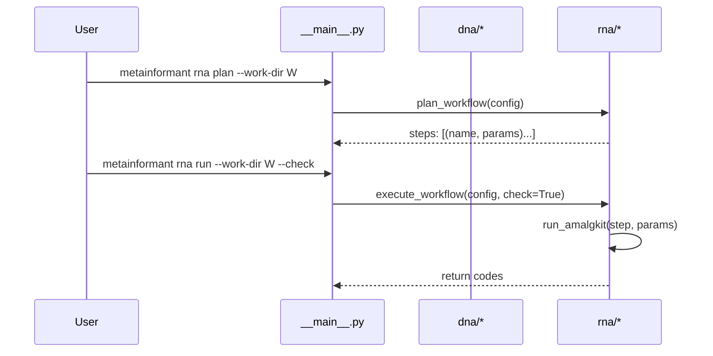

### CLI

Entry: `python -m metainformant` or the `metainformant` console script.

```text
metainformant dna fetch --assembly GCF_000001405.40
metainformant rna plan --work-dir ./work --threads 8 --species Apis_mellifera
metainformant rna run  --work-dir ./work --threads 8 --species Apis_mellifera --check
metainformant tests -q
```



See: [RNA Workflow](./rna/workflow.md), [DNA](./dna/index.md).


