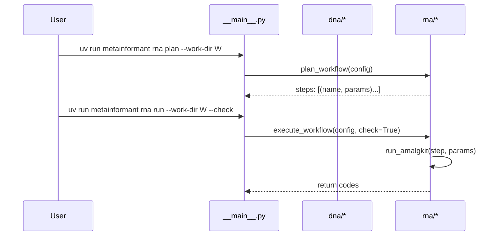

# CLI

Entry: `uv run python -m metainformant` or `uv run metainformant`.

```text
uv run metainformant setup --with-amalgkit --ncbi-email "you@example.com"
uv run metainformant dna fetch --assembly GCF_000001405.40
uv run metainformant rna plan --work-dir output/amalgkit/work --threads 8 --species Apis_mellifera
uv run metainformant rna run  --work-dir output/amalgkit/work --threads 8 --species Apis_mellifera --check
uv run metainformant rna run-config --config config/amalgkit_pbarbatus.yaml --check
uv run metainformant protein taxon-ids --file tests/data/protein/taxon_id_list.txt
uv run metainformant protein comp --fasta data/protein/example.faa
uv run metainformant protein rmsd-ca --pdb-a file1.pdb --pdb-b file2.pdb
uv run metainformant math selection --help
uv run metainformant tests -q
```

Subcommands

- **setup**: runs repository setup (uv, dependencies); supports `--with-amalgkit` and `--ncbi-email` options
- **dna fetch**: validates assembly accessions (see [DNA Accessions](./dna/accessions.md))
- **rna plan**: prints an ordered plan of subcommands and parameters (see [RNA Workflow](./rna/workflow.md))
- **rna run**: executes the workflow; use `--check` to stop on first failure; logs written in `work-dir/logs` (default examples place this under `output/`)
- **rna run-config**: executes the workflow from a config file under `config/`; logs and manifest written under paths specified by the config
- **protein taxon-ids**: reads and prints taxon IDs from file (see [Protein Proteomes](./protein/proteomes.md))
- **protein comp**: calculates amino acid composition for sequences in FASTA
- **protein rmsd-ca**: computes Kabsch RMSD using CA atoms from two PDB files
- **math selection**: selection model experiments and visualizations (see [Math Selection](./math/selection.md))
- **tests**: runs the repo tests (see [Testing](./testing.md))



See: [RNA Workflow](./rna/workflow.md), [DNA](./dna/index.md).
