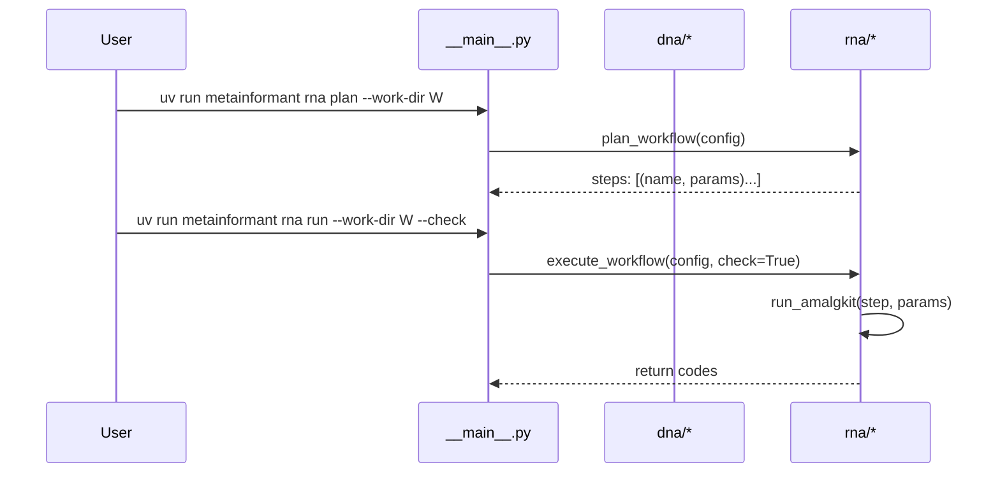

# CLI

Entry: `uv run python -m metainformant` or `uv run metainformant`.

```text
uv run metainformant setup --with-amalgkit --ncbi-email "you@example.com"
uv run metainformant dna fetch --assembly GCF_000001405.40
uv run metainformant rna plan --work-dir output/amalgkit/work --threads 8 --species Apis_mellifera
uv run metainformant rna run  --work-dir output/amalgkit/work --threads 8 --species Apis_mellifera --check
uv run metainformant rna run-config --config config/amalgkit_pbarbatus.yaml --check
uv run metainformant gwas run --config config/gwas_config.yaml
uv run metainformant gwas run --config config/gwas_config.yaml --check
uv run metainformant protein taxon-ids --file tests/data/protein/taxon_id_list.txt
uv run metainformant protein comp --fasta data/protein/example.faa
uv run metainformant protein rmsd-ca --pdb-a file1.pdb --pdb-b file2.pdb
uv run metainformant math selection --help
uv run metainformant ontology run --go data/go.obo --output output/ontology
uv run metainformant phenotype run --input data/phenotypes.json --output output/phenotype
uv run metainformant networks run --input data/interactions.tsv --output output/networks
uv run metainformant multiomics run --genomics data/genomics.tsv --transcriptomics data/rna.tsv --output output/multiomics
uv run metainformant singlecell run --input data/counts.h5ad --output output/singlecell --qc --normalize
uv run metainformant quality run --fastq data/reads.fq --output output/quality --analyze-fastq
uv run metainformant simulation run --model sequences --output output/simulation --n 1000
uv run metainformant visualization run --input data/results.csv --plot-type heatmap --output output/visualization
uv run metainformant epigenome run --methylation data/methylation.tsv --output output/epigenome --compute-beta
uv run metainformant ecology run --input data/abundance.tsv --output output/ecology --diversity
uv run metainformant ml run --features data/features.csv --labels data/labels.csv --output output/ml --classify
uv run metainformant tests -q
```

Subcommands

- **setup**: runs repository setup (uv, dependencies); supports `--with-amalgkit` and `--ncbi-email` options
- **dna fetch**: validates assembly accessions (see [DNA Accessions](./dna/accessions.md))
- **rna plan**: prints an ordered plan of subcommands and parameters (see [RNA Workflow](./rna/workflow.md))
- **rna run**: executes the workflow; use `--check` to stop on first failure; logs written in `work-dir/logs` (default examples place this under `output/`)
- **rna run-config**: executes the workflow from a config file under `config/`; logs and manifest written under paths specified by the config
- **gwas run**: executes GWAS workflow from configuration file (see [GWAS Workflow](./gwas/workflow.md)); use `--check` to validate configuration without execution
- **protein taxon-ids**: reads and prints taxon IDs from file (see [Protein Proteomes](./protein/proteomes.md))
- **protein comp**: calculates amino acid composition for sequences in FASTA
- **protein rmsd-ca**: computes Kabsch RMSD using CA atoms from two PDB files
- **math selection**: selection model experiments and visualizations (see [Math Selection](./math/selection.md))
- **ontology run**: ontology analysis workflow (GO term queries, enrichment analysis)
- **phenotype run**: phenotype analysis workflow (statistics, correlations)
- **networks run**: network analysis workflow (metrics, communities, centrality)
- **multiomics run**: multi-omics integration workflow (joint PCA, NMF, CCA)
- **singlecell run**: single-cell analysis workflow (QC, normalization, clustering)
- **quality run**: quality control workflow (FASTQ analysis, contamination detection)
- **simulation run**: simulation workflow (sequences, agents, expression models)
- **visualization run**: visualization workflow (lineplots, heatmaps, animations)
- **epigenome run**: epigenome analysis workflow (methylation, beta values)
- **ecology run**: ecology analysis workflow (diversity indices, beta diversity)
- **ml run**: machine learning pipeline workflow (classification, regression, feature selection)
- **tests**: runs the repo tests (see [Testing](./testing.md))



See: [RNA Workflow](./rna/workflow.md), [DNA](./dna/index.md), [GWAS Workflow](./gwas/workflow.md), [Testing](./testing.md).

## Configuration Files

Many workflows support configuration files for complex parameter sets:

- **RNA workflows**: Use `config/amalgkit/*.yaml` files (see [RNA Workflow](./rna/workflow.md))
- **GWAS workflows**: Use `config/gwas/*.yaml` files (see [GWAS Workflow](./gwas/workflow.md))
- **Network analysis**: Template available at `config/networks_template.yaml`
- **Multi-omics**: Template available at `config/multiomics_template.yaml`
- **Single-cell**: Template available at `config/singlecell_template.yaml`

See [Configuration Management](./core/config.md) for details on using configuration files and environment variable overrides.
