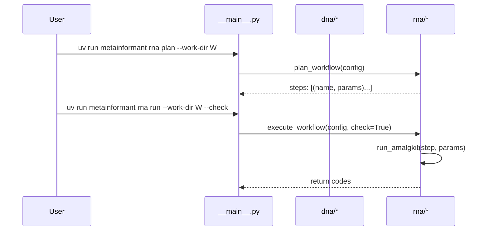

# CLI

Entry: `uv run python -m metainformant` or `uv run metainformant`.

```text
uv run metainformant setup --with-amalgkit --ncbi-email "you@example.com"
uv run metainformant dna fetch --assembly GCF_000001405.40
uv run metainformant rna plan --work-dir output/amalgkit/work --threads 8 --species Apis_mellifera
uv run metainformant rna plan-species --work-dir output/amalgkit/work --threads 8 --taxon-id 7460 --tissue brain --tissue muscle
uv run metainformant rna plan-config --config config/amalgkit/amalgkit_pogonomyrmex_barbatus.yaml
uv run metainformant rna run  --work-dir output/amalgkit/work --threads 8 --species Apis_mellifera --check
uv run metainformant rna run-config --config config/amalgkit/amalgkit_pogonomyrmex_barbatus.yaml --check
uv run metainformant gwas run --config config/gwas/gwas_template.yaml
uv run metainformant gwas run --config config/gwas/gwas_template.yaml --check
uv run metainformant protein taxon-ids --file tests/data/protein/taxon_id_list.txt
uv run metainformant protein comp --fasta data/protein/example.faa
uv run metainformant protein rmsd-ca --pdb-a file1.pdb --pdb-b file2.pdb
uv run metainformant math selection --help
uv run metainformant ontology run --go data/go.obo --output output/ontology
uv run metainformant phenotype run --input data/phenotypes.json --output output/phenotype
uv run metainformant networks run --input data/interactions.tsv --output output/networks
uv run metainformant multiomics run --genomics data/genomics.tsv --transcriptomics data/rna.tsv --output output/multiomics
uv run metainformant singlecell run --input data/counts.h5ad --output output/singlecell --qc --normalize
uv run metainformant quality run --fastq data/reads.fq --output output/quality --analyze-fastq
uv run metainformant simulation run --model sequences --output output/simulation --n 1000
uv run metainformant visualization run --input data/results.csv --plot-type heatmap --output output/visualization
uv run metainformant epigenome run --methylation data/methylation.tsv --output output/epigenome --compute-beta
uv run metainformant ecology run --input data/abundance.tsv --output output/ecology --diversity
uv run metainformant ml run --features data/features.csv --labels data/labels.csv --output output/ml --classify
uv run metainformant information entropy --input data/sequences.fasta --k 1
uv run metainformant information mutual-information --x data/variable1.csv --y data/variable2.csv --output output/information
uv run metainformant information profile --sequences data/sequences.fasta --k 2 --visualize
uv run metainformant life-events embed --input data/event_sequences.json --output output/life_events/embeddings --embedding-dim 100
uv run metainformant life-events predict --events data/event_sequences.json --model output/life_events/model.pkl --output output/life_events/predictions
uv run metainformant life-events interpret --model output/life_events/model.pkl --sequences data/event_sequences.json --output output/life_events/interpretation
uv run metainformant tests -q
```

Subcommands

- **setup**: runs repository setup (uv, dependencies); supports `--with-amalgkit` and `--ncbi-email` options
- **dna fetch**: validates assembly accessions (see [DNA Accessions](./dna/accessions.md))
- **rna plan**: prints an ordered plan of subcommands and parameters (see [RNA Workflow](./rna/workflow.md))
- **rna plan-species**: plans workflow with species/tissue parameters; requires `--work-dir` and `--threads`; optional `--taxon-id` and repeatable `--tissue` filters
- **rna plan-config**: plans workflow from a config file without executing; requires `--config` path to YAML/TOML/JSON file
- **rna run**: executes the workflow; use `--check` to stop on first failure; logs written in `work-dir/logs` (default examples place this under `output/`)
- **rna run-config**: executes the workflow from a config file under `config/`; logs and manifest written under paths specified by the config
- **gwas run**: executes GWAS workflow from configuration file (see [GWAS Workflow](./gwas/workflow.md)); use `--check` to validate configuration without execution
- **protein taxon-ids**: reads and prints taxon IDs from file (see [Protein Proteomes](./protein/proteomes.md))
- **protein comp**: calculates amino acid composition for sequences in FASTA
- **protein rmsd-ca**: computes Kabsch RMSD using CA atoms from two PDB files
- **math selection**: selection model experiments and visualizations (see [Math Selection](./math/selection.md))
- **ontology run**: ontology analysis workflow (GO term queries, enrichment analysis, ontology summaries)
  - Options: `--go` (OBO file), `--output` (default: output/ontology), `--query-term`, `--ancestors`, `--descendants`
- **phenotype run**: phenotype analysis workflow (trait statistics, correlations, AntWiki data integration)
  - Options: `--input` (required, JSON/CSV/TSV), `--output` (default: output/phenotype), `--analyze-statistics`, `--analyze-correlations`
- **networks run**: network analysis workflow (metrics, community detection, centrality measures)
  - Options: `--input` (required, edge list), `--output` (default: output/networks), `--analyze-metrics`, `--detect-communities`, `--analyze-centrality`
- **multiomics run**: multi-omics integration workflow (joint PCA, NMF, CCA across genomics/transcriptomics/proteomics)
  - Options: `--genomics`, `--transcriptomics`, `--proteomics`, `--output` (default: output/multiomics), `--joint-pca`, `--joint-nmf`, `--canonical-correlation`
- **singlecell run**: single-cell analysis workflow (QC, normalization, dimensionality reduction, clustering)
  - Options: `--input` (required, count matrix), `--output` (default: output/singlecell), `--qc`, `--normalize`, `--cluster`
- **quality run**: quality control workflow (FASTQ metrics, contamination detection)
  - Options: `--fastq`, `--output` (default: output/quality), `--analyze-fastq`, `--detect-contamination`
- **simulation run**: simulation workflow (synthetic sequences, agent-based models, expression simulation)
  - Options: `--model` (required: sequences/agents/expression), `--output` (default: output/simulation), `--n` (sequences count), `--steps` (simulation steps)
- **visualization run**: visualization workflow (publication-quality plots, heatmaps, animations, histograms)
  - Options: `--input` (required, data file), `--plot-type` (required: lineplot/heatmap/animation/histogram), `--output` (default: output/visualization)
- **epigenome run**: epigenome analysis workflow (DNA methylation patterns, chromatin accessibility tracks)
  - Options: `--methylation` (CpG table), `--bedgraph` (track file), `--output` (default: output/epigenome), `--compute-beta`
- **ecology run**: ecology analysis workflow (community diversity metrics, species richness, beta diversity)
  - Options: `--input` (required, abundance table), `--output` (default: output/ecology), `--diversity`, `--beta-diversity`
- **ml run**: machine learning pipeline workflow (feature selection, classification, regression, validation)
  - Options: `--features` (required, feature matrix), `--labels` (optional), `--output` (default: output/ml), `--classify`, `--regress`, `--feature-selection`
- **information entropy**: calculates Shannon entropy for sequences or data files (see [Information Theory](./information/index.md))
- **information mutual-information**: calculates mutual information between two variables/data files
- **information profile**: calculates information profile for sequences with optional visualization
- **life-events embed**: learns event embeddings from life course event sequences (see [Life Events](./life_events/index.md))
- **life-events predict**: predicts life outcomes from event sequences using pre-trained models
- **life-events interpret**: interprets model predictions and provides feature importance analysis
- **tests**: runs the repo tests (see [Testing](./testing.md))



See: [RNA Workflow](./rna/workflow.md), [DNA](./dna/index.md), [GWAS Workflow](./gwas/workflow.md), [Testing](./testing.md).

## Configuration Files

Many workflows support configuration files for complex parameter sets:

- **RNA workflows**: Use `config/amalgkit/*.yaml` files (see [RNA Workflow](./rna/workflow.md))
- **GWAS workflows**: Use `config/gwas/*.yaml` files (see [GWAS Workflow](./gwas/workflow.md))
- **Network analysis**: Template available at `config/networks_template.yaml`
- **Multi-omics**: Template available at `config/multiomics_template.yaml`
- **Single-cell**: Template available at `config/singlecell_template.yaml`

See [Configuration Management](./core/config.md) for details on using configuration files and environment variable overrides.
