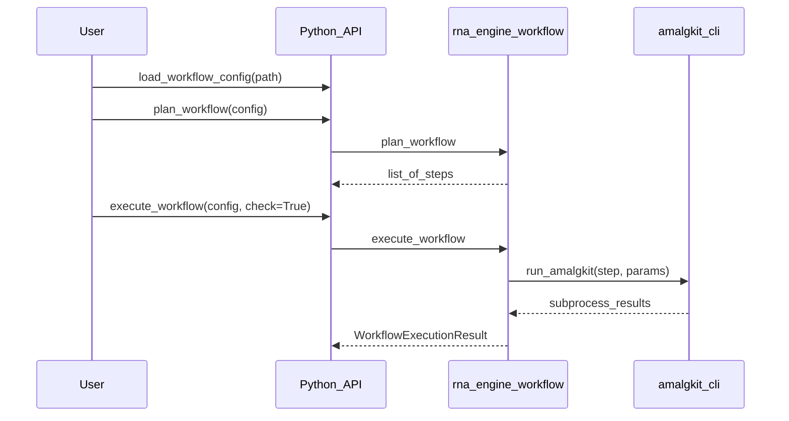

# CLI

Most analysis APIs are used from Python (`import metainformant...`). The **`metainformant` entry point** ([`src/metainformant/__main__.py`](../src/metainformant/__main__.py)) exposes a small set of commands today.

Entry: `uv run python -m metainformant` or `uv run metainformant`.

## Implemented commands

Global flags:

- `--version` — print package version
- `--modules` — list domain module names
- `--help` — usage (default when no arguments)

Subcommands:

```text
uv run metainformant protein taxon-ids --file tests/data/protein/taxon_id_list.txt
uv run metainformant protein comp --fasta data/protein/example.faa
uv run metainformant protein rmsd-ca --pdb-a file1.pdb --pdb-b file2.pdb

uv run metainformant quality batch-detect --data samples.csv --batches batches.txt
uv run metainformant quality batch-detect --data samples.csv --batches batches.txt --alpha 0.01

uv run metainformant rna info
uv run metainformant gwas info
```

| Command | Purpose |
|--------|---------|
| **protein taxon-ids** | Read and print taxon IDs from a file ([Protein Proteomes](./protein/proteomes.md)) |
| **protein comp** | Amino acid composition per sequence from FASTA |
| **protein rmsd-ca** | Kabsch RMSD between CA atoms of two PDB files |
| **quality batch-detect** | Batch-effect report from a numeric matrix (CSV) and per-sample batch labels file |
| **rna info** | Prints RNA sub-package summary (use Python API for workflows) |
| **gwas info** | Prints GWAS sub-package summary (use Python API or scripts for full runs) |

## RNA-seq and GWAS workflows (not via main CLI)

The main `metainformant` CLI does **not** implement `rna run`, `rna plan`, `gwas run`, `dna fetch`, or `setup`. Use one of:

**Python API** (see [RNA Workflow](./rna/workflow.md), [GWAS Workflow](./gwas/workflow.md)):

```python
from pathlib import Path
from metainformant.rna.engine.workflow import load_workflow_config, plan_workflow, execute_workflow

config = load_workflow_config(Path("config/amalgkit/amalgkit_pogonomyrmex_barbatus.yaml"))
steps = plan_workflow(config)
result = execute_workflow(config, check=False)
```

**Module entry (amalgkit):**

```bash
uv run python -m metainformant.rna.amalgkit --help
```

**Script orchestrators** (recommended for config-driven runs):

```bash
python3 scripts/rna/run_workflow.py --config config/amalgkit/amalgkit_pogonomyrmex_barbatus.yaml
```

TUI variants: [TUI Monitoring Tools](#tui-monitoring-tools) below.

## Tests

Run the test suite with pytest, not via `metainformant`:

```bash
bash scripts/package/test.sh
```

See [Testing](./testing.md).


```mermaid
sequenceDiagram
  participant U as User
  participant Py as Python_API
  participant Eng as rna_engine_workflow
  participant Am as amalgkit_cli
  U->>Py: load_workflow_config(path)
  U->>Py: plan_workflow(config)
  Py->>Eng: plan_workflow
  Eng-->>Py: list_of_steps
  U->>Py: execute_workflow(config, check=True)
  Py->>Eng: execute_workflow
  Eng->>Am: run_amalgkit(step, params)
  Am-->>Eng: subprocess_results
  Eng-->>Py: WorkflowExecutionResult
```

See: [RNA Workflow](./rna/workflow.md), [DNA](./dna/index.md), [GWAS Workflow](./gwas/workflow.md), [Testing](./testing.md).

## TUI monitoring tools

Interactive terminal tools (separate from `metainformant`):

- **`scripts/rna/monitor_tui.py`** — Dashboard for pipeline progress and system metrics (default refresh ~5s).

  ```bash
  python scripts/rna/monitor_tui.py
  ```

- **`scripts/rna/run_workflow_tui.py`** — Workflow runner with TUI.

  ```bash
  python scripts/rna/run_workflow_tui.py --config config/amalgkit/amalgkit_pogonomyrmex_barbatus.yaml --threads 5
  ```

## Directory conventions (RNA output)

```text
output/amalgkit/<species>/
 work/ # Amalgkit intermediate files (metadata, selected samples, merge outputs)
 metadata/ # Sample metadata from NCBI (metadata_selected.tsv)
 getfastq/ # Symlinks to downloaded FASTQ files
 quant/ # Kallisto quantification results per sample
 merge/ # Combined abundance matrices
 logs/ # Step-level log files
 fastq/ # Raw downloaded FASTQ files (ENA .fastq.gz or SRA extracts)
 getfastq/ # Per-sample subdirectories with FASTQ pairs
 genome/ # Reference genome FASTA + Kallisto index
```

`work/getfastq/` holds **symlinks** to `fastq/getfastq/` where data files live.

## Configuration files

- **RNA**: `config/amalgkit/*.yaml` ([RNA Workflow](./rna/workflow.md))
- **GWAS**: `config/gwas/*.yaml` ([GWAS Workflow](./gwas/workflow.md))
- **Networks**: `config/networks/networks_template.yaml`
- **Multi-omics**: `config/multiomics/multiomics_template.yaml`
- **Single-cell**: `config/singlecell/singlecell_template.yaml`

See [Configuration Management](./core/config.md) for environment overrides.
