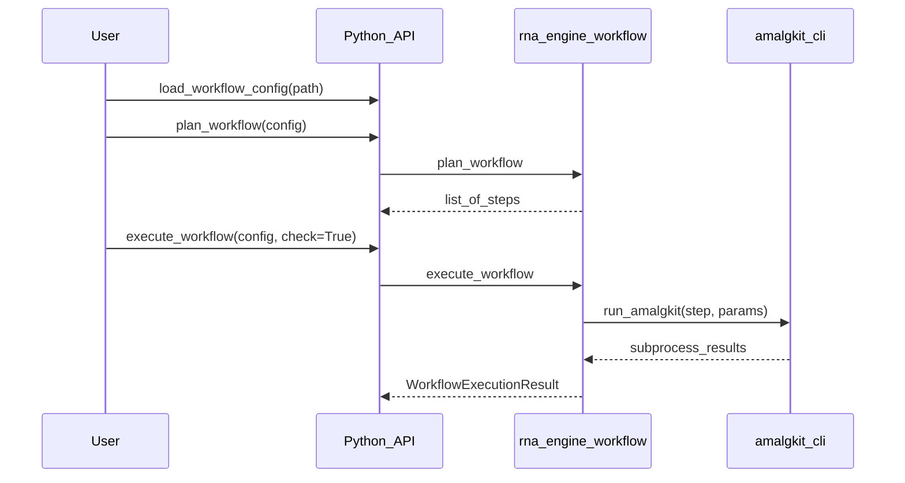

# CLI

Most analysis APIs are used from Python (`import metainformant...`). The **`metainformant` entry point** ([`src/metainformant/__main__.py`](../src/metainformant/__main__.py)) exposes the commands documented here.

Entry: `uv run python -m metainformant` or `uv run metainformant`.

## Global flags

- `--version` — print package version
- `--modules` — list domain module names (the printed list does not include `eqtl` or `popgen`)
- `--help` — usage (also printed when no arguments are given)

A bare domain with no subcommand (for example `metainformant rna`) prints help to stderr and exits 1.

## Commands

| Command | Purpose |
|--------|---------|
| **protein taxon-ids** | Read and print taxon IDs from a file (`--file`) ([Protein Proteomes](./protein/proteomes.md)) |
| **protein comp** | Amino acid composition per sequence from FASTA (`--fasta`) |
| **protein rmsd-ca** | Kabsch RMSD between CA atoms of two PDB files (`--pdb-a`, `--pdb-b`) |
| **quality batch-detect** | Batch-effect report from a numeric matrix (CSV, `--data`) and per-sample batch labels file (`--batches`, optional `--alpha`) |
| **quality run** | Docs-vs-source cross-code verification: writes a Markdown report (`--output`, default `output/cross_code_verification_report.md`), verifies `--docs-dir` against `--src-dir`; `--include-historical` includes historical snapshots, `--strict-optional-imports` treats optional third-party imports as violations; exits 1 when violations are found |
| **rna info** | Prints RNA sub-package summary (use Python API for workflows) |
| **gwas info** | Prints GWAS sub-package summary (use Python API or scripts for full runs) |
| **gwas run** | Validate (`--check`) or execute a config-driven GWAS workflow (`--config`, optional `--output-dir`) |
| **life-events predict** | Predict outcomes for event sequences (`--events`, `--model`, `--output`); writes `predictions.json` — per-sequence predictions with class probabilities for classification tasks and mean/min/max statistics for regression |
| **life-events interpret** | Create an interpretation report (`--model`, `--sequences`, `--output`); writes `interpretation_report.json` with event importance, temporal patterns, and feature attribution |
| **simulation run** | Run a simulation workflow (`--model` from `sequence_evolution`, `population_genetics`, `rna_expression`, `agent_ecosystem`, `predator_prey`, `competition`; optional `--n` size override; `--output` directory, default `output/simulation`); saves the result JSON in the output directory |
| **ontology run** | Run the GO/HPO ontology enrichment workflow (`--input` workflow YAML, `--phenotype` and `--model` labels for the results subdirectory); the workflow exits nonzero when GWAS stage inputs are missing |
| **phenotype run** | Run the phenotype pipeline over a JSON dataset (`--input`, list of records; `--type` from `morphological`, `behavioral`, `chemical`, `electronic`, `sonic`, default `morphological`; `--output` directory, default `output/phenotype`); writes `pipeline_result.json` and exits 0/1 by pipeline success |
| **networks run** | Build and analyze a network from an edge-list CSV (`--input` with `source` and `target` columns, optional `weight`); runs community detection and metrics and exports results to `--output` (default `output/networks`) |

There is no `math` subcommand; selection-replay tooling was removed.

## RNA-seq and GWAS workflows

The main `metainformant` CLI implements `gwas run` but does **not** implement
`rna run`, `rna plan`, `dna fetch`, or `setup`. Use one of:

**Python API** (see [RNA Workflow](./rna/workflow.md), [GWAS Workflow](./gwas/workflow.md)):

```python
from pathlib import Path
from metainformant.rna.engine.workflow import load_workflow_config, plan_workflow, execute_workflow

config = load_workflow_config(Path("config/amalgkit/amalgkit_pogonomyrmex_barbatus.yaml"))
steps = plan_workflow(config)
result = execute_workflow(config, check=False)
```

**GWAS CLI:**

```bash
uv run metainformant gwas run --config config/gwas/gwas_pbarbatus.yaml --check
uv run metainformant gwas run --config config/gwas/gwas_pbarbatus.yaml --output-dir output/gwas/pbarbatus
```

**Module entry (amalgkit):**

```bash
uv run python -m metainformant.rna.amalgkit --help
```

**Script orchestrators** (recommended for config-driven runs):

```bash
uv run python scripts/rna/run_all_species.py \
  --config-dir projects/hymenoptera_amalgkit/config/amalgkit \
  --data-root "$AMALGKIT_DATA_ROOT" --dry-run
```

For running campaigns, use the maintained [RNA status](#rna-status) command
below; it reads the SQLite progress database and downstream evidence.

## Tests

Run the test suite with pytest, not via `metainformant`:

```bash
bash scripts/package/test.sh
```

See [Testing](./testing.md).


```mermaid
sequenceDiagram
  participant U as User
  participant Py as Python_API
  participant Eng as rna_engine_workflow
  participant Am as amalgkit_cli
  U->>Py: load_workflow_config(path)
  U->>Py: plan_workflow(config)
  Py->>Eng: plan_workflow
  Eng-->>Py: list_of_steps
  U->>Py: execute_workflow(config, check=True)
  Py->>Eng: execute_workflow
  Eng->>Am: run_amalgkit(step, params)
  Am-->>Eng: subprocess_results
  Eng-->>Py: WorkflowExecutionResult
```

See: [RNA Workflow](./rna/workflow.md), [DNA](./dna/index.md), [GWAS Workflow](./gwas/workflow.md), [Testing](./testing.md).

## RNA status

The current status command reads SQLite progress and downstream evidence:

```bash
uv run python scripts/rna/check_pipeline_status.py \
  --data-root "$AMALGKIT_DATA_ROOT" --verbose
```

## Directory conventions (RNA output)

```text
output/amalgkit/<species>/
 work/ # Amalgkit intermediate files (metadata, selected samples, merge outputs)
 metadata/ # Sample metadata from NCBI (metadata_selected.tsv)
 getfastq/ # Symlinks to downloaded FASTQ files
 quant/ # Kallisto quantification results per sample
 merge/ # Combined abundance matrices
 logs/ # Step-level log files
 fastq/ # Raw downloaded FASTQ files (ENA .fastq.gz or SRA extracts)
 getfastq/ # Per-sample subdirectories with FASTQ pairs
 genome/ # Reference genome FASTA + Kallisto index
```

`work/getfastq/` holds **symlinks** to `fastq/getfastq/` where data files live.

## Configuration files

- **RNA**: `config/amalgkit/*.yaml` ([RNA Workflow](./rna/workflow.md))
- **GWAS**: `config/gwas/*.yaml` ([GWAS Workflow](./gwas/workflow.md))
- **Networks**: `config/networks/networks_template.yaml`
- **Multi-omics**: `config/multiomics/multiomics_template.yaml`
- **Single-cell**: `config/singlecell/singlecell_template.yaml`

See [Configuration Management](./core/config.md) for environment overrides.
