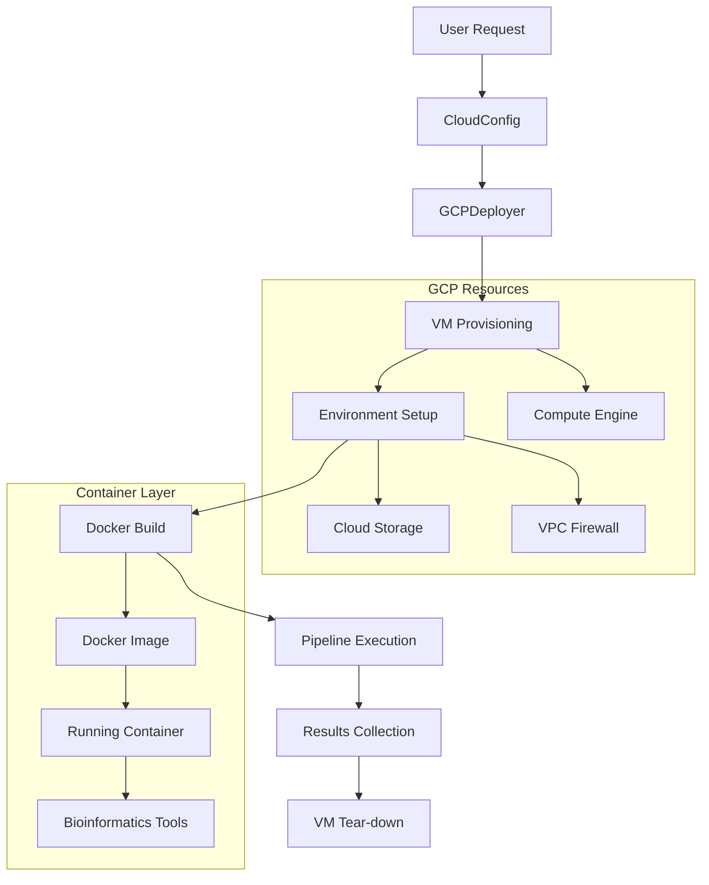

# Cloud Module

Cloud deployment and infrastructure automation for METAINFORMANT bioinformatics workflows.

## Overview

Cloud deployment and infrastructure automation for METAINFORMANT bioinformatics workflows.


## Table of Contents

- [Architecture](#architecture)
- [Key Components](#key-components)
  - [CloudConfig (`cloud_config.py`)](#cloudconfig-cloud_configpy)
  - [GCPDeployer (`gcp_deployer.py`)](#gcpdeployer-gcp_deployerpy)
- [Genome Preparation](#genome-preparation)
  - [Reference Genome Indexing](#reference-genome-indexing)
  - [Caching Strategy](#caching-strategy)
- [Workflow Example: RNA-seq on Cloud](#workflow-example-rna-seq-on-cloud)
- [Cost Optimization](#cost-optimization)
  - [Preemptible VMs (70-80% savings)](#preemptible-vms-70-80-savings)
  - [Cost Estimation](#cost-estimation)
- [Troubleshooting](#troubleshooting)
- [See Also](#see-also)

## Architecture



## Key Components

### CloudConfig (`cloud_config.py`)

Configuration management for cloud deployments:

```python
from metainformant.cloud import CloudConfig

config = CloudConfig(
    project_id="my-gcp-project",
    region="us-central1",
    zone="us-central1-a",
    machine_type="n1-standard-8",
    disk_size_gb=100,
    docker_image="metainformant/amplicon:latest",
    startup_script="scripts/cloud/cloud_startup.sh"
)
```

**Configuration Fields:**

| Field | Type | Description |
|-------|------|-------------|
| `project_id` | str | GCP project ID (required) |
| `region` | str | GCP region (default: `us-central1`) |
| `zone` | str | GCP zone (default: `us-central1-a`) |
| `machine_type` | str | Compute Engine machine type (default: `n1-standard-8`) |
| `disk_size_gb` | int | Boot disk size in GB (default: 100) |
| `docker_image` | str | Docker image to deploy |
| `preemptible` | bool | Use preemptible VMs for cost savings (default: `False`) |
| `network` | str | VPC network name (default: `default`) |
| `service_account` | str | Service account email (optional) |
| `scopes` | list[str] | OAuth2 scopes (default: cloud-platform) |
| `startup_script` | str | Path to startup script |
| `shutdown_script` | str | Path to shutdown script (optional) |
| `metadata` | dict | Custom metadata key-value pairs |
| `labels` | dict | Resource labels for organization |

### GCPDeployer (`gcp_deployer.py`)

VM lifecycle management and job execution:

```python
from metainformant.cloud import GCPDeployer

deployer = GCPDeployer(config)

# Start VM and wait for initialization
instance = deployer.create_instance("my-analysis-001")

# Upload data to VM
deployer.upload_directory("local/data/", "/home/user/data/", instance_name=instance.name)

# Execute command on VM
result = deployer.execute_command(
    "uv run metainformant rna workflow --config config.yaml",
    instance_name=instance.name
)

# Download results
deployer.download_directory("/home/user/output/", "local/results/", instance_name=instance.name)

# Clean up
deployer.delete_instance(instance.name)
```

**Methods:**

| Method | Description |
|--------|-------------|
| `create_instance(name, labels=None)` | Create new Compute Engine VM |
| `delete_instance(instance_name)` | Delete VM and attached resources |
| `get_instance(instance_name)` | Get instance status |
| `list_instances()` | List all project instances |
| `wait_for_ready(instance_name, timeout=600)` | Block until VM SSH-accessible |
| `upload_file(local, remote, instance_name)` | Upload single file via SCP |
| `upload_directory(local, remote, instance_name)` | Recursively upload directory |
| `download_file(remote, local, instance_name)` | Download single file |
| `download_directory(remote, local, instance_name)` | Recursively download directory |
| `execute_command(command, instance_name, capture_output=True)` | Run shell command on VM |
| `stream_logs(instance_name, filter=None)` | Stream Cloud Logging entries |

## Genome Preparation

### Reference Genome Indexing

```python
from metainformant.cloud.genome_prep import prepare_genome_index

# Download and index genome (runs on cloud VM)
index_path = prepare_genome_index(
    accession="GCA_003254395.2",  # Apis mellifera
    output_dir="/data/genomes/",
    tools=["samtools", "bwa", "hisat2"],
    overwrite=False
)
```

**Supported tools:**
- BWA-MEM (`bwa index`)
- HISAT2 (`hisat2-build`)
- STAR (`STAR --runMode genomeGenerate`)
- Bowtie2 (`bowtie2-build`)
- SAMtools FASTA index (`samtools faidx`)

### Caching Strategy

Pre-downloaded genomes cached in GCS bucket:
```
gs://metainformant-genomes/
 amellifera/
 GCA_003254395.2.fna.gz
 GCA_003254395.2.bwa.index.tar.gz
 metadata.json
```

If genome already cached → instantly download from bucket. Otherwise fetch from NCBI and upload to cache.

## Workflow Example: RNA-seq on Cloud

```python
from metainformant.cloud import CloudConfig, GCPDeployer

config = CloudConfig.from_yaml("config/cloud_deploy.yaml")
deployer = GCPDeployer(config)

# 1. Create VM
instance = deployer.create_instance("rna-pipeline-20250115")

# 2. Upload FASTQ data
deployer.upload_directory("data/fastq/", "/data/fastq/", instance_name=instance.name)

# 3. Upload config
deployer.upload_file("config/amalgkit.yaml", "/config/pipeline.yaml", instance_name=instance.name)

# 4. Execute pipeline
result = deployer.execute_command(
    "cd /work && uv run python scripts/rna/run_workflow.py --config /config/pipeline.yaml",
    instance_name=instance.name
)
print(f"Pipeline exit code: {result.returncode}")

# 5. Download results
deployer.download_directory("/work/output/", "output/cloud_run/", instance_name=instance.name)

# 6. Clean up
deployer.delete_instance(instance.name)
```

## Cost Optimization

### Preemptible VMs (70-80% savings)

```python
config = CloudConfig(
    preemptible=True,
    max_run_time_hours=6,  # Preemptible limit is 24h
    retry_on_preempt=True  # Auto-restart on fresh VM
)
```

| Instance Type | On-Demand | Preemptible | Savings |
|---------------|-----------|-------------|---------|
| n1-standard-8 | $0.38/hr | $0.10/hr | 74% |
| n1-standard-16 | $0.76/hr | $0.20/hr | 74% |

### Cost Estimation

```python
cost = config.estimate_cost(runtime_hours=6, machine_type="n1-standard-8")
print(f"Estimated: ${cost:.2f}")  # "Estimated: $4.80"
```

## Troubleshooting

| Failure | Cause | Fix |
|---------|-------|-----|
| `PERMISSION_DENIED` | Missing IAM roles | Grant `compute.instanceAdmin.v1` + `storage.objectAdmin` |
| `INSUFFICIENT_CPU` | Quota exhausted | Request quota increase or use different zone |
| `STARTUP_SCRIPT_FAILED` | Missing dependency | Check `/var/log/startupscript.log` on VM |
| `SSH_TIMEOUT` | Firewall blocking | Allow TCP:22 in VPC firewall rules |

---

**Next:** [RNA Pipeline](../rna/) | [GWAS Pipeline](../gwas/) | [Orchestration Guide](../rna/ORCHESTRATION.md)

---

## See Also

- **Documentation**: [index.md](index.md) — Architecture, deployment guides, cost optimization
- **API Reference**: [SPEC.md](SPEC.md) — Full type signatures, error codes, JSON schemas
- **Troubleshooting**: [TROUBLESHOOTING.md](TROUBLESHOOTING.md) — Common errors + fixes, logs to inspect, escalation paths
- **Economics**: [ECONOMICS.md](ECONOMICS.md) — Cost breakdown, preemptible VM strategy
- **GWAS Pipeline**: [../gwas/index.md](../gwas/index.md) — Can also be deployed via `deploy_gcp.py`
- **Mothership**: [README.md](../README.md) — Project homepage
