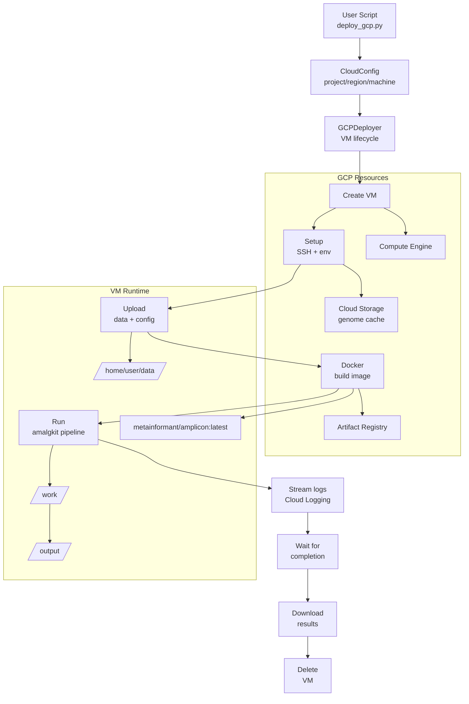

# Cloud Deployment Module

Production-grade GCP deployment for running METAINFORMANT pipelines at warehouse scale.

## Overview

The cloud module provides **orchestration and automation** for large-scale bioinformatics workflows:

* **VM lifecycle management** — spin up/down Compute Engine instances programmatically
* **Docker-based execution** — containers guarantee reproducibility across environments
* **Genome reference caching** — pre-built indices in GCS buckets (instant retrieval)
* **Job distribution** — thousands of samples processed in parallel
* **Cost optimization** — preemptible VMs, spot pricing, budget alerts
* **State monitoring** — real-time logs, progress tracking, failure recovery

**Current focus:** Amalgkit RNA-seq pipeline for Hymenoptera (28 species) — proven at 8,300+ samples.

**Planned:** GWAS cloud runner, multi-omics orchestration, cross-cloud (AWS/Azure) support.

---

## Architecture



## When to Use Cloud

| Scenario | Local? | Cloud? | Why |
|-----------|--------|--------|-----|
| Single small RNA-seq experiment (≤20 samples) | [DONE] Yes | No | Takes 1–2 hours locally; cloud overhead not worth it |
| Batch of 100+ samples | No | [DONE] Yes | Parallel VMs; ~5–6× speedup |
| Genome assembly (requires 96+ cores, 500 GB RAM) | Rarely | [DONE] Yes | High-memory instances (n2-highmem-32) available on-demand |
| Production service (automated, daily runs) | Possibly | [DONE] Yes | Easier to schedule, monitor, auto-retry |
| Learning/experimentation | [DONE] Yes | Yes (cost concerns) | Start locally first; cloud for full-scale validation |
| Memory-intensive (Hi-C, long-read assembly) | No | [DONE] Yes | High-memory instances otherwise unavailable |

**Rule of thumb:** If your workflow runs >6 hours locally or requires >32 GB RAM, use cloud.

## Quick Start

```bash
# 1. Install gcloud CLI
bash scripts/cloud/install_gcloud.sh

# 2. Authenticate
gcloud auth login
gcloud config set project YOUR_PROJECT_ID

# 3. Deploy pipeline
python scripts/cloud/deploy_gcp.py deploy --project YOUR_PROJECT_ID

# 4. Monitor
python scripts/cloud/deploy_gcp.py status --project YOUR_PROJECT_ID

# 5. Download results
python scripts/cloud/deploy_gcp.py download --project YOUR_PROJECT_ID

# 6. Clean up
python scripts/cloud/deploy_gcp.py destroy --project YOUR_PROJECT_ID
```

## Guides

| Guide | Description |
|-------|-------------|
| [DEPLOYMENT.md](DEPLOYMENT.md) | Step-by-step deployment walkthrough with working example |
| [ARCHITECTURE.md](ARCHITECTURE.md) | Technical design decisions, component diagrams, VM specs |
| [ECONOMICS.md](ECONOMICS.md) | Cost optimization strategies, budget tracking, ROI analysis |
| [TROUBLESHOOTING.md](TROUBLESHOOTING.md) | Common errors + fixes, logs to inspect, escalation paths |

## Configuration

### Machine Types

| Type | vCPUs | RAM | Hourly (on-demand) | Hourly (spot) | Use Case |
|------|-------|-----|-------------------|---------------|----------|
| `n2-highcpu-96` | 96 | 96 GB | $1.28 | $0.32 | Default batch (80 samples/vm) |
| `n2-highmem-32` | 32 | 256 GB | $1.47 | $0.37 | Genome assembly, Hi-C |
| `n1-standard-8` | 8 | 30 GB | $0.38 | $0.10 | Single-sample dev/test |
| `n1-standard-16` | 16 | 60 GB | $0.76 | $0.20 | Small batch (5–10 samples) |

### Defaults

| Parameter | Value |
|-----------|-------|
| Machine type | `n2-highcpu-96` |
| Boot disk | 500 GB SSD |
| OS | Ubuntu 22.04 LTS |
| Network | Default VPC, allow SSH from your IP only |
| Pricing | Spot (80% savings vs. on-demand) |
| Workers | 80 simultaneous samples |
| Max sample size | 20 GB uncompressed FASTQ |

**Estimated cost:** $7–27 per full 28-species run (4–8 hours runtime).

## Source Code

| File | Purpose |
|------|---------|
| `src/metainformant/cloud/cloud_config.py` | CloudConfig dataclass (settings + validation) |
| `src/metainformant/cloud/gcp_deployer.py` | GCPDeployer: VM lifecycle, file transfer, Docker ops |
| `scripts/cloud/deploy_gcp.py` | CLI entry point — user-facing orchestrator |
| `scripts/cloud/prep_genomes.py` | Genome indexing + GCS cache upload |
| `scripts/cloud/cloud_startup.sh` | VM init: install Docker, pull images, configure env |

## Related Documentation

- [LINUX_TRANSFER.md](../LINUX_TRANSFER.md) — Linux/WSL file transfer patterns
- [RNA workflows](../rna/workflow.md) — Amalgkit pipeline (cloud consumer)
- [Architecture](../architecture.md) — System-wide design
- [SPEC.md](SPEC.md) — Full technical API reference

## External Links

- [GCP Pricing Calculator](https://cloud.google.com/products/calculator)
- [Amalgkit publication](https://doi.org/10.1186/s12859-021-04549-4) — Methodology background

## Detailed Documentation

```{toctree}
:maxdepth: 2
:caption: Cloud Module Documentation

README
SPEC
AGENTS
DEPLOYMENT
ARCHITECTURE
ECONOMICS
TROUBLESHOOTING
PAI
```
