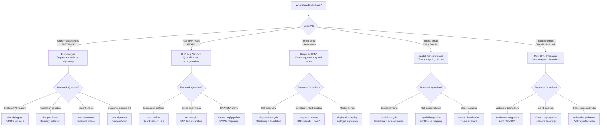
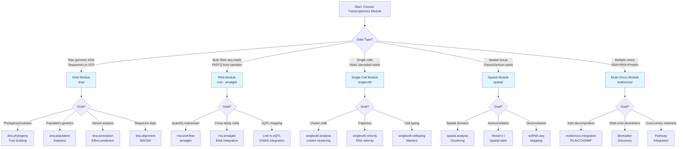

# DNA vs RNA vs Transcriptome Analysis: Module Comparison Guide

## Overview

This guide helps users choose between DNA, RNA, and transcriptome analysis approaches in METAINFORMANT. While these modules overlap in some capabilities, they serve distinct purposes and are optimized for different data types and research questions.

## Module Summary

| Module | Primary Data | Core Purpose | Key Technologies |
|--------|--------------|--------------|------------------|
| **[dna](../dna/)** | Genomic DNA sequences (FASTA, VCF) | Sequence analysis, alignment, phylogeny, population genetics | Needleman-Wunsch, Smith-Waterman, NJ/UPGMA trees, Tajima's D, Fst |
| **[rna](../rna/)** | RNA-seq reads (FASTQ, BAM) | Bulk transcriptome quantification and integration | Amalgkit workflow, Kallisto, ENA/SRA streaming, cross-species TMM |
| **[singlecell](../singlecell/)** | Single-cell RNA-seq (h5ad, count matrices) | Cell-level resolution transcriptomics | Leiden clustering, trajectory inference, RNA velocity |
| **[spatial](../spatial/)** | Spatial transcriptomics (Visium, Xenium) | Spatially-resolved gene expression | Spatial clustering, deconvolution, autocorrelation |
| **[multiomics](../multiomics/)** | Integrated DNA+RNA (multi-modal) | Cross-omics integration and joint analysis | MultiOmicsData container, joint PCA/CCA/NMF |

## Detailed Comparison

### 1. Data Type & Input Format

| Feature | dna | rna | singlecell | spatial | multiomics |
|---------|-----|-----|------------|---------|------------|
| **Primary Input** | FASTA, VCF, FASTQ | FASTQ, BAM | h5ad, count matrix | H5, TIFF, AnnData | Mixed (DNA+RNA+etc) |
| **Sequence-based** | ✓ Direct sequences | ✓ Reads (post-alignment) | ✓ Counts (no sequences) | ✓ Spots + spatial coords | ✓ Variants + expression |
| **Variant-aware** | ✓ Full VCF support | Limited (via eQTL) | ✗ | ✗ | ✓ Integration |
| **Spatial info** | ✗ | ✗ | ✗ | ✓ 2D/3D coordinates | ✗ |
| **Single-cell** | ✗ | ✗ | ✓ Cell barcodes | ✗ | Optional |
| **Metadata** | Minimal | Sample/phenotype | Cell-type annotation | Spatial coordinates | All of above |

### 2. Analysis Capabilities

| Capability | dna | rna | singlecell | spatial | multiomics |
|------------|-----|-----|------------|---------|------------|
| **Sequence alignment** | ✓ Pairwise, MSA | Via external tools | ✗ | ✗ | ✗ |
| **Phylogenetics** | ✓ Trees (NJ/UPGMA) | ✗ | ✗ | ✗ | ✗ |
| **Population genetics** | ✓ Fst, π, Tajima's D | ✗ | ✗ | ✗ | Limited |
| **Quantification** | ✗ | ✓ Gene counts/TPM | ✓ Expression matrix | ✓ Spot expression | ✓ Harmonized counts |
| **Normalization** | Basic | TMM, CSTMM | Library size, SCTransform | Spatial smoothing | Multi-omic scaling |
| **Differential expression** | ✗ | Basic (via downstream) | ✓ DESeq2/edgeR wrapper | ✓ Spatial DE | Joint models |
| **Clustering** | ✗ | ✗ | ✓ Leiden/ Louvain | ✓ Spatial domains | Cross-modal clusters |
| **Trajectory** | ✗ | ✗ | ✓ PAGA, RNA velocity | ✗ | ✗ |
| **Cell typing** | ✗ | ✗ | ✓ Marker-based | ✗ | ✗ |
| **Integration** | Cross-species translation | Multi-study amalgamation | scRNA-seq→bulk | scRNA-seq mapping | DNA↔RNA↔Protein |

### 3. Computational Scale & Requirements

| Metric | dna | rna | singlecell | spatial | multiomics |
|--------|-----|-----|------------|---------|------------|
| **Sample count** | 1–10,000+ genomes | 1–10,000 samples | 1,000–1,000,000 cells | 1–1,000 tissues | 10–1,000 coordinated |
| **Data size** | MB–GB (FASTA) | GB–TB (FASTQ) | GB–100GB (h5ad) | 10GB–TB (images+counts) | TB (multi-modal) |
| **Memory footprint** | Low (1–4GB) | Medium (8–64GB) | High (32–128GB) | Very High (64–256GB) | High (64–128GB) |
| **Parallelization** | CPU-light | I/O-heavy | CPU+memory heavy | GPU-optional | CPU+memory heavy |
| **Typical runtime** | Seconds–hours | Hours–days | Hours–days | Days–weeks | Days–weeks |

### 4. Use Case Decision Guide



### 5. Output Format Differences

| Output Type | dna | rna | singlecell | spatial | multiomics |
|-------------|-----|-----|------------|---------|------------|
| **Primary artifacts** | Newick trees, distance matrices, VCF annotations | TPM/counts matrices, manifests, logs | AnnData objects, clusters, embeddings | Tissue images, spatial spots, coordinates | MultiOmicsData objects, joint components |
| **File format** | .nwk, .npy, .vcf.gz | .tsv, .jsonl, .log | .h5ad, .tsv, .png | .h5, .tif, .png | .h5, .tsv, .json |
| **Location convention** | `output/dna/` | `output/rna/{species}/` | `output/singlecell/` | `output/spatial/` | `output/multiomics/` |
| **Manifest/log** | Optional | `amalgkit.manifest.jsonl` | `workflow.json` | `pipeline.log` | `integration_summary.json` |

### 6. Example Equivalent Operations

#### Basic quantification/analysis across modules:

```python-snippet
# === DNA: Variant calling and annotation ===
from metainformant.dna import calling, annotation
variants = calling.call_variants("sample.bam", "ref.fa")
effects = annotation.annotate_variants(variants, "genes.gff")

# === RNA: Gene expression quantification ===
from metainformant.rna import workflow
wf = workflow.plan_workflow(config="rna_config.yaml")
results = workflow.execute_workflow(wf)
# Output: TPM/counts matrix in output/rna/

# === Single-Cell: Cell clustering ===
from metainformant.singlecell import analysis
adata = analysis.load_h5ad("cells.h5ad")
clusters = analysis.run_leiden(adata, resolution=0.5)
markers = analysis.find_marker_genes(adata, clusters)

# === Spatial: Domain detection ===
from metainformant.spatial import analysis
spatial_data = analysis.load_visium("tissue.h5")
domains = analysis.spatial_clustering(spatial_data)
de_genes = analysis.spatial_de(spatial_data, domains)

# === Multi-Omics: Joint analysis ===
from metainformant.multiomics import integration
multi = integration.MultiOmicsData()
multi.add_omics("genome", variants_df)
multi.add_omics("transcriptome", expression_df)
joint = integration.joint_pca(multi)
```

### 7. When to Use Each Module

#### Use **dna** when:
- ✓ You have genomic sequences (FASTA) to align or analyze
- ✓ Building phylogenetic trees or computing evolutionary distances
- ✓ Calculating population genetics statistics (π, Fst, Tajima's D)
- ✓ Parsing and annotating VCF variant files
- ✓ Analyzing genetic variation without RNA expression component

#### Use **rna** when:
- ✓ You have bulk RNA-seq FASTQ files to quantify
- ✓ Integrating multiple RNA-seq studies/species (meta-analysis)
- ✓ Using ENA/SRA public data at scale (streaming orchestration)
- ✓ Need cross-species ortholog mapping and normalization
- ✓ Typical gene expression differential analysis (post-processing)

#### Use **singlecell** when:
- ✓ You need cell-type resolution (not bulk averages)
- ✓ Working with 10x Genomics or similar scRNA-seq data
- ✓ Discovering novel cell populations
- ✓ Inference of developmental trajectories
- ✓ RNA velocity (future state prediction)

#### Use **spatial** when:
- ✓ Tissue spatial architecture matters
- ✓ You have 10x Visium, MERFISH, or Xenium data
- ✓ Mapping gene expression to histological coordinates
- ✓ Analyzing spatial patterns (autocorrelation, niches)
- ✓ Deconvolving cell-type proportions in spots

#### Use **multiomics** when:
- ✓ You have coordinated DNA+RNA (+Protein) data from same samples
- ✓ Want to identify multi-omic biomarkers
- ✓ Integrating GWAS variants with expression (eQTL-style)
- ✓ Joint dimensionality reduction across omics layers
- ✓ Cross-omics correlation and network construction

### 8. Cross-Module Dependencies

| Dependency | Uses | Notes |
|------------|------|-------|
| **rna → dna** | Transcription, codon translation | `dna.transcription.dna_to_rna()` |
| **multiomics → dna/rna** | Data container integration | Uses `from_dna_variants()`, `from_rna_expression()` |
| **eqtl → gwas + rna** | Expression QTL mapping | Logic in `gwas.finemapping.eqtl` |
| **spatial → singlecell** | Cell-type mapping | Anchors-based integration |
| **singlecell → rna** | Normalization methods | Shared preprocessing concepts |

## Decision Flowchart



## Quick Reference Table

| Criterion | dna | rna | singlecell | spatial | multiomics |
|-----------|-----|-----|------------|---------|------------|
| **Data scale** | Few–many genomes | Many samples | Many cells | Few tissues | Moderate samples |
| **Resolution** | Nucleotide | Gene | Cell | Spot | Multi-layer |
| **Temporal** | ✗ | ✗ | Velocity possible | Static snapshot | Static snapshot |
| **Spatial** | ✗ | ✗ | ✗ | ✓ 2D/3D | ✗ |
| **Integration depth** | Cross-species translation | Cross-study amalgamation | sc↔bulk bridging | sc mapping | Full multi-omic |
| **Primary output** | Trees, variants | Expression matrices | Cell clusters, embeddings | Tissue maps | Joint components |
| **Typical users** | Evolutionary biologists | Transcriptomicists | Immunologists, developmental biologists | Pathologists, spatial biologists | Systems biologists |

## Related Documentation

- **[dna/index.md](../dna/index.md)** — Full DNA module guide
- **[rna/index.md](../rna/index.md)** — RNA-seq workflow documentation
- **[singlecell/SPEC.md](../singlecell/SPEC.md)** — Single-cell specifications
- **[spatial/index.md](../spatial/index.md)** — Spatial transcriptomics guide
- **[multiomics/index.md](../multiomics/index.md)** — Multi-omic integration
- **[eqtl/README.md](../eqtl/README.md)** — eQTL bridging (GWAS×RNA)
- **[COMPARISON_GUIDES.md](../COMPARISON_GUIDES.md)** — Master comparison index
