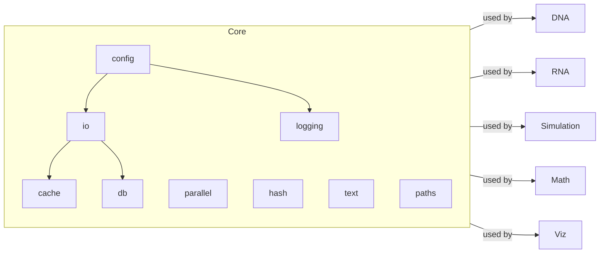

### Core Utilities

- **config**: configuration helpers
- **io**: robust I/O (json, jsonl, csv/tsv, gzip-aware)
- **logging**: consistent loggers
- **text**: normalization helpers
- **parallel**: simple thread-based `map`
- **hash**: file/content hashing
- **paths**: path helpers
- **cache**: JSON cache helpers
- **db**: PostgreSQL client helper



Examples

```python
from metainformant.core import io, parallel, hash

io.ensure_directory("./out")
checksums = parallel.thread_map(hash.sha256_file, ["README.md"])  # list[str]
```


