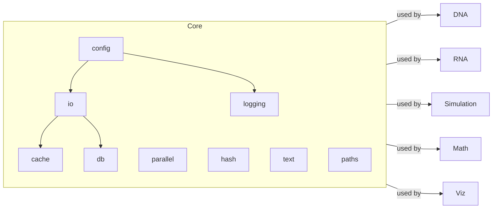

# Core Utilities

- [config](./core/config.md): environment, typed env loaders, Postgres config
- [io](./core/io.md): JSON/JSONL, CSV/TSV, gzip-aware open, mkdir
- [logging](./core/logging.md): consistent logger factory
- [text](./core/text.md): normalization, slugify, safe filenames
- [parallel](./core/parallel.md): thread-based map
- [hash](./core/hash.md): SHA-256 hashing helpers
- [paths](./core/paths.md): expand/resolve, containment check
- [cache](./core/cache.md): simple JSON cache with TTL
- [db](./core/db.md): PostgreSQL client initialization



Conventions

- **Outputs**: write to `output/` by default; accept an override path parameter.
- **Configs**: read from `config/` using `core.config` helpers; allow env overrides.
- **Data**: read inputs from `data/` unless explicit paths are provided.

Examples

```python
from metainformant.core import io, parallel, hash

io.ensure_directory("output")
checksums = parallel.thread_map(hash.sha256_file, ["README.md"])  # list[str]
```

