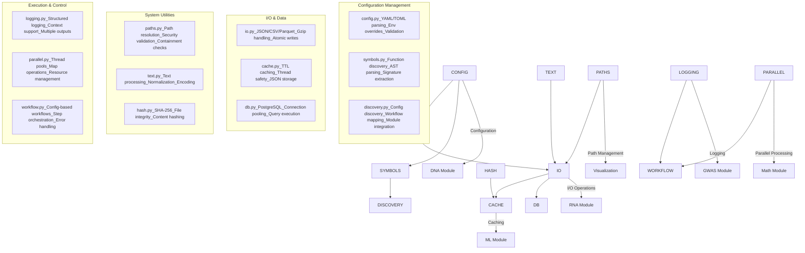

# Core Utilities Documentation

This directory contains documentation for METAINFORMANT's core infrastructure and shared utilities.

## Overview

The core module provides essential utilities used across all METAINFORMANT domains, including configuration management, I/O operations, logging, and parallel processing.

## Core Utilities

- [config](config.md): environment, typed env loaders, Postgres config
- [io](io.md): JSON/JSONL, CSV/TSV, gzip-aware open, mkdir
- [logging](logging.md): consistent logger factory
- [text](text.md): normalization, slugify, safe filenames
- [parallel](parallel.md): thread-based map
- [hash](hash.md): SHA-256 hashing helpers
- [paths](paths.md): path expansion, resolution, and containment checks
- [cache](cache.md): simple JSON cache with TTL
- [db](db.md): PostgreSQL client initialization



## Conventions

- **Outputs**: write to `output/` by default; accept an override path parameter.
- **Configs**: read from `config/` using `core.config` helpers; allow env overrides.
- **Data**: read inputs from `data/` unless explicit paths are provided.

## Documentation Files

### Infrastructure Utilities
- **`cache.md`**: JSON-based caching with TTL support
- **`config.md`**: Configuration management and environment variables
- **`db.md`**: Database integration and connection management
- **`hash.md`**: Content hashing and file integrity
- **`io.md`**: Input/output utilities and file format support
- **`logging.md`**: Consistent logging configuration and best practices
- **`parallel.md`**: Parallel processing and thread management
- **`paths.md`**: Path handling and validation utilities
- **`text.md`**: Text processing and normalization

## Related Source Code

- See `src/metainformant/core/` for implementation details
- See `tests/test_core_*.py` for test coverage
- See `src/metainformant/core/README.md` for module-specific documentation

## Usage Examples

Core utilities are used throughout METAINFORMANT:

```python
from metainformant.core import io, parallel, hash

io.ensure_directory("output")
checksums = parallel.thread_map(hash.sha256_file, ["README.md"])  # list[str]
```

Additional examples:

```python
from metainformant.core import config, io, logging, download_and_process_data

# Load configuration with environment overrides
cfg = config.load_config("config.yaml")

# Setup consistent logging
logger = logging.setup_logger("my_module")

# Robust I/O operations
data = io.read_json("data.json")
io.write_json(data, "output.json")

# High-level config-driven processing
results = download_and_process_data({
    "downloads": {"data": {"url": "https://example.com/data.csv"}},
    "processing": {"analyze": {"type": "analysis"}}
})
```

## Integration

Core utilities are integrated across all domains:
- **Configuration** used by all modules for parameter management
- **I/O operations** provide consistent file handling
- **Logging** ensures uniform error reporting and debugging
- **Path utilities** enforce repository structure conventions
- **Caching** improves performance for expensive operations

## Testing

Comprehensive tests ensure infrastructure reliability:
- Configuration parsing and validation
- I/O format compatibility and error handling
- Logging functionality and performance
- Path handling security and correctness
- Cache operation and TTL functionality

## Contributing

When adding new core functionality:
1. Update relevant utility documentation
2. Add comprehensive tests in `tests/test_core_*.py`
3. Ensure backward compatibility
4. Follow established patterns for error handling and validation

This documentation provides complete coverage of METAINFORMANT's core infrastructure utilities.
