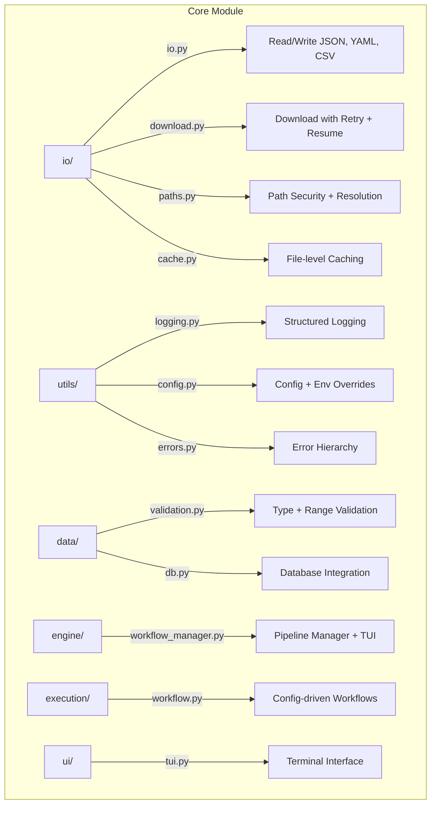

# CORE

## Overview
Core utilities for METAINFORMANT bioinformatics toolkit.

## Contents
- **[data/](db.md)**
- **[engine/](workflow.md)**
- **[execution/](parallel.md)**
- **[io/](io.md)**
- **ui/**
- **[utils/](config.md)**
- `__init__.py`

## Structure


```mermaid
graph TD
    subgraph "Core Module"
        IO[io/] --> |io.py| RW[Read/Write JSON, YAML, CSV]
        IO --> |download.py| DL[Download with Retry + Resume]
        IO --> |paths.py| PA[Path Security + Resolution]
        IO --> |cache.py| CA[File-level Caching]

        UT[utils/] --> |logging.py| LG[Structured Logging]
        UT --> |config.py| CF[Config + Env Overrides]
        UT --> |errors.py| ER[Error Hierarchy]

        DA[data/] --> |validation.py| VA[Type + Range Validation]
        DA --> |db.py| DB[Database Integration]

        EN[engine/] --> |workflow_manager.py| WM[Pipeline Manager + TUI]
        EX[execution/] --> |workflow.py| WF[Config-driven Workflows]
        UI[ui/] --> |tui.py| TI[Terminal Interface]
    end
```

## Coordination Role

Core provides the orchestration primitives used by all domain agents:
- `engine/workflow_manager.py`: BasePipelineManager — generic multi-phase pipeline
- `execution/workflow.py`: Config-driven execution engine
- `execution/parallel.py`: Resource-aware thread pool utilities

See [Agent Coordination Hub](../agents/README.md) for multi-agent workflow patterns.

## Usage
Import module:
```python
from metainformant.core.io import paths
from metainformant.core.utils import config
```

Deprecated compatibility shims `metainformant.core.config` and
`metainformant.core.paths` are tested for older imports, but new code should use
the canonical paths above.
