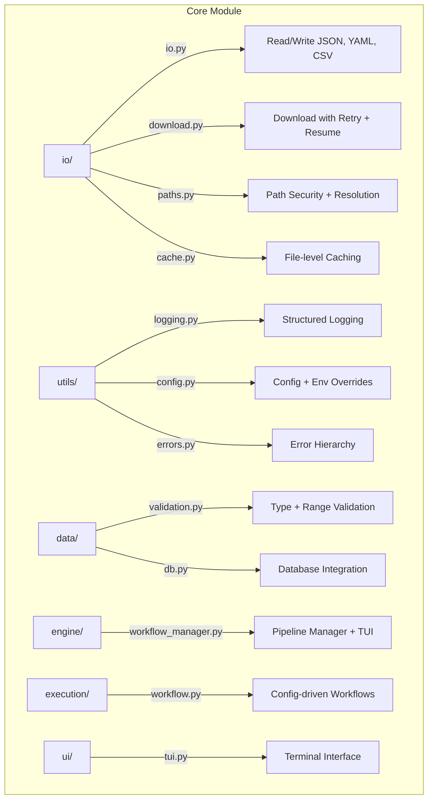

# CORE

## Overview
Core utilities for METAINFORMANT bioinformatics toolkit.

## 📦 Contents
- **[data/](data/)**
- **[engine/](engine/)**
- **[execution/](execution/)**
- **[io/](io/)**
- **[output/](output/)**
- **[ui/](ui/)**
- **[utils/](utils/)**
- `[__init__.py](__init__.py)`

## 📊 Structure


```mermaid
graph TD
    subgraph "Core Module"
        IO[io/] --> |io.py| RW[Read/Write JSON, YAML, CSV]
        IO --> |download.py| DL[Download with Retry + Resume]
        IO --> |paths.py| PA[Path Security + Resolution]
        IO --> |cache.py| CA[File-level Caching]

        UT[utils/] --> |logging.py| LG[Structured Logging]
        UT --> |config.py| CF[Config + Env Overrides]
        UT --> |errors.py| ER[Error Hierarchy]

        DA[data/] --> |validation.py| VA[Type + Range Validation]
        DA --> |db.py| DB[Database Integration]

        EN[engine/] --> |workflow_manager.py| WM[Pipeline Manager + TUI]
        EX[execution/] --> |workflow.py| WF[Config-driven Workflows]
        UI[ui/] --> |tui.py| TI[Terminal Interface]
    end
```

## Usage
Import module:
```python
from metainformant.core import ...
```
