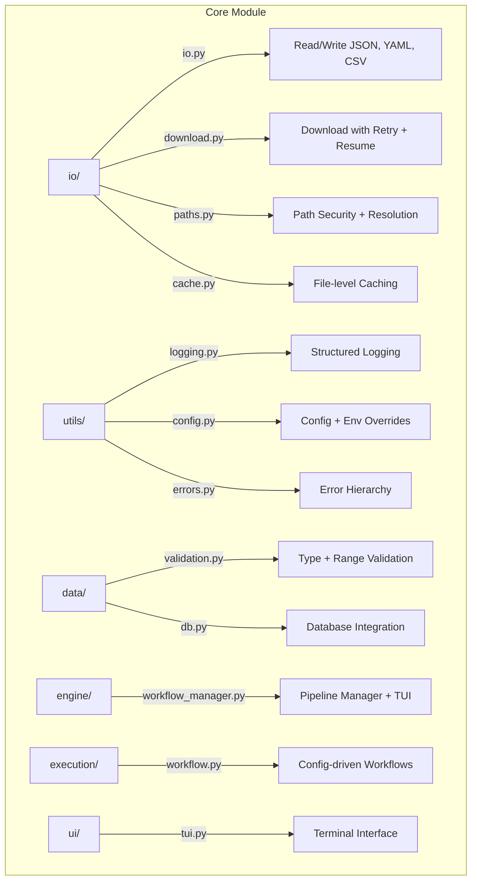

# Core: Overview

Shared infrastructure and utilities used by all METAINFORMANT domain modules.

## Capabilities

- JSON/CSV/TSV/YAML I/O (`core.io`)
- Configuration management with environment overrides (`core.config`)
- Path security and resolution (`core.paths`)
- Structured logging (`core.utils.logging`)
- File-level caching with TTL (`core.cache`)
- Download with retry and resume (`core.download`)
- Parallel execution utilities (`core.parallel`)
- Database integration (`core.db`)
- Error hierarchy and handling (`core.utils.errors`)
- Pipeline workflow management (`core.workflow`)
- TUI for interactive monitoring (`core.ui.tui`)

## Detailed Documentation

- [I/O Operations](./io.md): JSON, CSV, TSV, YAML reading and writing
- [Configuration](./config.md): Config loading, environment variable overrides
- [Path Handling](./paths.md): Path security, resolution, and validation
- [Logging](./logging.md): Structured logging utilities
- [Caching](./cache.md): File-level caching with TTL support
- [Download](./download.md): HTTP download with retry and resume
- [Parallel](./parallel.md): Parallel execution utilities
- [Database](./db.md): SQLite/DuckDB database integration
- [Hashing](./hash.md): Content hashing utilities
- [Text](./text.md): Text processing and Levenshtein distance
- [Workflow](./workflow.md): BaseWorkflowOrchestrator and pipeline framework
