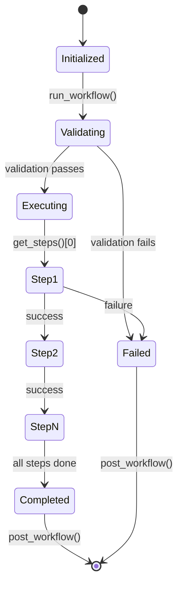

# Core Workflow Orchestration

## Overview

The `metainformant.core.workflow` module provides the foundation for workflow orchestration in METAINFORMANT. It defines the `BaseWorkflowOrchestrator` abstract base class and related utilities for building consistent, robust workflows across all domains.

## BaseWorkflowOrchestrator

### Overview

`BaseWorkflowOrchestrator` is an abstract base class that provides a standardized framework for implementing workflows. It handles:

- **Step execution** with error handling and recovery
- **Progress tracking** and logging
- **Result aggregation** and reporting
- **Configuration validation**
- **Resource management** (working directories, cleanup)

### Class Signature

```python
from abc import ABC, abstractmethod
from pathlib import Path
from typing import Any, Dict, List, Optional

class BaseWorkflowOrchestrator(ABC):
    """Base class for workflow orchestrators."""

    def __init__(self, name: str, work_dir: Path, config: Optional[Dict[str, Any]] = None):
        """Initialize orchestrator."""

    @abstractmethod
    def get_steps(self) -> List[str]:
        """Get list of workflow step names in execution order."""

    @abstractmethod
    def execute_step(self, step_name: str, step_config: Dict[str, Any]) -> Dict[str, Any]:
        """Execute a single workflow step."""

    def validate_config(self) -> bool:
        """Validate workflow configuration."""

    def pre_workflow(self) -> None:
        """Hook for pre-workflow setup."""

    def post_workflow(self) -> None:
        """Hook for post-workflow cleanup."""

    def run_workflow(self, check: bool = False) -> Dict[str, Any]:
        """Run complete workflow."""
```

### Usage Pattern

```python
from metainformant.core.workflow import BaseWorkflowOrchestrator
from pathlib import Path

class MyWorkflow(BaseWorkflowOrchestrator):
    """Custom workflow implementation."""

    def get_steps(self) -> List[str]:
        """Define execution order of steps."""
        return ["validate", "process", "analyze", "report"]

    def execute_step(self, step_name: str, step_config: Dict[str, Any]) -> Dict[str, Any]:
        """Execute individual workflow step."""
        if step_name == "validate":
            # Validation logic
            return {"status": "completed", "output": {"valid": True}}
        elif step_name == "process":
            # Processing logic
            return {"status": "completed", "output": {"processed_files": 5}}
        # ... other steps

        return {"status": "failed", "errors": ["Unknown step"]}

# Usage
workflow = MyWorkflow("my_analysis", Path("output/my_analysis"))
results = workflow.run_workflow()
```

## Workflow Execution Flow

### Complete Workflow Lifecycle



### Step Execution Details

```mermaid
flowchart TD
    A[get_steps()] --> B[for each step]
    B --> C[execute_step(step_name, config)]
    C --> D{status == 'completed'?}
    D --> E[Record success<br/>Continue to next step] --> B
    D --> F{status == 'failed'?}
    F --> G[Record error<br/>Stop execution<br/>Mark workflow failed] --> H[post_workflow()]
    F --> I{status == 'skipped'?}
    I --> J[Record skip reason<br/>Continue to next step] --> B
```

## Result Structure

### Workflow Results

All workflows return a standardized result dictionary:

```python
{
    "name": "workflow_name",           # Workflow identifier
    "work_dir": "/path/to/work/dir",   # Working directory path
    "start_time": 1640995200.0,       # Unix timestamp
    "end_time": 1640995260.0,         # Unix timestamp
    "duration_seconds": 60.0,         # Total execution time
    "steps": [                        # Step execution results
        {
            "step": "validate",
            "status": "completed",
            "result": {
                "status": "completed",
                "output": {"valid": True},
                "errors": [],
                "warnings": []
            }
        },
        # ... more steps
    ],
    "status": "completed",            # "completed" | "failed" | "validated"
    "errors": [],                     # List of workflow-level errors
    "warnings": []                    # List of workflow-level warnings
}
```

### Step Results

Individual step functions return standardized result dictionaries:

```python
{
    "status": "completed",           # "completed" | "failed" | "skipped"
    "output": {                      # Step-specific output data
        "files_created": ["/path/to/output.txt"],
        "metrics": {"accuracy": 0.95}
    },
    "errors": [],                    # List of error messages
    "warnings": [],                  # List of warning messages
    "metadata": {                    # Additional metadata
        "execution_time": 45.2,
        "memory_used": "1.2GB"
    }
}
```

## Configuration Management

### Config Loading Pattern

Workflows use the standard METAINFORMANT configuration loading pattern:

```python
from metainformant.core.config import load_mapping_from_file, apply_env_overrides

def load_workflow_config(config_path: str | Path, prefix: str = "WORKFLOW") -> Dict[str, Any]:
    """Load workflow configuration with environment overrides."""
    # Load base config
    config = load_mapping_from_file(config_path)

    # Apply environment variable overrides
    config = apply_env_overrides(config, prefix=prefix)

    return config
```

### Config Validation

```python
def validate_config(self) -> bool:
    """Validate workflow configuration."""
    required_keys = ["work_dir", "input_files"]
    for key in required_keys:
        if key not in self.config:
            self.results["errors"].append(f"Missing required config key: {key}")
            return False

    # Validate paths exist
    work_dir = Path(self.config["work_dir"])
    if not work_dir.exists():
        work_dir.mkdir(parents=True, exist_ok=True)

    return True
```

## Error Handling and Logging

### Error Propagation

```python
def run_workflow(self, check: bool = False) -> Dict[str, Any]:
    """Run workflow with comprehensive error handling."""
    try:
        # Pre-workflow setup
        self.pre_workflow()

        # Validate configuration
        if not self.validate_config():
            return self.results

        if check:
            # Validation-only mode
            return self.results

        # Execute steps
        steps = self.get_steps()
        for step_name in steps:
            step_result = self.execute_step(step_name, self.config)

            if step_result.get("status") == "failed":
                error_msg = step_result.get("error", f"Step {step_name} failed")
                self.results["errors"].append(error_msg)
                break

    except Exception as e:
        error_msg = f"Workflow execution failed: {str(e)}"
        self.results["errors"].append(error_msg)
        logger.error(error_msg, exc_info=True)

    finally:
        # Always run post-workflow cleanup
        self.post_workflow()

    return self.results
```

### Logging Integration

```python
from metainformant.core.logging import get_logger

logger = get_logger(__name__)

def execute_step(self, step_name: str, step_config: Dict[str, Any]) -> Dict[str, Any]:
    """Execute step with logging."""
    logger.info(f"Executing step: {step_name}")

    try:
        # Step execution logic
        result = perform_step_logic(step_config)

        logger.info(f"Step {step_name} completed successfully")
        return result

    except Exception as e:
        error_msg = f"Step {step_name} failed: {str(e)}"
        logger.error(error_msg, exc_info=True)

        return {
            "status": "failed",
            "errors": [error_msg],
            "output": {}
        }
```

## Step Function Standards

### Required Interface

All step functions must follow this signature:

```python
def execute_step_name(config: Dict[str, Any], **kwargs) -> Dict[str, Any]:
    """Execute workflow step.

    Args:
        config: Step configuration dictionary
        **kwargs: Additional keyword arguments

    Returns:
        Standardized result dictionary with status, output, errors, warnings
    """
```

### Step Function Best Practices

```python
def execute_data_processing(config: Dict[str, Any], **kwargs) -> Dict[str, Any]:
    """Process input data according to configuration."""

    # 1. Extract parameters from config
    input_file = config.get("input_file")
    output_file = config.get("output_file", "processed_data.txt")

    # 2. Validate inputs
    if not input_file or not Path(input_file).exists():
        return {
            "status": "failed",
            "errors": ["Input file not found or not specified"],
            "output": {}
        }

    # 3. Execute step logic
    try:
        # Processing logic here
        processed_data = process_data(input_file)

        # Write output
        with open(output_file, 'w') as f:
            f.write(processed_data)

        return {
            "status": "completed",
            "output": {
                "output_file": output_file,
                "records_processed": len(processed_data.split('\n'))
            },
            "warnings": []  # Any non-fatal issues
        }

    except Exception as e:
        return {
            "status": "failed",
            "errors": [f"Processing failed: {str(e)}"],
            "output": {}
        }
```

## Advanced Patterns

### Conditional Step Execution

```python
def get_steps(self) -> List[str]:
    """Get steps based on configuration."""
    steps = ["validate"]

    if self.config.get("enable_processing", True):
        steps.append("process")

    if self.config.get("enable_analysis", True):
        steps.append("analyze")

    steps.append("report")
    return steps
```

### Step Dependencies and Parallelization

```python
def get_steps(self) -> List[str]:
    """Define step execution order with dependencies."""
    return [
        "validate_input",     # Must run first
        "preprocess_data",    # Depends on validate_input
        "parallel_analysis",  # Can run in parallel with other steps
        "merge_results",      # Depends on parallel_analysis
        "generate_report"     # Depends on merge_results
    ]
```

### Workflow Composition

```python
class CompositeWorkflow(BaseWorkflowOrchestrator):
    """Workflow that combines multiple sub-workflows."""

    def __init__(self, name: str, work_dir: Path, config: Dict[str, Any]):
        super().__init__(name, work_dir, config)
        # Initialize sub-workflows
        self.preprocessing = PreprocessingWorkflow("preprocessing", work_dir / "preprocessing", config)
        self.analysis = AnalysisWorkflow("analysis", work_dir / "analysis", config)

    def get_steps(self) -> List[str]:
        return ["preprocessing", "analysis", "integration"]

    def execute_step(self, step_name: str, step_config: Dict[str, Any]) -> Dict[str, Any]:
        if step_name == "preprocessing":
            return self.preprocessing.run_workflow()
        elif step_name == "analysis":
            return self.analysis.run_workflow()
        elif step_name == "integration":
            # Integration logic
            return integrate_results(self.preprocessing.results, self.analysis.results)
```

## Integration with Core Utilities

### Path Management

```python
from metainformant.core import paths

def pre_workflow(self) -> None:
    """Setup with path validation."""
    super().pre_workflow()

    # Ensure work directory is within allowed paths
    if not paths.is_within(self.work_dir, Path("output")):
        raise ValueError("Work directory must be within output/")

    # Expand and resolve all paths in config
    self.config = paths.expand_config_paths(self.config)
```

### Configuration Management

```python
from metainformant.core import config

def __init__(self, name: str, work_dir: Path, config: Optional[Dict[str, Any]] = None):
    # Load config with environment overrides
    if isinstance(config, (str, Path)):
        config = config.load_mapping_from_file(config)

    config = config.apply_env_overrides(config or {}, prefix=f"{name.upper()}_")
    super().__init__(name, work_dir, config)
```

### Progress Tracking

```python
from metainformant.core import progress

def run_workflow(self, check: bool = False) -> Dict[str, Any]:
    """Run workflow with progress tracking."""
    steps = self.get_steps()
    with progress.ProgressTracker(total=len(steps), desc=self.name) as pbar:
        # ... existing logic but update progress ...
        for step_name in steps:
            # ... step execution ...
            pbar.update(1)

    return self.results
```

## Testing Workflow Orchestrators

### Unit Testing Pattern

```python
import pytest
from pathlib import Path
from metainformant.core.workflow import BaseWorkflowOrchestrator

class TestWorkflow(BaseWorkflowOrchestrator):
    def get_steps(self) -> List[str]:
        return ["test_step"]

    def execute_step(self, step_name: str, step_config: Dict[str, Any]) -> Dict[str, Any]:
        return {"status": "completed", "output": {"test": True}}

def test_workflow_execution(tmp_path: Path):
    """Test workflow execution."""
    workflow = TestWorkflow("test", tmp_path / "output")

    results = workflow.run_workflow()

    assert results["status"] == "completed"
    assert len(results["steps"]) == 1
    assert results["steps"][0]["status"] == "completed"
```

### Integration Testing

```python
def test_workflow_with_real_steps(tmp_path: Path):
    """Test workflow with actual step implementations."""
    config = {
        "input_file": str(tmp_path / "input.txt"),
        "output_file": str(tmp_path / "output.txt")
    }

    # Create test input
    (tmp_path / "input.txt").write_text("test data")

    workflow = MyWorkflow("integration_test", tmp_path / "output", config)
    results = workflow.run_workflow()

    assert results["status"] == "completed"
    assert (tmp_path / "output.txt").exists()
```

## Migration Guide

### From Direct Function Calls

**Before:**
```python
def run_analysis(input_file, output_file):
    # Direct implementation
    pass

result = run_analysis("input.txt", "output.txt")
```

**After:**
```python
class AnalysisWorkflow(BaseWorkflowOrchestrator):
    def get_steps(self) -> List[str]:
        return ["analyze"]

    def execute_step(self, step_name: str, step_config: Dict[str, Any]) -> Dict[str, Any]:
        return run_analysis_logic(step_config)

workflow = AnalysisWorkflow("analysis", Path("output/analysis"), config)
results = workflow.run_workflow()
```

### From Script-Only Workflows

**Before:**
```bash
#!/bin/bash
# Complex bash workflow
step1
step2
step3
```

**After:**
```python
from metainformant.core.workflow import BaseWorkflowOrchestrator

class BashWorkflow(BaseWorkflowOrchestrator):
    def get_steps(self) -> List[str]:
        return ["step1", "step2", "step3"]

    def execute_step(self, step_name: str, step_config: Dict[str, Any]) -> Dict[str, Any]:
        import subprocess
        result = subprocess.run([step_name], capture_output=True, text=True)
        return {
            "status": "completed" if result.returncode == 0 else "failed",
            "output": {"stdout": result.stdout, "stderr": result.stderr}
        }
```

## Best Practices

### Design Principles

1. **Single Responsibility**: Each step should do one thing well
2. **Idempotency**: Steps should be safe to re-run
3. **Error Isolation**: Step failures shouldn't break entire workflow
4. **Result Consistency**: Standardize return value structures
5. **Configuration First**: Use config dictionaries, not hardcoded values

### Implementation Guidelines

1. **Validate Early**: Check inputs and configuration before execution
2. **Log Liberally**: Use structured logging throughout
3. **Handle Errors Gracefully**: Provide meaningful error messages
4. **Document Thoroughly**: Include docstrings for all public methods
5. **Test Extensively**: Cover success, failure, and edge cases

### Performance Considerations

1. **Resource Management**: Clean up temporary files and connections
2. **Progress Feedback**: Provide progress indicators for long-running workflows
3. **Memory Efficiency**: Process large datasets in chunks when possible
4. **Parallelization**: Use parallel processing for independent steps
5. **Caching**: Cache expensive computations when appropriate

## Related Documentation

- **[Orchestration Guide](../ORCHESTRATION.md)** - Overall orchestration paradigm
- **[Configuration Guide](config.md)** - Configuration management
- **[Logging Guide](logging.md)** - Logging best practices
- **[Testing Guide](../testing.md)** - Testing workflow orchestrators
- **[RNA Workflow](../rna/workflow.md)** - Example domain workflow implementation

