# DNA Domain Documentation

This directory contains documentation for METAINFORMANT's DNA analysis capabilities.

## Overview

The DNA domain provides tools for sequence analysis, alignment, phylogenetics, population genetics, and genomic data integration.

### DNA Analysis Workflow

```mermaid
graph TD
    AinputSequencesFasta/fastq[Input Sequences_FASTA/FASTQ] --> BsequenceValidationValidateDnaSequence[Sequence Validation_validate_dna_sequence]
    B --> CbasicAnalysisGcContent,KmerCounts[Basic Analysis_gc_content, kmer_counts]

    C --> DalignmentGlobal/localMsa[Alignment_Global/Local MSA]
    C --> EcompositionGcSkew,Motifs[Composition_GC skew, motifs]

    D --> FphylogeneticsNeighborJoiningUpgmaTrees[Phylogenetics_Neighbor Joining_UPGMA trees]
    E --> GpopulationGeneticsΠ,Tajima'sD,Fst[Population Genetics_π, Tajima's D, Fst]

    F --> HvisualizationTreePlots,Networks[Visualization_Tree plots, networks]
    G --> IstatisticalAnalysisNeutralityTests[Statistical Analysis_Neutrality tests]

    H --> JintegrationRna,Protein,Gwas[Integration_RNA, Protein, GWAS]
    I --> J

    KncbiData[NCBI Data] --> LgenomeDownloadFetchGenome[Genome Download_fetch_genome]
    L --> A

    MvariantDataVcfFiles[Variant Data_VCF files] --> NvariantAnalysisParseVcf,EffectPrediction[Variant Analysis_parse_vcf, effect prediction]
    N --> G

    OqualityControlFastqMetrics[Quality Control_FASTQ metrics] --> PfilteringQualityFilter[Filtering_quality_filter]
    P --> A


    class A,K,M,O input
    class B,C,D,E,L,N,P process
    class F,G,I analysis
    class H,J output
```



## Documentation Files

### Core DNA Analysis
- **`index.md`**: DNA domain overview and module index
- **`sequences.md`**: DNA sequence manipulation and I/O
- **`alignment.md`**: Pairwise sequence alignment algorithms
- **`msa.md`**: Multiple sequence alignment methods
- **`phylogeny.md`**: Phylogenetic tree construction and analysis

### Population Genetics
- **`population.md`**: Population genetic analysis and diversity metrics
- **`distances.md`**: Evolutionary distance calculations
- **`composition.md`**: Sequence composition and GC content analysis
- **`codon.md`**: Codon usage analysis and genetic code

### Molecular Biology
- **`transcription.md`**: DNA to RNA transcription
- **`translation.md`**: Genetic code translation and ORF finding
- **`motifs.md`**: Motif discovery and pattern analysis
- **`restriction.md`**: Restriction enzyme site mapping
- **`mutations.md`**: Mutation analysis and variant calling

### Genomic Data Integration
- **`ncbi.md`**: NCBI database integration and Entrez queries
- **`accessions.md`**: Genome accession validation and retrieval
- **`variants.md`**: VCF variant parsing and analysis

### Sequence Quality
- **`fastq.md`**: FASTQ format processing and quality analysis

## Related Source Code

- See `src/metainformant/dna/` for implementation details
- See `tests/test_dna_*.py` for comprehensive test coverage
- See `src/metainformant/dna/README.md` for module-specific documentation

## Usage Examples

The DNA domain supports a wide range of biological analyses:

```python
from metainformant.dna import sequences, alignment, phylogeny

# Load and analyze DNA sequences
seqs = sequences.read_fasta("genomes.fasta")
# Pairwise alignment example
seq_list = list(seqs.values())
if len(seq_list) >= 2:
    aln = alignment.global_align(seq_list[0], seq_list[1])
# Build phylogenetic tree from sequences
tree = phylogeny.neighbor_joining_tree(seqs)

# Population genetic analysis
from metainformant.dna import population
pi = population.nucleotide_diversity(seqs.values())
```

## Integration

DNA analysis integrates with:
- **RNA workflows** for transcriptomic context
- **Protein analysis** for functional annotation
- **Visualization tools** for phylogenetic trees and alignments
- **Statistical methods** for evolutionary analysis

## Testing

Comprehensive tests ensure algorithm correctness:
- Sequence format I/O validation
- Algorithm implementation verification
- Performance benchmarking with real data
- Integration testing across modules

## Contributing

When adding new DNA analysis functionality:
1. Update relevant documentation files
2. Add comprehensive tests in `tests/test_dna_*.py`
3. Update module README and API references
4. Ensure compatibility with existing workflows

This documentation provides complete coverage of METAINFORMANT's DNA analysis capabilities.
