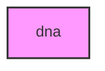

# DNA

## Overview
DNA sequence analysis and genomics module for METAINFORMANT.

## 📦 Contents
- **[alignment/](alignment/)**
- **[expression/](expression/)**
- **[external/](external/)**
- **[integration/](integration/)**
- **[io/](io/)**
- **[phylogeny/](phylogeny/)**
- **[population/](population/)**
- **[sequence/](sequence/)**
- **[variation/](variation/)**
- `[__init__.py](__init__.py)`

## 📊 Structure



## Usage
Import module:
```python
from metainformant.dna import ...
```
