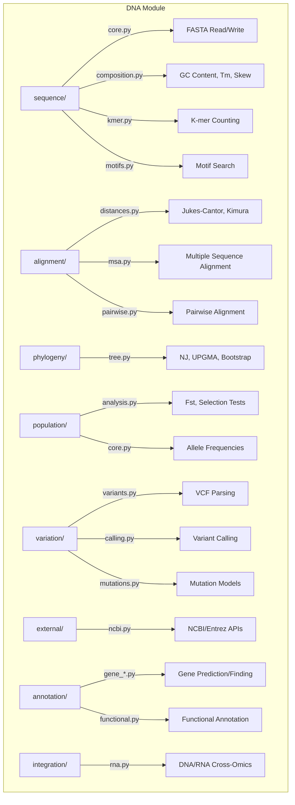

# DNA

## Overview
DNA sequence analysis and genomics module for METAINFORMANT.

## Contents
- **[alignment/](alignment.md)**
- **[annotation/](annotation.md)**
- **[expression/](transcription.md)**
- **[external/](ncbi.md)**
- **[integration/](integration.md)**
- **[io/](../core/io.md)**
- **[phylogeny/](phylogeny.md)**
- **[population/](population.md)**
- **[sequence/](sequences.md)**
- **[variation/](variants.md)**
- `__init__.py`

## Structure


```mermaid
graph TD
    subgraph "DNA Module"
        SE[sequence/] --> |core.py| RW[FASTA Read/Write]
        SE --> |composition.py| GC[GC Content, Tm, Skew]
        SE --> |kmer.py| KM[K-mer Counting]
        SE --> |motifs.py| MO[Motif Search]

        AL[alignment/] --> |distances.py| DI[Jukes-Cantor, Kimura]
        AL --> |msa.py| MS[Multiple Sequence Alignment]
        AL --> |pairwise.py| PW[Pairwise Alignment]

        PH[phylogeny/] --> |tree.py| TR[NJ, UPGMA, Bootstrap]

        PO[population/] --> |analysis.py| FS[Fst, Selection Tests]
        PO --> |core.py| PG[Allele Frequencies]

        VA[variation/] --> |variants.py| VC[VCF Parsing]
        VA --> |calling.py| CA[Variant Calling]
        VA --> |mutations.py| MU[Mutation Models]

        EX[external/] --> |ncbi.py| NC[NCBI/Entrez APIs]

        AN[annotation/] --> |gene_*.py| GP[Gene Prediction/Finding]
        AN --> |functional.py| FA[Functional Annotation]

        IN[integration/] --> |rna.py| RN[DNA/RNA Cross-Omics]
    end
```

## Usage
Import module:
```python-snippet
from metainformant.dna import ...
```

## Full Pipelines

DNA modules form the basis of several end-to-end workflows:
- **[GWAS Pipeline](../gwas/README.md)**: Genome-Wide Association Studies (Sequence variants to Phenotypes).
- **[eQTL Integration Pipeline](../eqtl/README.md)**: Integrating DNA variants with RNA-seq expression data.
- **[Simulation Pipelines](../simulation/README.md)**: Forward-time population genetics simulations.
