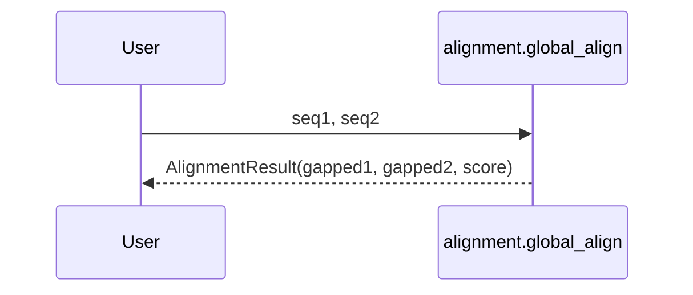

### DNA: Pairwise Alignment

Functions: `global_align`, `local_align` returning an `AlignmentResult` with `aligned_seq1`, `aligned_seq2`, `score`.



Example

```python
from metainformant.dna import alignment

res = alignment.global_align("ACGT", "AGT")
print(res.score, res.aligned_seq1, res.aligned_seq2)
```
