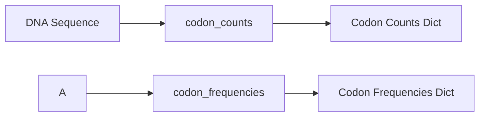

### DNA: Codon Analysis

Functions: `codon_counts`, `codon_frequencies`



Example

```python
from metainformant.dna import codon

# Count codons in sequence
seq = "ATGAAATTTCCCGGGTAG"
counts = codon.codon_counts(seq)
# Returns: {"ATG": 1, "AAA": 1, "TTT": 1, "CCC": 1, "GGG": 1, "TAG": 1}

# Calculate codon frequencies
frequencies = codon.codon_frequencies(seq)  
# Returns: {"ATG": 0.167, "AAA": 0.167, "TTT": 0.167, ...}
```

Features:
- **Triplet parsing**: Divides sequence into 3-base codons
- **Complete codons only**: Ignores incomplete trailing bases
- **Case insensitive**: Converts to uppercase for standardization  
- **Frequency calculation**: Normalized counts (sum = 1.0)
- **All codons**: Includes start and stop codons

Codon analysis applications:
- **Codon usage bias**: Species-specific codon preferences
- **Gene expression prediction**: Highly used codons correlate with expression
- **Evolutionary analysis**: Synonymous vs non-synonymous substitutions
- **Protein optimization**: Codon optimization for heterologous expression

Standard genetic code:
- **64 codons**: 61 sense codons + 3 stop codons
- **Start codon**: Usually ATG (methionine)
- **Stop codons**: TAG, TAA, TGA

Related: Complements [translation](./translation.md) for protein coding analysis.
