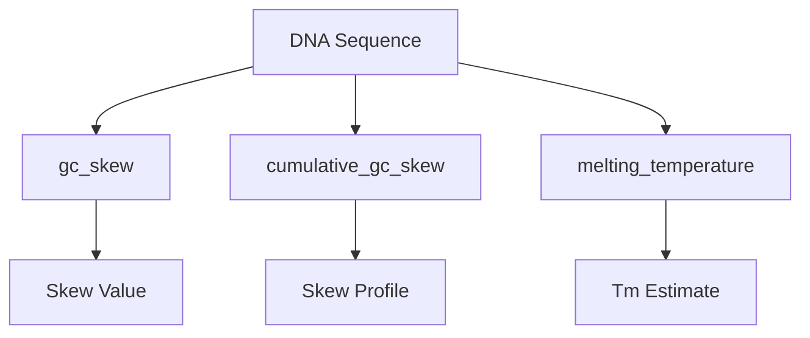

### DNA: Composition Analysis

Functions: `gc_skew`, `cumulative_gc_skew`, `melting_temperature`



Example

```python
from metainformant.dna import composition

seq = "ATCGGGCCCATG"

# Calculate GC skew: (G-C)/(G+C)
skew = composition.gc_skew(seq)  # 0.143 (more G than C)

# Cumulative GC skew walk
cumulative = composition.cumulative_gc_skew(seq)
# Returns: [0, 0, 1, 2, 3, 2, 1, 0, 1, 2, 2, 2]

# Estimate melting temperature
tm = composition.melting_temperature(seq)  # Temperature in °C
```

Features:
- **GC skew analysis**: Measures G vs C asymmetry in sequences
- **Cumulative tracking**: Progressive skew calculation across sequence
- **Melting temperature**: Simple Tm estimation for primer design
- **Robust calculation**: Handles edge cases (no GC content, empty sequences)

GC Skew applications:
- **Replication analysis**: Origin and terminus identification
- **Strand bias detection**: Transcriptional or replication strand preferences  
- **Genome organization**: Chromosome structure analysis
- **Phylogenetic signals**: Evolutionary compositional patterns

Melting temperature methods:
- **Wallace rule** (≤14 bp): 2×(A+T) + 4×(G+C)
- **Enhanced formula** (>14 bp): 64.9 + 41×(G+C-16.4)/N
- **Applications**: Primer design, PCR optimization, hybridization conditions

Related: Complements [sequences](./sequences.md) GC content analysis with directional information.
