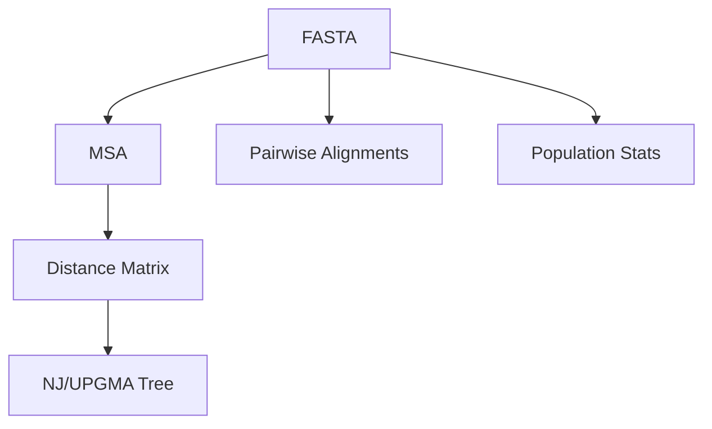

### DNA: Overview

Capabilities
- FASTA I/O (`sequences.read_fasta`)
- Pairwise alignment (`alignment.global_align`, `alignment.local_align`)
- Lightweight MSA (`msa.align_msa`, optional external tools)
- Phylogeny (NJ/UPGMA, Newick export)
- Population genetics (diversity, Tajima's D, Fst)

See: [Sequences](./sequences.md), [Alignment](./alignment.md), [MSA](./msa.md), [Phylogeny](./phylogeny.md), [Population](./population.md).

