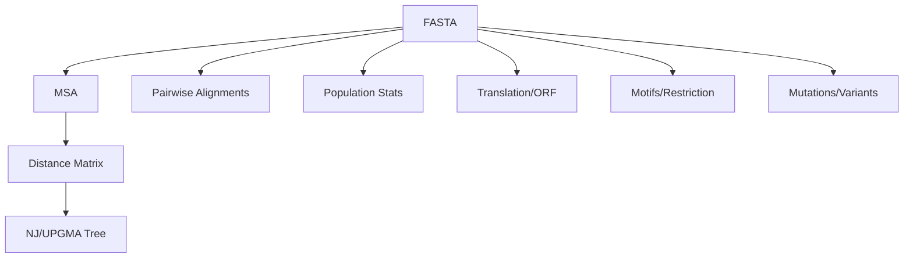

# DNA: Overview

Capabilities

- FASTA I/O (`sequences.read_fasta`)
- Pairwise alignment (`alignment.global_align`, `alignment.local_align`)
- Lightweight MSA (`msa.align_msa`, optional external tools)
- Phylogeny (NJ/UPGMA, Newick export)
- Population genetics (diversity, Tajima's D, Fst)
- Accession checks and Entrez fetch (NCBI)
- Consensus sequence from alignment
- FASTQ quality summaries
- Sequence distances and evolutionary models
- Translation and ORF finding
- Transcription (DNA ↔ RNA)
- Mutation analysis and random mutagenesis
- Motif searching with IUPAC codes
- Restriction enzyme site mapping
- Codon usage analysis
- Composition analysis (GC skew, melting temperature)
- VCF variant parsing

## Core Modules

See: [Sequences](./sequences.md), [Alignment](./alignment.md), [MSA](./msa.md), [Phylogeny](./phylogeny.md), [Population](./population.md).

## Analysis Modules

- [Distances](./distances.md): Evolutionary distances and k-mer comparisons
- [Translation](./translation.md): Protein translation and ORF finding
- [Transcription](./transcription.md): DNA ↔ RNA conversion
- [Mutations](./mutations.md): Point mutations and Hamming distance
- [Codon](./codon.md): Codon usage analysis
- [Composition](./composition.md): GC skew and melting temperature

## Sequence Features

- [Motifs](./motifs.md): Pattern searching with IUPAC codes
- [Restriction](./restriction.md): Restriction enzyme site mapping
- [Variants](./variants.md): VCF file parsing

## External Data

- [Entrez/NCBI](./ncbi.md): Sequence retrieval from NCBI
- [Accession Validation](./accessions.md): Assembly accession validation
- [Consensus](./consensus.md): Consensus sequence generation
- [FASTQ](./fastq.md): FASTQ quality analysis
