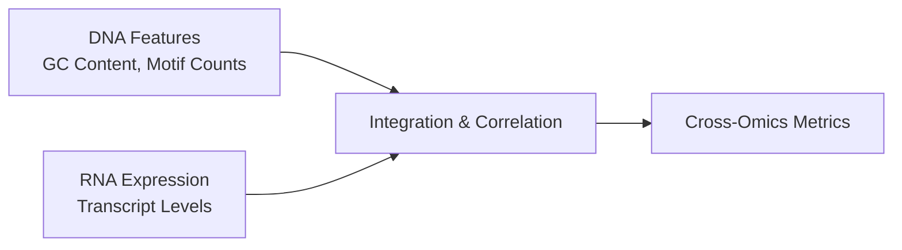

### DNA: Cross-Omics Integration

The `metainformant.dna.integration` package provides tools for linking DNA genomic features with RNA transcriptomic data to enable cross-omics correlation studies.



---

## Module Overview (`dna.integration.rna`)

### Feature Extraction

Helper functions to extract structural features from DNA that might correlate with expression:

```python
from metainformant.dna.integration import rna

# Find Transcription Start Sites (TSS) based on motifs
tss_sites = rna.predict_transcription_start_sites(sequence, window_size=50)

# Parse TF binding sites
tf_sites = rna.find_transcription_factor_binding_sites(sequence, {"SP1": "GGGCGG"})

# Quick regulatory element summary
regulatory = rna.analyze_regulatory_elements(sequence)
```

### Comprehensive Gene Structure Analysis

```python
# Analyzes ORFs, TSS, and promoter GC content
structure = rna.analyze_gene_structure(gene_sequence)
# Returns {"orfs": [...], "promoter_gc_content": 0.6, "potential_coding_regions": 2, ...}
```

### Cross-Omics Correlation

Link the presence or strength of genomic features to RNA expression levels (e.g., Pearson correlation).

```python
dna_features = {
    "gc_content": 0.65,
    "orf_count": 1
}

rna_expression = {
    "geneA": 150.5,
    "geneB": 24.0
}

# Correlate DNA features (like GC content) across multiple genes with their RNA expression
correlation = rna.correlate_dna_with_rna_expression(dna_features, rna_expression)
```

### Multi-Omics Integration

```python
integrated = rna.integrate_dna_rna_data(dna_data, rna_data)
# Produces combined dictionary with "integration_metrics" like coding_density
```
