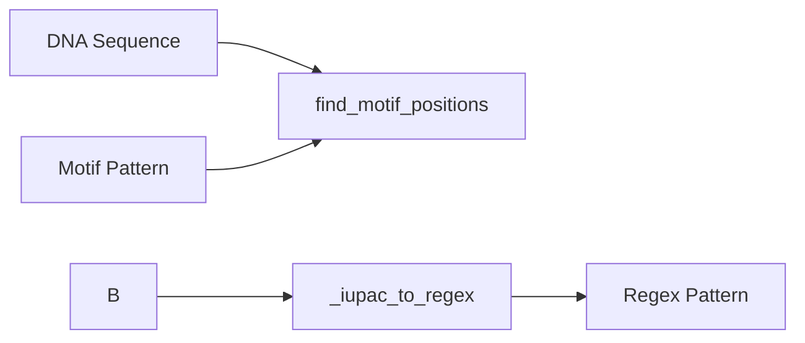

### DNA: Motifs

Functions: `find_motif_positions`, `_iupac_to_regex`



Example

```python
from metainformant.dna import motifs

# Find positions of a simple motif
seq = "ATCGATCGATCG"
positions = motifs.find_motif_positions(seq, "ATG")  # [0-based positions]

# IUPAC ambiguity codes supported
# N = any base, R = A/G, Y = C/T, etc.
positions = motifs.find_motif_positions(seq, "RYNR")
```

Features:
- **IUPAC support**: Handles ambiguous nucleotide codes (N, R, Y, S, W, K, M, B, D, H, V)
- **Case insensitive**: Matches regardless of case
- **All occurrences**: Returns all matching positions in sequence
- **Zero-based indexing**: Positions returned as 0-based integers

Related: Used by [restriction sites](./restriction.md) for enzyme recognition.
