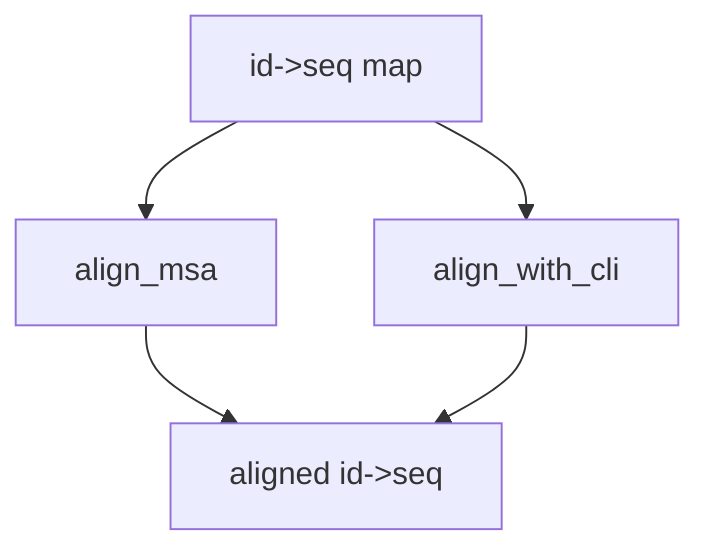

### DNA: Multiple Sequence Alignment (MSA)

Functions: `align_msa` (progressive, no external deps), `align_with_cli` (MUSCLE/Clustal if available).



Example

```python
from metainformant.dna import msa

aligned = msa.align_msa({"A": "ACGT", "B": "AG-T"})

# External tools
# - If MUSCLE is in PATH, align_with_cli will use it.
# - The setup script installs a lightweight MUSCLE shim in `.venv/bin/muscle` if the real binary is missing,
#   so tests and examples still run under uv. For real analyses, install MUSCLE v5 and ensure it is in PATH.
# msa.align_with_cli(id_to_seq, tool="muscle")  # or "clustalo"
```


