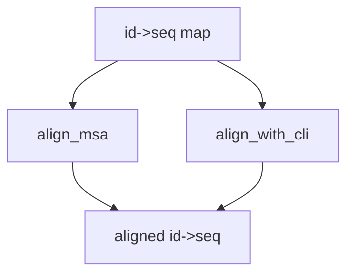

### DNA: Multiple Sequence Alignment (MSA)

Functions: `align_msa` (progressive, no external deps), `align_with_cli` (MUSCLE/Clustal if available).



Example

```python
from metainformant.dna import msa

aligned = msa.align_msa({"A": "ACGT", "B": "AG-T"})
```


