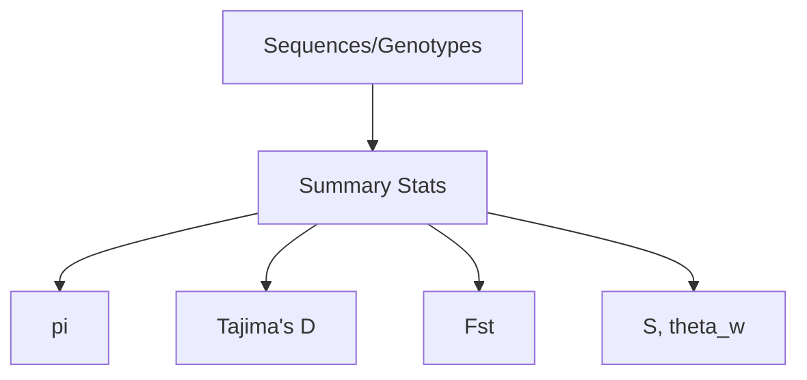

### DNA: Population Genetics

Functions: `allele_frequencies`, `observed_heterozygosity`, `nucleotide_diversity`, `tajimas_d`, `hudson_fst`, `segregating_sites`, `wattersons_theta`.



Example

```python
from metainformant.dna import population

pi = population.nucleotide_diversity(["AAAA", "AAAT"])  # 0.25
fst = population.hudson_fst(["AAAA"], ["TTTT"])        # 1.0
```


